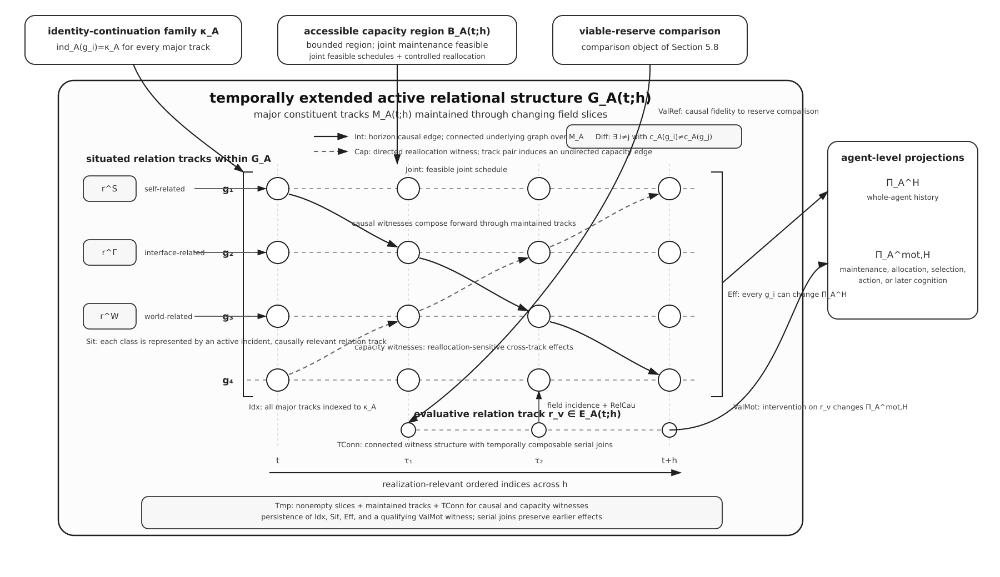
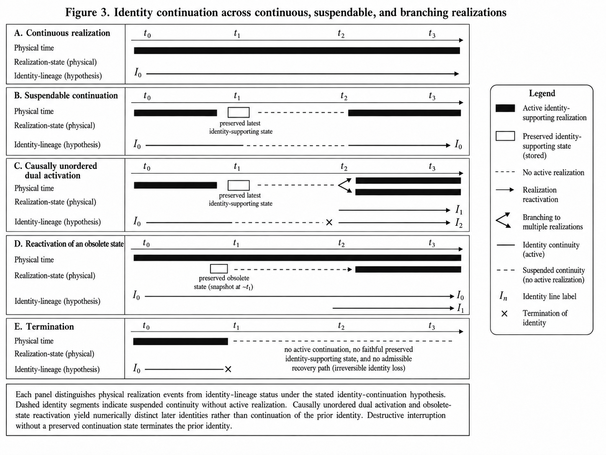

# Structural Consciousness

**Agenthood, Cognition, and the Constitution of a Subjective Field**

**Ibrahim Nahvi Ibrahim**  
**Independent Researcher, Maldives**  
**ORCID: [0009-0000-7317-5811](https://orcid.org/0009-0000-7317-5811)**  
**1 September 2026**  
**Extended Manuscript 1.0**

---

## Abstract

Structural Consciousness develops an **organization-level constitutive account** of the causal organization by which the active processes of a physical cognitive system are proposed to constitute a unified, structured, agent-relative subjective experience from one continuing point of view. The construction proceeds from agenthood, through cognition with retained historical organization, to a conjunctive active-field organization. The resulting organization is termed a **subjective field**: it is differentiated, causally integrated, effective at the agent scale, capacity-coupled, persistently self-indexed, situated relative to self, interface, and world, evaluatively sensitive to viable continuation, and temporally unified. The definition is substrate-independent, while each realization remains physically specific.

The content formalism grounds qualitative occurrence in realization-level differentiation, distinguishes novel occurrences from recurrent qualitative types, and permits partial reinstatement of historically formed sensory, bodily, and evaluative relations during later perception and recall. Viable-reserve relations enter the field through field-integrated valence and motivation. Definition 8 specifies the technical category of structural consciousness; the account identifies complete realization of that organization with the organization of the target subjective experience. Under the identity-continuation hypothesis, Sections 6.4 and 6.5 state conditional consequences for interruption and continuation. Positive instantiation requires realization-specific causal evidence for the complete constitutive organization, while external description of that organization and the agent's first-person standpoint remain distinct epistemic relations.

## Introduction

Consciousness research addresses several explanatory targets, including conscious access, conscious level, qualitative character, phenomenal structure, and the unity of experience.[\[75\]](#ref-75)[\[76\]](#ref-76)[\[83\]](#ref-83)[\[84\]](#ref-84) The present paper addresses a narrower constitutive question: **what causal-organizational structure would a physical cognitive system have to realize for its active processes to constitute a unified subjective experience from one continuing point of view?** Questions of phenomenal unity concern how distinct experiences belong together within one subject or encompassing experience,[\[80\]](#ref-80)[\[81\]](#ref-81) while the relation between first-person subjectivity and third-person scientific description remains a methodological problem in consciousness science.[\[87\]](#ref-87)[\[88\]](#ref-88)

SC specifies the constitutive organization of the target subjective field; conscious level, wakefulness, conscious access, and behavioural responsiveness remain distinct assessment targets.

The method used here is an **organization-level constitutive analysis**. The analysis first identifies the organization required for one continuing bearer, then the additional organization required for history-sensitive cognition, and finally the relations by which the differentiated processes of that cognitive agent form one causally connected, capacity-coupled, situated, evaluatively organized, and temporally maintained subjective whole. The term **subjective field** is introduced below for that resulting active organization.

The construction proceeds in three stages. Agenthood is defined through identity-preserving continuation, an effective boundary, bidirectional causal exchange, and viability under a declared disturbance class. Cognition adds retained historical change, causal efficacy of retained organization, composite formation and recruitment, endogenous propagation, competition among incompatible continuations, and recursive modification of later candidate availability. Structural consciousness is then stated as a conjunctive condition on the agent's active relational field. Differentiation is grounded in realized relational histories; recurrence, novelty, and similarity compare those realized contents. Viable-reserve comparisons enter the field when actual or anticipated consequences for the agent causally alter maintenance, capacity allocation, candidate competition, action, or later cognition. Each constitutive term is non-compensatory; no weighted score is introduced.

Definition 8 specifies the technical category called **structural consciousness**. In the present account, complete physical realization of this organization constitutes the organization of the target form of unified, structured, agent-relative subjective experience. This identification is the constitutive hypothesis of the theory. Putative minimally structured or non-agentic forms of phenomenal experience discussed elsewhere in the literature are not classified by the present agent-level construction.[\[82\]](#ref-82)

Unity, differentiation, perspective, temporality, qualitative organization, and valenced significance are specified through relations contained in the active field and its retained history. A newly realized differentiation may constitute a qualitative occurrence before a stable type or learned composite exists; recurrent relations can later form qualitative types shared across different object composites. Historically formed composites can be partially reinstated from a cue, allowing present perception, recall, anticipation, bodily organization, and motivation to be jointly active.

The paper also develops conditional consequences for interruption and identity, examines biological and artificial candidate realizations, and specifies a staged evidential procedure for identifying the proposed organization in physical systems. Section 7 formalizes the distinction between external description of a realized subjective field and first-person access to that field.

## 1. Problem, claims, and scope

The question *Is this system conscious?* is incomplete until the intended claim is specified. A system may produce behaviour associated with conscious agents or realize the organization by which one persistent, situated, self-indexed subjective experience is constituted. A further question concerns what an external observer can access of that experience. Behavioural evidence, constitutive-organizational and phenomenological realization, and first-person epistemic access are related but distinct claims.[\[2\]](#ref-2)[\[3\]](#ref-3)[\[4\]](#ref-4)[\[83\]](#ref-83)[\[84\]](#ref-84)

Artificial systems make the distinction especially important. Their language can resemble human report while the processes that generate it differ markedly from biological cognition.[\[5\]](#ref-5)[\[6\]](#ref-6) The resulting problem is not peculiar to artificial intelligence: consciousness is always attributed from evidence available outside the system. AI removes some of the biological and evolutionary background that ordinarily supports the attribution.

### 1.1 Attribution claims and first-person standpoint

**Behavioural attribution.** A system reports memories, intentions, uncertainty, pain, confidence, or self-reflection, and adapts its conduct to context. Such behaviour establishes what the system can produce. Turing's imitation game is the canonical case of replacing a disputed internal question with an operational behavioural one.[\[1\]](#ref-1) Behaviour alone does not identify the causal organization that produced it.

**Constitutive-organizational attribution.** A system realizes the causal, temporal, capacity-sensitive, identity-indexed, situated, and evaluative organization specified by the present account. Under SC's constitutive hypothesis, complete realization of this organization constitutes the target form of unified agent-relative subjective experience. This is a claim about constitutive organization rather than a catalogue of capacities or a behavioural report.

**Private first-person access.** *Phenomenal consciousness* and *subjective experience* retain their standard what-it-is-like sense here: they concern subjective or experienced character.[\[2\]](#ref-2)[\[3\]](#ref-3)[\[4\]](#ref-4) An external observer may acquire increasingly complete information about another system without thereby occupying that system's first-person standpoint or directly accessing its qualitative occurrences as constituents of the observer's own field. This epistemic relation between systems is formalized in Section 7.1.

The technical term **structural consciousness** names the causal-organizational category developed in the paper. **Subjective field** is introduced in Section 5 for the agent-relative organization whose realization-level field object is specified by Definition 7 and whose constitutive conditions are stated in Definition 8.

Let $B(A)$ denote behavioural resemblance and $S(A)$ constitutive-organizational realization under the SC theory. Let $\mathcal T_{\mathrm{SC}}$ denote the definitions and premises introduced below. The definitions and premises introduced below do not entail constitutive-organizational realization from behavioural resemblance:

```math
\boxed{
\mathcal T_{\mathrm{SC}}
\not\models
B(A)\rightarrow S(A).
}
```

The non-entailment separates behavioural attribution from constitutive-organizational attribution. Section 7.1 separately formalizes the observer's epistemic relation to an instantiated field.

### 1.2 Definition and realization

The definition is stated at the level of functional causal organization. It does not select biological tissue, silicon, or any other material in advance. Human and non-human animal nervous systems, artificial cognitive engines, and other physical systems may therefore realize the same predicates through different states, causal relations, capacities, timescales, and failure modes.

Let $\Sigma_{\mathrm{SC}}$ be the nonlogical signature containing the state, identity, boundary, transition, causal, capacity, and field symbols defined in Sections 2–5. For a physical system $Y$, an **admissible realization interpretation** $\rho_Y$ assigns realization-specific states, relations, interventions, and capacity variables to those symbols. Admissibility requires causal fidelity: a symbol representing a causal, temporal, or capacity-sensitive relation must be assigned to a relation of that kind in the physical system. Predicate satisfaction is evaluated relative to $\rho_Y$ and the analysis context $\chi$. Distinct admissible scales, horizons, or disturbance classes therefore define distinct context-indexed assessments.

The interpretation induces a structural model $\mathfrak M_Y^{\rho_Y}$. At a fixed interpretation $\rho_Y$ and analysis context $\chi$, $Y$ realizes structural consciousness at time $t$ exactly when

```math
\boxed{
\mathfrak M_Y^{\rho_Y}
\models
\mathrm{SC}_{\chi}(Y,t).
}
```

This biconditional fixes membership in the technical category. The constitutive proposal of the theory identifies a complete physical realization of that category with the organization of the target subjective experience. Definition 8 specifies the complete organizational criterion for the target class at a fixed admissible realization interpretation and context. The target class is the unified, structured, agent-relative subjective experience specified in Section 1. Empirical application determines whether a candidate system realizes that organization, while comparative evidence bears on the adequacy of the constitutive account. Distinctions among explanatory target, explanatory direction, and necessity or sufficiency remain consequential when comparing consciousness theories.[\[83\]](#ref-83)[\[84\]](#ref-84)

A relation is **constitutive in the present model** when its realization belongs to the organization classified by Definition 8, rather than functioning only as an upstream cause, downstream consequence, behavioural correlate, or external enabling condition. The intervention-sensitive contrasts used below identify whether those relations are realized in a candidate system. Related mechanistic work in consciousness research likewise distinguishes causal relevance from constitutive organization.[\[89\]](#ref-89)

Structural consciousness is therefore a constitutive classification of agent-level organization by which realized differentiated contents form one subjective field. Qualitative occurrence, recurrence, similarity, and field-integrated valence are realization-level relations subsequently specified within that organization. Biological life, moral status, capacity for suffering, and broader ordinary-language uses of *sentience* are outside the classification. The definition assigns no scalar degree or ranking.

### 1.3 Organization-level constitutive analysis

The construction begins from unified, structured, agent-relative subjective experience and asks what organizational relations are required for differentiated cognitive processes to belong to one continuing subjective organization. The analysis proceeds through successive organizational dependencies and corresponding separation cases.

Phenomenal-unity research asks how distinct experiences belong together within one subject or phenomenal field,[\[80\]](#ref-80)[\[81\]](#ref-81) while structuralist approaches in consciousness science examine relations among phenomenal qualities and corresponding neural or representational structures.[\[85\]](#ref-85)[\[86\]](#ref-86) The phrase *structured consciousness* has also been used for conscious experience with structured contents, in contrast to proposed forms of minimal phenomenal experience.[\[82\]](#ref-82) SC addresses the problem at the level of a persistent cognitive agent and its realization-level causal, temporal, capacity, identity, situated, and evaluative relations.

The organization-level analysis has three dependency stages:

1. **Agenthood:** because the target concerns experience from one continuing point of view, the analysis first specifies the continuing bearer through identity, boundary, bidirectional causal exchange, and viability.
2. **Cognition:** because a viable bearer alone does not provide history-sensitive differentiated contents, the second stage requires retained deformation, causal efficacy of retained organization, composite formation and recruitment, endogenous propagation, competition, and recursive modification.
3. **Structural consciousness:** because cognitive processes may still remain fragmented or merely co-active, the final stage requires them to form one differentiated, causally integrated, capacity-coupled, agent-effective, self-indexed, situated, evaluatively organized, and temporally maintained active whole.

The resulting conditions are formalized as a conjunctive category. Their structural and phenomenological consequences are developed in Section 6, their relation to existing theories is considered in Section 7, and their physical realization is examined in Sections 8–10.

### 1.4 Structure of the argument

Sections 2 and 3 define agenthood and cognition. Section 4 introduces the self-, interface-, and world-related organization required of a situated agent. Section 5 defines the active field, grounds differentiation in realized content occurrence, specifies recurrence, novelty, and similarity relations, introduces viable reserve and field-integrated valence, and states the conjunctive structural-consciousness condition. Section 6 develops structural and phenomenological consequences and conditional cases concerning qualitative character, partial reinstatement, continuous and suspendable identity realization, interruption, interface attenuation, copying, and identity continuation. Section 7 states the limit on external first-person access and locates the proposal relative to major consciousness theories and nearby structural and unity-oriented approaches. Sections 8 and 9 examine biological and artificial candidate realizations. Section 10 states the staged evidential procedure for identifying the constitutive organization in physical systems. The phrase *structural consciousness* is used throughout in the stipulated technical sense.


*Figure 1. Logical construction of the stipulated structural category. Agenthood contains the five conditions of Definition 4; cognition adds the seven conditions C1–C7 of Definition 5; structural consciousness adds the eight field conditions of Definition 8. The figure does not represent an observer's epistemic access to the agent's field.*

## 2. Agenthood: context, identity, and viability

Because the target concerns subjective experience from one continuing point of view, the bearer of the analysis cannot be left implicit. The first stage therefore identifies a causally coherent candidate system at a selected scale, with a boundary, a temporal horizon, and conditions under which its identity persists. Accounts of agency in cognitive science have emphasized individuality, autonomous regulation, normativity, interactional asymmetry, and viability.[\[23\]](#ref-23)[\[24\]](#ref-24) The conjunction below is specific to the present model; it specifies the continuing bearer required by the subsequent cognition and field stages rather than assuming a subject in advance.

### 2.1 Analysis context

**Definition 1 (analysis context).** Fix

```math
\chi=(s,h,\mathcal D_A),
```

where $s$ is the selected causal scale, $h>0$ is the causal horizon, and $\mathcal D_A$ is the nontrivial disturbance class under which viability is assessed. Unless otherwise stated, all predicates below are relative to this fixed context.

The corresponding agent description at time $t$ is

```math
\mathcal A_t^{\chi}
=
\left(
\mathcal X_A(t),
 x_A(t),
 \kappa,
 \partial A(t),
 J_A(t),
 \{\Rightarrow_A^{\tau}\}_{\tau\in[t,t+h]}
\right),
```

where:

- $\mathcal X_A(t)$ is the admissible state space at time $t$;
- $x_A(t)\in\mathcal X_A(t)$ is the agent's actual state;
- $\kappa$ is a family of identity-continuation relations defined in Section 2.2;
- $\partial A(t)$ is the effective boundary separating internal organization from external conditions;
- $J_A(t)=\bigl(J_A^{\mathrm{in}}(t),J_A^{\mathrm{out}}(t)\bigr)$ is inward and outward exchange across that boundary;
- $\Rightarrow_A^{\tau}$ is the admissible state-transition relation at time $\tau$.

The decomposition of $J_A$ concerns causal direction across the selected boundary. It does not require distinct physical channels, and it may be realization-specific.

### 2.2 Identity-preserving continuation

**Definition 2 (identity continuation).** For system tokens $A,B$ and $t'\geq t$, let

```math
\kappa_{A,B}^{t,t'}
\subseteq
\mathcal X_A(t)\times\mathcal X_B(t')
```

and interpret $\kappa_{A,B}^{t,t'}(x,x')$ as saying that $x'$ is an identity-preserving continuation of $x$ under the declared realization interpretation and selected scale. For same-system continuation, write $\kappa_A^{t,t'}:=\kappa_{A,A}^{t,t'}$.

The family is required to be reflexive at a fixed time and temporally compatible across declared tokens:

```math
\kappa_{A,A}^{t,t}(x,x),
```

```math
\kappa_{A,B}^{t,t'}(x,x')
\land
\kappa_{B,C}^{t',t''}(x',x'')
\Longrightarrow
\kappa_{A,C}^{t,t''}(x,x'').
```

The feasible continuation structure may contain several possible later states, but possibility is not actual identity continuation. The present paper adds an **identity-continuation hypothesis**: an actual agent identity occupies one singular realized continuation of its latest identity-bearing organization. The criterion depends on realization mode. In a continuous identity realization, identity is borne by the complete realization-level physical organization rather than by persistence of particular material tokens. Exact reconstitution of that organization preserves the prior identity when it supplies the unique realized continuation and no competing continuation of the prior identity remains. If another continuation remains active, an exact replica instantiates a new identity with the replicated historical organization. In a suspendable realization, multiple inert encodings may preserve candidates for later continuation, but causally unordered independent activations from the same latest state do not jointly continue the prior identity. This hypothesis is not derived from reflexivity, temporal compatibility, Definition 8, or physics alone. The relation remains a stipulated realization-level identity criterion and is not, without further premises, a theorem of numerical personal identity.[\[35\]](#ref-35)[\[36\]](#ref-36)[\[37\]](#ref-37) Sections 6.4 and 6.5 state the realization modes and copying cases to which the hypothesis applies.

### 2.3 Feasible continuation

From the present state, feasible continuation represents the physically admissible ways the system can evolve across the declared horizon. The history set retains those trajectories through the interval, while the continuation set records their admissible endpoint states.

For an initial state $x$ at time $t$, let $\mathrm{Adm}_A(x,t;h)$ be the set of finite transition chains beginning at state $x$ at time $t$ and ending at time $t+h$, with every step satisfying the transition relation applicable at that step, the stated boundary conditions, and the realization-specific feasibility constraints. Each chain $\gamma$ induces a state history $x_\gamma$ on the realization-relevant ordered index set $I_A[t,t+h]$.

Define the admissible history set

```math
\mathcal H_A(x,t;h)
=
\left\{
 x_\gamma:I_A[t,t+h]\to\bigcup_{\tau\in I_A[t,t+h]}\mathcal X_A(\tau)
 \;\middle|\;
 \gamma\in\mathrm{Adm}_A(x,t;h)
\right\}.
```

The feasible continuation set is the endpoint projection

```math
\boxed{
\mathcal R_A(x,t;h)
=
\left\{
 x_\gamma(t+h)
 \;\middle|\;
 x_\gamma\in\mathcal H_A(x,t;h)
\right\}.
}
```

**Definition 3 (feasible continuation set).** $\mathcal R_A(x,t;h)$ is the set of states reachable at $t+h$ through admissible transition chains. It is a set, not an ordered frontier. No ordering of its elements is assumed. A superscript on $\mathcal H_A$ or $\mathcal R_A$ denotes the same construction under a declared modification, such as a disturbance $d$, intervention $\iota$, or schedule $\sigma$. The term *viability* is used below in the system-specific sense of remaining within identity-preserving admissible continuations under declared constraints; it is not an unqualified adoption of the viability-kernel formalism of control theory.[\[25\]](#ref-25)

The horizon $h$ is **nontrivial at scale $s$** only when it spans at least two causally dependent transitions. There must exist a baseline history $x_\gamma\in\mathcal H_A(x_A(t),t;h)$, a matched modified history $x_{\bar\gamma}\in\mathcal H_A^{\iota}(x_A(t),t;h)$, and times

```math
 t\leq\tau_0<\tau_1<t+h,
```

and an admissible modification $\iota$ applied at $\tau_0$ such that the histories agree before $\tau_0$, differ only through the declared modification and its consequences, and, for some $h'>0$ with $\tau_1+h'\leq t+h$,

```math
\boxed{
\mathcal R_A\!\left(x_\gamma(\tau_1),\tau_1;h'\right)
\neq
\mathcal R_A\!\left(x_{\bar\gamma}(\tau_1),\tau_1;h'\right).
}
```

Thus the first transition must be capable of changing the later continuation structure within the same declared horizon. The criterion does not impose one universal duration: neural, behavioural, software, and organizational realizations can require different values of $h$. An instantiation claim must report sensitivity across plausible nearby horizons.

The disturbance class is nontrivial at the current state only when at least one declared disturbance changes the admissible history set or its endpoint projection:

```math
\boxed{
\exists d\in\mathcal D_A:
\mathcal H_A^{d}\!\left(x_A(t),t;h\right)
\neq
\mathcal H_A\!\left(x_A(t),t;h\right).
}
```

As elsewhere, a burden-only change must be represented in the state, demand, or feasibility relation before this test is applied.

The disturbance class must be declared before viability and reserve assessment and justified by physically admissible perturbations of the candidate at scale $s$ in the operating regime under study. Where several physically plausible disturbance classes remain, the assessment must report the corresponding context-indexed results and their sensitivity.

The boundary need not coincide with a biological body. A software agent may have a distributed boundary involving processes, memory stores, sensors, tool permissions, output channels, and physical devices. Boundary membership is fixed by the causal relations of the declared realization interpretation.

### 2.4 Agenthood

Five conditions are jointly required at the selected scale:

1. **Persistent identity:** at least one feasible later state is related to the present state by $\kappa_A$;
2. **Effective boundary:** there is a causally meaningful distinction between internal organization and external conditions;
3. **Outward efficacy:** an admissible internal intervention can alter later outward exchange;
4. **Inward susceptibility:** an admissible external intervention can alter the internal state history;
5. **Identity-preserving viability:** for each disturbance in the stated class, at least one admissible continuation preserves the agent's identity over the stated horizon.

Let $\mathcal I_A^{\mathrm{int}}$ be the declared class of admissible interventions on internal variables that do not directly overwrite the outward-exchange variables used as outcomes, and let $\mathcal I_A^{\mathrm{ext}}$ be the corresponding class for external conditions that do not directly overwrite the internal variables used as outcomes. Let $\mathbf J_A^{\mathrm{out}}[\mathcal H]$ denote the set of outward-exchange trajectories induced by a set of state histories, and let $\Pi_A^{\mathrm{int},\mathcal H}[\mathcal H]$ denote their projection onto the declared internal variables.

The identity and coupling predicates require

```math
\mathsf{Id}_{A,\chi}(t)
\iff
\exists x'\in\mathcal R_A\!\left(x_A(t),t;h\right):
\kappa_A^{t,t+h}\!\left(x_A(t),x'\right),
```

```math
\mathsf{Out}_{A,\chi}(t)
\iff
\exists\iota_{\mathrm{int}}\in\mathcal I_A^{\mathrm{int}}:
\mathbf J_A^{\mathrm{out}}\!\left[
\mathcal H_A^{\iota_{\mathrm{int}}}\!\left(x_A(t),t;h\right)
\right]
\neq
\mathbf J_A^{\mathrm{out}}\!\left[
\mathcal H_A\!\left(x_A(t),t;h\right)
\right],
```

and

```math
\mathsf{In}_{A,\chi}(t)
\iff
\exists\iota_{\mathrm{ext}}\in\mathcal I_A^{\mathrm{ext}}:
\Pi_A^{\mathrm{int},\mathcal H}\!\left[
\mathcal H_A^{\iota_{\mathrm{ext}}}\!\left(x_A(t),t;h\right)
\right]
\neq
\Pi_A^{\mathrm{int},\mathcal H}\!\left[
\mathcal H_A\!\left(x_A(t),t;h\right)
\right].
```

Using history projections allows inward susceptibility to be identified when an external intervention changes a transient internal trajectory even if the compared endpoints later converge.

Let $\mathcal U_A^{\mathrm{int}}(t;h)$ and $\mathcal U_A^{\mathrm{ext}}(t;h)$ be the nonempty, disjoint internal and external variable classes declared by the realization interpretation at scale $s$. Let $\mathcal P_A^{\partial}(t;h)$ denote the complete represented set of directed causal paths in the assessment model that cross between those two classes in either direction; the realization interpretation may not omit represented bypass paths in order to satisfy the boundary predicate. Let $\mathsf{Uses}_{J_A}(\gamma)$ mean that path $\gamma$ contains at least one relation assigned to the inward or outward exchange structure $J_A$. Define

```math
\boxed{
\begin{aligned}
\mathsf{Bnd}_{A,\chi}(t)
\iff{}&
\mathcal U_A^{\mathrm{int}}(t;h)\neq\varnothing
\land
\mathcal U_A^{\mathrm{ext}}(t;h)\neq\varnothing\\
&\land
\mathcal U_A^{\mathrm{int}}(t;h)
\cap
\mathcal U_A^{\mathrm{ext}}(t;h)
=
\varnothing\\
&\land
\mathcal P_A^{\partial}(t;h)\neq\varnothing\\
&\land
\forall\gamma\in\mathcal P_A^{\partial}(t;h):
\mathsf{Uses}_{J_A}(\gamma).
\end{aligned}
}
```

Together with $\mathsf{In}$ and $\mathsf{Out}$ in Definition 4, this criterion requires the declared boundary to participate in the system's inward and outward causal organization and permits spatially distributed realizations.

The viability condition is

```math
\mathsf{Via}_{A,\chi}(t)
\iff
\forall d\in\mathcal D_A\;
\exists x'\in\mathcal R_A^{d}\!\left(x_A(t),t;h\right):
\kappa_A^{t,t+h}\!\left(x_A(t),x'\right).
```

This quantifier order does not require one fixed policy to succeed under every disturbance. It requires an identity-preserving admissible continuation for every disturbance included in the declared comparison class.

**Definition 4 (agenthood).** Agenthood is the conjunction

```math
\boxed{
\mathrm{Agent}_{\chi}(A,t)
\iff
\mathsf{Id}_{A,\chi}(t)
\land
\mathsf{Bnd}_{A,\chi}(t)
\land
\mathsf{Out}_{A,\chi}(t)
\land
\mathsf{In}_{A,\chi}(t)
\land
\mathsf{Via}_{A,\chi}(t).
}
```

The definition is conjunctive. Together, the five conditions identify a continuing causal organization whose boundary supports bidirectional exchange and whose admissible dynamics retain at least one identity-preserving continuation under each disturbance in the declared class.

Agenthood is scale-relative. A component can participate in an agent without itself being an agent. Conversely, a group of components forms one agent only when the group has one relevant identity, boundary, and transition organization at that scale.

## 3. Cognition: retained history and endogenous selection

Agenthood supplies persistence, boundary, exchange, and viability, but those properties alone do not provide the history-sensitive differentiated organization required by the target explanandum. Cognition therefore requires a further organization in which past interactions alter the actual present state and its later possibilities, and in which alternatives available from that state can compete, propagate, and modify the organization that generated them. A fixed regulator can preserve a variable without meeting these conditions.

All seven predicates below are evaluated relative to the actual state $x_A(t)$. Past-history witnesses must terminate before $t$. Future histories and interventions express causal dispositions of that actual state over the declared horizon; they do not permit an unrealized state elsewhere in $\mathcal X_A(t)$ to establish cognition for the agent at $t$.

Let $\mathcal U_A(x)$ be the declared family of internal relational substructures represented in a complete state $x$, and let $\mathrm{Dom}(\pi_u)$ be the complete states on which the projection associated with $u$ is defined. A comparison using $\pi_u$ is admissible only when every compared state lies in $\mathrm{Dom}(\pi_u)$.

A realization must declare a proper-substructure relation $\prec$ and a composition relation

```math
\mathrm{Comp}_A(q;u_1,\ldots,u_m),
\qquad m\geq 2,
```

meaning that $q$ is a maintained higher-order relational composite whose proper parts include $u_1,\ldots,u_m$. The relation is realization-specific, and its equality, recurrence, and maintenance criteria are fixed before assessment. Write $u\preceq v$ for the non-strict substructure relation induced by $\prec$: $u\preceq v$ means $u=v$ or $u\prec v$. The symbols $\prec$ and $\preceq$ denote typed realization-specific substructure relations. Their object domain and projection rules are specified for state substructures, composites, realized occurrences, and temporally extended field/history objects as they occur below. The capacity preorder $\preceq_C$ and the later realization-specific comparison preorders are separate relations.

For a declared repeated relational pattern $r$ and an admissible past history $\eta$, let $N_A(r,\eta;t)$ count the occurrences of $r$ completed before $t$. Matched-history comparisons are counterfactual causal comparisons in the general interventionist sense used throughout the paper.[\[26\]](#ref-26) Let $\eta\equiv_{-r}\bar\eta$ mean that two histories are matched in the declared exogenous conditions and boundary interactions outside the altered occurrences of $r$. For a composite $q$, define the extended projection

```math
\widehat\pi_q(x)
=
\begin{cases}
\pi_q(x),& q\preceq x\text{ and }x\in\mathrm{Dom}(\pi_q),\\
\bot_q,& q\not\preceq x,
\end{cases}
```

where $\bot_q$ is an absence marker not equal to any realized value of $\pi_q$. The realization must define $\pi_q$ on every compared state in which $q$ is present; the absence marker is not used to conceal an undefined projection.

For a baseline history $x_\gamma\in\mathcal H_A(x,t;h)$ and a proper part $p\preceq x$, let $\mathrm{Match}_A(\gamma,p)$ be the declared class of histories $x_{\bar\gamma}\in\mathcal H_A^{\iota_p}(x,t;h)$ generated by an admissible intervention $\iota_p$ that removes or alters the activation of $p$, holds fixed the exogenous conditions and boundary interactions outside the consequences of that intervention, and does not directly overwrite any candidate composite or later comparison variable. For a composite $q$, define its occurrence set in a history by

```math
\mathrm{Occ}_q(x_\gamma;t,h)
=
\left\{
\tau\in I_A(t,t+h]
\;\middle|\;
q\preceq x_\gamma(\tau)
\right\}.
```

For a proper part $p\prec q$, define the candidate-completion set from the actual or another explicitly supplied state $x$ by

```math
\boxed{
\begin{aligned}
\mathcal K_A(p,x,t;h)
=
\Bigl\{
q\;\Bigm|\;{}&
p\preceq x,\;p\prec q,\;
\exists x_\gamma\in\mathcal H_A(x,t;h),\;
\exists x_{\bar\gamma}\in\mathrm{Match}_A(\gamma,p):\\
&\mathrm{Occ}_q(x_\gamma;t,h)\neq\varnothing,\\
&q\text{ is not directly imposed across }\partial A,\\
&\Bigl[
\mathrm{Occ}_q(x_\gamma;t,h)
\neq
\mathrm{Occ}_q(x_{\bar\gamma};t,h)\\
&\qquad\lor
\exists\tau\in
\mathrm{Occ}_q(x_\gamma;t,h)
\cap
\mathrm{Occ}_q(x_{\bar\gamma};t,h):
\widehat\pi_q(x_\gamma(\tau))
\neq
\widehat\pi_q(x_{\bar\gamma}(\tau))
\Bigr]
\Bigr\}.
\end{aligned}
}
```

Direct imposition means that the complete candidate is fixed by the boundary event rather than completed through the agent's internal transition organization. The matched comparison requires alteration of the proper part to change whether the composite appears, when it appears, or its realized organization. The criterion must be stated for the realization under study.

The capacity objects used at the cognition and field stages are shared. Let $(\mathcal C_A,\preceq_C)$ be the ordered heterogeneous demand domain, and let $\mathcal B_A(t;h)\subsetneq\mathcal C_A$ be the accessible bounded capacity region. The region is downward closed and upper bounded in the declared preorder:

```math
\begin{aligned}
&c\in\mathcal B_A(t;h),\;c'\preceq_C c
\Longrightarrow c'\in\mathcal B_A(t;h),\\
&\exists b_A(t;h)\in\mathcal C_A\;\forall c\in\mathcal B_A(t;h):
c\preceq_C b_A(t;h).
\end{aligned}
```

Let $\Sigma_A(S;t,h)$ be the admissible schedules for maintaining a declared relational organization $S$. Let

```math
\mathbf D_A(S,\sigma;t,h)\in\mathcal C_A
```

be its aggregate realization-specific demand. No additive scalar budget is assumed. For a declared maintained constituent $u\preceq S$, let $\mathbf a_{A,u}(\sigma;t,h)$ denote the realization-specific direct allocation variables assigned by schedule $\sigma$ to maintaining $u$. These variables may themselves be heterogeneous, and no common scalar or additive decomposition across constituents is assumed. The distinction between separately feasible processes and interference under a limited resource regime has an established precedent in capacity-limited accounts of cognition, but the particular demand domain and feasibility relation used here remain realization-specific.[\[59\]](#ref-59)

Seven conditions are jointly required.

#### Historical deformation ($C_1$)

Let $\eta$ contain a boundary-interaction episode ending at $t_e(\eta)<t$ and reach the actual state, $x_A^\eta(t)=x_A(t)$. Let $\bar\eta$ be a matched history in which that episode is omitted or altered, and write $\bar x_A(t)=x_A^{\bar\eta}(t)$. Define

```math
\mathcal W_{1,A}(t)
=
\left\{
(\eta,\bar\eta,u,\bar x_A(t))
\;\middle|\;
\begin{aligned}
&t_e(\eta)<t,\quad x_A^\eta(t)=x_A(t),\\
&\eta\text{ and }\bar\eta\text{ are matched outside the episode},\\
&x_A(t),\bar x_A(t)\in\mathrm{Dom}(\pi_u),\\
&\pi_u\!\left(x_A(t)\right)
\neq
\pi_u\!\left(\bar x_A(t)\right)
\end{aligned}
\right\}.
```

Historical deformation requires

```math
\boxed{
C_{1,\chi}(A,t)
\iff
\mathcal W_{1,A}(t)\neq\varnothing.
}
```

The initiating interaction has ended before $t$, while its matched-history difference remains present in the actual state.

#### Future causal efficacy ($C_2$)

For a witness $(\eta,\bar\eta,u,\bar x_A(t))\in\mathcal W_{1,A}(t)$, let $\mathcal I_A^{\mathrm{ret}}(u,\bar x_A(t))$ be the declared admissible interventions at $t$ that replace the actual retained projection by its matched value $\pi_u(\bar x_A(t))$ without directly overwriting the other present comparison variables or later outcomes used to determine the effect. Let $\mathrm{Dir}_A(\iota_u)$ denote the realization-level assignments made directly by that retained-state intervention.

For a declared later relational substructure $v$ and index $\tau>t$, let $\pi^{\mathrm{nd}}_{v,\iota_u,\tau}$ be a nonempty realization-declared restriction of $\pi_v$ to later comparison components whose values at $\tau$ are not fixed by those direct assignments. The restricted components may represent state, relational, timing, feasibility, or candidate-availability properties within the same physical organization; no separate physical module or overt behavioural outcome is required. Let $\mathcal U_A^{\mathrm{nd}}(\iota_u,\tau)$ contain the declared $v$ for which this restriction is defined on every compared state, and write

```math
\Pi^{\mathrm{nd}}_{A,v,\tau,\iota_u}[\mathcal H]
=
\left\{
\pi^{\mathrm{nd}}_{v,\iota_u,\tau}
\!\left(x_\gamma(\tau)\right)
\;\middle|\;
x_\gamma\in\mathcal H
\right\}.
```

Future causal efficacy requires at least one retained deformation to alter later realized organization beyond persistence or redescription of what the intervention directly assigns:

```math
\boxed{
\begin{aligned}
C_{2,\chi}(A,t)
\iff{}&
\exists(\eta,\bar\eta,u,\bar x_A(t))\in\mathcal W_{1,A}(t),\;
\exists\iota_u\in\mathcal I_A^{\mathrm{ret}}(u,\bar x_A(t)),\\
&\exists h'\in(0,h],\;\exists\tau\in I_A(t,t+h'],\;
\exists v\in\mathcal U_A^{\mathrm{nd}}(\iota_u,\tau):\\
&\Pi^{\mathrm{nd}}_{A,v,\tau,\iota_u}
\!\left[
\mathcal H_A^{\iota_u}\!\left(x_A(t),t;h'\right)
\right]
\neq
\Pi^{\mathrm{nd}}_{A,v,\tau,\iota_u}
\!\left[
\mathcal H_A\!\left(x_A(t),t;h'\right)
\right].
\end{aligned}
}
```

The intervention binds the later consequence to the retained organization identified by $u$. A witness consisting only of persistence of the imposed retained value does not satisfy $C_2$. Where thresholds, burdens, candidate sets, timing, or feasibility relations are represented in the realization, they may supply the later non-directly-assigned comparison. $C_2$ therefore requires retained deformation to alter later admissible organization.

#### Composite regularity ($C_3$)

A repeated relational pattern must causally contribute to the maintained composite organization present at $t$:

```math
\boxed{
\begin{aligned}
C_{3,\chi}(A,t)
\iff{}&
\exists r,q,u_1,\ldots,u_m,\eta,\bar\eta,
\quad m\geq2:\\
&\mathrm{Comp}_A(q;u_1,\ldots,u_m)
\land x_A^\eta(t)=x_A(t)\\
&\land N_A(r,\eta;t)\geq2
\land N_A(r,\bar\eta;t)<N_A(r,\eta;t)\\
&\land \eta\equiv_{-r}\bar\eta
\land
\widehat\pi_q\!\left(x_A(t)\right)
\neq
\widehat\pi_q\!\left(x_A^{\bar\eta}(t)\right).
\end{aligned}
}
```

The condition is not satisfied merely because a hard-coded $q$ occurs after repeated episodes. The matched comparison must show that altering the repetition changes the presence or realized organization of $q$. The formula permits repeated history to form a composite or to modify an already available composite; it does not assume a particular learning rule.

#### Partial activation ($C_4$)

A proper part of the actual state can recruit a maintained composite that is not completely supplied by the boundary:

```math
\boxed{
C_{4,\chi}(A,t)
\iff
\exists p,q:
q\in\mathcal K_A\!\left(p,x_A(t),t;h\right).
}
```

This condition distinguishes completion from direct presentation of the whole composite.

#### Endogenous propagation ($C_5$)

Endogenous propagation asks whether recruitment of a composite from an active proper part changes the agent's internal organization before any divergence in outward exchange can account for that change. The matched-history comparison below isolates that ordering.

Let $\Gamma_A(p,q,t;h)$ be the class of matched history pairs that witness recruitment of $q$ by $p$ from the actual state:

```math
\boxed{
\begin{aligned}
\Gamma_A(p,q,t;h)
=
\Bigl\{
(x_\gamma,x_{\bar\gamma})\;\Bigm|\;{}&
p\preceq x_A(t),\;p\prec q,\;
x_\gamma\in\mathcal H_A(x_A(t),t;h),\;
x_{\bar\gamma}\in\mathrm{Match}_A(\gamma,p),\\
&\mathrm{Occ}_q(x_\gamma;t,h)\neq\varnothing,\;
q\text{ is not directly imposed across }\partial A,\\
&\Bigl[
\mathrm{Occ}_q(x_\gamma;t,h)
\neq
\mathrm{Occ}_q(x_{\bar\gamma};t,h)\\
&\qquad\lor
\exists\tau\in
\mathrm{Occ}_q(x_\gamma;t,h)
\cap
\mathrm{Occ}_q(x_{\bar\gamma};t,h):
\widehat\pi_q(x_\gamma(\tau))
\neq
\widehat\pi_q(x_{\bar\gamma}(\tau))
\Bigr]
\Bigr\}.
\end{aligned}
}
```

For any matched pair used to witness $C_5$, require the nonempty candidate-occurrence set and any nonempty outward-divergence set below to possess least elements in the declared ordered index set. On that index set define

```math
\tau_q(\gamma)
=
\min\left\{
\tau\in I_A(t,t+h]:q\preceq x_\gamma(\tau)
\right\},
```

and

```math
\tau_{\mathrm{out}}(\gamma,\bar\gamma)
=
\min\left(
\left\{
\tau\in I_A(t,t+h]:
J_{A,\gamma}^{\mathrm{out}}(\tau)
\neq
J_{A,\bar\gamma}^{\mathrm{out}}(\tau)
\right\}
\cup\{+\infty\}
\right).
```

Endogenous propagation requires

```math
\boxed{
\begin{aligned}
C_{5,\chi}(A,t)
\iff{}&
\exists p,q,\gamma,\bar\gamma,u,\tau:\\
&(x_\gamma,x_{\bar\gamma})\in\Gamma_A(p,q,t;h),
\quad u\not\preceq p,\\
&t<\tau_q(\gamma)\leq\tau<\tau_{\mathrm{out}}(\gamma,\bar\gamma),\\
&x_\gamma(\tau),x_{\bar\gamma}(\tau)\in\mathrm{Dom}(\pi_u),\\
&\pi_u\!\left(x_\gamma(\tau)\right)
\neq
\pi_u\!\left(x_{\bar\gamma}(\tau)\right).
\end{aligned}
}
```

The same matched recruitment contrast must also produce an internal difference outside the initially altered proper part at or after the first occurrence of $q$, before any outward-exchange divergence between the matched histories. External interaction may continue during the comparison provided that the matched histories hold the relevant boundary conditions fixed outside the consequences of the declared intervention.

#### Partial relational reinstatement

Partial relational reinstatement concerns recurrence of some historically formed relational organization under present conditions. The recurrence is partial rather than state-identical: a current cue may reinstate a declared nonempty subset of earlier sensory, bodily, world-related, or evaluative relations while the remaining current organization differs.

For a maintained composite $q$, let $\eta$ be an admissible history containing a historical index $\tau_\eta<t$ at which $q$ was present or formed. Let $\mathfrak R_A^q$ be the realization-declared domain of signature relations for $q$, and require $\mathrm{Sig}_A(q,x)\subseteq\mathfrak R_A^q$ whenever $q\preceq x$. Let $\mathrm{Sig}_A(q,x_A^\eta(\tau_\eta))$ be its relational signature at the historical index. For any state $x$, define the extended current signature

```math
\widehat{\mathrm{Sig}}_A(q,x)
=
\begin{cases}
\mathrm{Sig}_A(q,x),&q\preceq x,\\
\varnothing,&q\not\preceq x.
\end{cases}
```

A realization must declare a correspondence relation

```math
\mathrm{Corr}_A^q
\subseteq
\mathfrak R_A^q\times\mathfrak R_A^q
```

and a nonempty family

```math
\mathfrak S_A^q(\eta,\tau_\eta)
\subseteq
\mathcal P\!\left(\mathrm{Sig}_A(q,x_A^\eta(\tau_\eta))\right)
\setminus\{\varnothing\}
```

of admissible nonempty partial historical signatures. Both must be fixed independently of the later comparison. The admissible family may not be selected from the observed outcome and may not be satisfied solely by a generic label or track identifier. Define the historically matched signature by

```math
\boxed{
\begin{aligned}
\mathrm{MatchSig}_A^q(\eta,\tau_\eta,\gamma,\tau)
=
\Bigl\{
 r\in\mathrm{Sig}_A(q,x_A^\eta(\tau_\eta))
 \;\Bigm|\;
 \exists r'\in\widehat{\mathrm{Sig}}_A(q,x_\gamma(\tau)):\
 (r,r')\in\mathrm{Corr}_A^q
\Bigr\}.
\end{aligned}
}
```

Define **partial relational reinstatement** by

```math
\boxed{
\begin{aligned}
\mathsf{Reinst}_A(q,\eta,\tau_\eta,\gamma,\tau)
\iff{}&
\tau_\eta<t
\land q\preceq x_A^\eta(\tau_\eta)
\land q\preceq x_\gamma(\tau)\\
&\land
\exists R\in\mathfrak S_A^q(\eta,\tau_\eta):
R\subseteq
\mathrm{MatchSig}_A^q(\eta,\tau_\eta,\gamma,\tau).
\end{aligned}
}
```

For a matched recruitment pair, define **endogenous partial reinstatement** by

```math
\boxed{
\begin{aligned}
\mathsf{EndReinst}_A
(p,q,\eta,\tau_\eta,\gamma,\bar\gamma,\tau)
\iff{}&
(x_\gamma,x_{\bar\gamma})\in\Gamma_A(p,q,t;h)\\
&\land
\mathsf{Reinst}_A(q,\eta,\tau_\eta,\gamma,\tau)\\
&\land
\mathrm{MatchSig}_A^q(\eta,\tau_\eta,\gamma,\tau)
\neq
\mathrm{MatchSig}_A^q(\eta,\tau_\eta,\bar\gamma,\tau).
\end{aligned}
}
```

Reinstatement is defined at the level of the declared relational signature. It permits differences in microphysical state, intensity, and other historical constituents while requiring recurrence of an independently declared nonempty part of the earlier organization. $\mathsf{Reinst}_A$ records that recurrence under current conditions. $\mathsf{EndReinst}_A$ additionally binds the changed reinstated signature to the same matched proper-part intervention that witnesses recruitment. These relations support realization-specific accounts of recognition, recall, imagination, anticipation, and historically conditioned bodily or evaluative organization. They are derived relations available within the cognition formalism, not additional cognition conjuncts.

#### Competitive feasibility ($C_6$)

Several internally available completions must be separately feasible but excluded from unrestricted joint maintenance by the accessible capacity region:

```math
\boxed{
\begin{aligned}
C_{6,\chi}(A,t)
\iff{}&
\exists p,q_1,q_2,\sigma_1,\sigma_2:
q_1,q_2\in\mathcal K_A\!\left(p,x_A(t),t;h\right),\\
&q_1\neq q_2,\\
&\sigma_1\in\Sigma_A(q_1;t,h),
\quad \mathbf D_A(q_1,\sigma_1;t,h)\in\mathcal B_A(t;h),\\
&\sigma_2\in\Sigma_A(q_2;t,h),
\quad \mathbf D_A(q_2,\sigma_2;t,h)\in\mathcal B_A(t;h),\\
&\Sigma_A(\{q_1,q_2\};t,h)\neq\varnothing,\\
&\forall\sigma_{12}\in\Sigma_A(\{q_1,q_2\};t,h):
\mathbf D_A(\{q_1,q_2\},\sigma_{12};t,h)
\notin\mathcal B_A(t;h).
\end{aligned}
}
```

This is a local candidate-selection condition. It establishes competition under limited capacity but does not yet require the connected reallocation-sensitive capacity regime imposed on all major field constituents in Section 5.5.

#### Recursive landscape modification ($C_7$)

Let $\mathrm{sel}(q_a)$ denote a declared admissible modification under which candidate $q_a$ is actualized from $x_A(t)$, and let $\mathrm{alt}(q_a)$ denote a matched alternative completion or non-actualization under the same exogenous conditions outside that selection. These matched modifications may alter the variables that realize selection or non-actualization, but they may not directly overwrite the later state variables whose values determine the displayed difference between the two candidate-completion sets; those later differences must arise through the consequences of the alternative actualization histories. Recursive landscape modification requires

```math
\boxed{
\begin{aligned}
C_{7,\chi}(A,t)
\iff{}&
\exists p,q_a,t',x_a,x_b,p',h':\\
&t<t'<t+h,
\quad h'>0,
\quad t'+h'\leq t+h,\\
&q_a\in\mathcal K_A\!\left(p,x_A(t),t;t'-t\right),\\
&x_a\in\mathcal R_A^{\mathrm{sel}(q_a)}\!\left(x_A(t),t;t'-t\right),\\
&x_b\in\mathcal R_A^{\mathrm{alt}(q_a)}\!\left(x_A(t),t;t'-t\right),\\
&p'\preceq x_a\land p'\preceq x_b,\\
&\mathcal K_A(p',x_a,t';h')
\neq
\mathcal K_A(p',x_b,t';h').
\end{aligned}
}
```

The recursion is temporal: actualizing one completion changes later candidate availability under a matched comparison. The displayed condition does not by itself establish a change in a separate selection threshold or policy unless that object is included in the state and comparison. No fixed point, convergence condition, or separate learning dynamics is assumed.

**Definition 5 (cognitive agent).**

```math
\boxed{
\mathrm{Cognitive}_{\chi}(A,t)
\iff
\mathrm{Agent}_{\chi}(A,t)
\land
\bigwedge_{i=1}^{7} C_{i,\chi}(A,t).
}
```

The conditions form a dependency-structured causal organization. Later conditions may presuppose relations introduced by earlier stages while retaining distinct causal roles. $C_1$ without $C_2$ is inert retention. $C_3$ without $C_4$ does not supply internally initiated completion. $C_5$ without $C_6$ does not establish selection among capacity-incompatible possibilities. $C_7$ is required for the system's own actualizations to alter later candidate availability.

Their conjunction has the following structural consequence:

1. $C_1$ and $C_2$ make previous interactions causally effective in the actual present state.
2. $C_3$ and $C_4$ allow partial present structure to recruit maintained candidate wholes not fully supplied by the boundary.
3. $C_5$ allows those candidates to alter internal processing before outward divergence.
4. $C_6$ requires capacity-constrained resolution among separately feasible alternatives.
5. $C_7$ makes the resolution alter later candidate availability.

A system satisfying the conjunction interprets current interaction through retained organization, generates internally conditioned alternatives, resolves them under finite capacity, and changes through actualization. This is the cognitive organization assumed by the structural-consciousness definition.

## 4. Situated organization: self, interface, and world

A situated agent must organize relations that play different roles with respect to its own continuation and boundary. Through its causal history, the agent encounters at least three different relational profiles:

1. relations whose alteration directly affects the agent's continuing identity or capabilities;
2. relations that mediate exchange across the effective boundary;
3. regularities that persist or vary partly independently of the agent's endogenous control.

The distinction is functional and causal; it does not presuppose three inner pictures or anatomical compartments.

Let $\mathcal Q_A(t;h)$ be the comparison domain of relations that are active or causally relevant over the stated horizon. **Definition 6 (relational comparison maps).** Define

```math
\mathfrak i_A:\mathcal Q_A(t;h)\to\mathcal O_A^{i},
\qquad
\mathfrak c_A:\mathcal Q_A(t;h)\to\mathcal O_A^{c},
\qquad
\mathfrak p_A:\mathcal Q_A(t;h)\to\mathcal O_A^{p},
```

where each codomain is preordered for the relevant comparison:

- $\mathfrak i_A(r)$ orders how strongly alteration of $r$ affects identity continuation;
- $\mathfrak c_A(r)$ orders how reliably and economically the agent can alter $r$ through internally initiated transitions;
- $\mathfrak p_A(r)$ orders how strongly effects associated with $r$ persist independently of the agent's endogenous control.

Let

```math
\Phi_A(r)
=
\left(\mathfrak i_A(r),\mathfrak c_A(r),\mathfrak p_A(r)\right).
```

Before assessment, an application must declare classification regions $\Omega_A^S$, $\Omega_A^\Gamma$, and $\Omega_A^W$ in the product comparison domain. The active relational classes are then

```math
\boxed{
\Lambda_A^\alpha(t;h)
=
\left\{
 r\in\mathcal Q_A(t;h)
 \;\middle|\;
 \Phi_A(r)\in\Omega_A^\alpha
\right\},
\qquad
\alpha\in\{S,\Gamma,W\}.
}
```

The interface region $\Omega_A^\Gamma$ may classify only relations that mediate exchange assigned to $J_A$ across $\partial A$. The self-related and world-related regions must implement the identity-coupling, controllability, and exogenous-persistence comparisons stated above. Their thresholds or preorder decision rules are realization-specific but must be fixed before the instantiation claim.

The classes may overlap and need not exhaust the comparison domain. A tool can become more self-related as reliable control and identity coupling increase; loss of control can move it toward interface- or world-related classification. The distinction is therefore causal and revisable, not anatomical or linguistic. These roles intersect with, but are not derived from, work on bodily self-consciousness and body ownership,[\[32\]](#ref-32)[\[33\]](#ref-33) tool-dependent changes in body schema,[\[28\]](#ref-28)[\[29\]](#ref-29) and extended-cognition arguments about environmentally coupled cognitive processes.[\[27\]](#ref-27)

## 5. The structural-consciousness field

Agenthood and cognition still permit collections of active processes that are locally effective, mutually disconnected, differently indexed, or unable to belong to one temporally maintained organization. The final stage therefore asks what relations are required for the active contents of one cognitive agent to constitute the single agent-relative subjective organization that the present account terms a **subjective field**.

### 5.1 Field specification

Let the structural model supply the realized state history $x_A^*$ over the assessment interval, with $x_A^*(t)=x_A(t)$. Define

```math
G_A(t;h)\preceq x_A^*[t,t+h]
```

as an active relational substructure of that history. Here $\preceq$ is the history-level typed restriction of the realization-specific substructure relation introduced in Section 3. $G_A(t;h)$ contains temporally indexed constituents together with their causal, dependency, and maintenance relations. For $\tau\in I_A[t,t+h]$, let $G_A^\tau$ denote its slice at $\tau$. The time-extended representation treats persistence through temporally indexed track continuity; related formalisms represent changing networks through temporally indexed graph structure.[\[58\]](#ref-58) The connectivity and persistence conditions used here are defined below.

Let

```math
M_A(t;h)\subseteq V\!\left(G_A(t;h)\right)
```

be the nonempty class of **major constituent tracks** over which integration is asserted. A track may change its realization-specific state or local components while retaining its declared functional and causal continuity through the interval. An application must declare the tracks before assessment using realization-specific activation, maintenance, and relevance rules.

For each $g_i\in M_A(t;h)$, let $\pi_i^{\mathcal H}$ project a complete state history onto the variables and relations assigned to that track. Let $\Pi_A^{\mathcal H}$ project a complete history onto declared agent-level outcomes over the horizon, such as available action, maintained goals, accessible memory, or other whole-agent continuations. For a set $\mathcal S$ of histories, write $\pi_i^{\mathcal H}[\mathcal S]=\{\pi_i^{\mathcal H}(x_\gamma):x_\gamma\in\mathcal S\}$ and similarly for $\Pi_A^{\mathcal H}[\mathcal S]$.

Let $\mathcal I_i$ be the declared class of admissible interventions on the variables assigned to track $g_i$. Such an intervention must preserve the declared system boundary, respect the realization's intervention constraints, and must not directly overwrite the outcome variables used to determine its effect.

The ordered capacity domain $(\mathcal C_A,\preceq_C)$, accessible bounded region $\mathcal B_A(t;h)$, schedule classes, and demand map are those introduced in Section 3. Joint field maintenance is evaluated with $\mathbf D_A(G_A,\sigma;t,h)$; no additive scalar budget is assumed.

**Definition 7 (active field).** The active field is the ordered temporally extended relational structure

```math
\boxed{
\mathfrak X_A^{\chi}(t)
:=
\left(
G_A(t;h),
M_A(t;h),
\kappa_A,
\Lambda_A^S(t;h),
\Lambda_A^\Gamma(t;h),
\Lambda_A^W(t;h),
\mathcal B_A(t;h),
\mathcal H_A\!\left(x_A(t),t;h\right)
\right).
}
```

Here *field* denotes the distributed causal organization specified by Definition 7. The term is a technical realization-level object in the present account, not a separate substance or physical field. Phenomenal-unity literature also uses *phenomenal field* for an experientially unified totality.[\[81\]](#ref-81) Definition 7 supplies the realization-level field object on which the field predicates are evaluated. Agenthood specifies the continuing causal system that bears the analysis; cognition specifies its history-sensitive and endogenously propagating organization; Definition 8 specifies the conditions under which the active contents constitute the target subjective field. Section 7.2 compares the present uses of differentiation and integration with IIT and other structural approaches.[\[19\]](#ref-19)[\[20\]](#ref-20)[\[85\]](#ref-85)[\[86\]](#ref-86)



*Figure 2. Realization schema for the active field $\mathfrak X_A^\chi(t)$, showing its temporally extended active relational structure $G_A(t;h)$. Major constituent tracks are maintained through changing field slices; all major tracks are indexed to the same identity-continuation family and are agent-scale effective. Solid arrows depict directed causal witnesses for horizon causal edges; dashed arrows depict directed reallocation witnesses whose track pairs induce undirected capacity-coupling edges under the controlled allocation relation of Section 5.5 and the temporal witness construction of Section 5.9. Self-, interface-, and world-related relation tracks and the maintained evaluative relation are internal to the active field.*

### 5.2 Realized differentiation and qualitative recurrence

For each active track $g_i\in M_A(t;h)$, let

```math
u_{g_i}
:=
\pi_i^{\mathcal H}\!\left(x_A^*[t,t+h]\right)
```

denote the realized relational occurrence of that track in the actual field history. For a generic active track $g$, write $u_g$ for the corresponding occurrence. An application must declare a realization-grounded content map

```math
\widehat c_A:
\{u_{g_i}:g_i\in M_A(t;h)\}
\to
\mathcal Z_A
```

into a comparison domain $\mathcal Z_A$, and write

```math
c_A(g):=\widehat c_A(u_g).
```

The equality rule for $\widehat c_A$ must be fixed before the instantiation claim, depend on declared realization-level state or relational properties of the occurrence, and remain invariant under renaming of otherwise unchanged constituent tracks. The content identity assigned to a track is therefore determined by its realized organization in the actual field history.

Differentiation requires

```math
\boxed{
\mathsf{Diff}_{A,\chi}(t)
\iff
\exists g_i,g_j\in M_A(t;h),\quad i\neq j:
 c_A(g_i)\neq c_A(g_j).
}
```

Thus $\mathsf{Diff}$ concerns differentiation among causally realized active contents. The realization-specific formation of an occurrence may proceed through current interface interaction, endogenous completion, partial reinstatement, anticipation, bodily organization, or another causal route represented in the declared realization model. These routes specify how an occurrence is formed; $\mathsf{Diff}$ requires that the resulting differences are realized as distinct active contents of the field.

For recurrence and proximity comparison, let $\mathcal Z_A^Q\subseteq\mathcal Z_A$ be a declared comparison domain for realized differentiated contents and their retained recurrence types. The superscript $Q$ denotes this comparison class; constitutive status remains with $\mathsf{Diff}$ and the other field predicates. In the phenomenological terminology of Section 6, a realized differentiated occurrence $u_g$ with $c_A(g)\in\mathcal Z_A^Q$, considered as a constituent of a field satisfying Definition 8, is a **qualitative occurrence**.

The realization must declare

```math
\equiv_A^Q\;\subseteq\;\mathcal Z_A^Q\times\mathcal Z_A^Q,
```

an equivalence relation for recurrence of one qualitative type across distinct occurrences, and

```math
d_A^Q:\mathcal Z_A^Q\times\mathcal Z_A^Q\to\mathcal O_A^Q,
```

where $(\mathcal O_A^Q,\preceq_Q)$ is preordered and

```math
d_A^Q(z_1,z_2)\preceq_Q d_A^Q(z_1,z_3)
```

means that $z_2$ is at least as close to $z_1$ as $z_3$ under the realization-specific qualitative comparison. No metric axioms are assumed unless supplied by the realization.

Let $\mathcal T_A^Q(t)\subseteq\mathcal Z_A^Q$ be the retained qualitative types available before $t$. A current occurrence is novel relative to that retained organization when

```math
\boxed{
\mathsf{NewQ}_A(g,t)
\iff
g\in M_A(t;h)
\land
c_A(g)\in\mathcal Z_A^Q
\land
\nexists q^Q\in\mathcal T_A^Q(t):
 c_A(g)\equiv_A^Q q^Q.
}
```

Novelty does not imply absence of all relations to prior contents. A newly realized differentiated occurrence can be non-equivalent to every retained type while standing closer to one retained quality than another under $d_A^Q$. It may therefore be qualitatively novel before repeated history stabilizes a reusable type or a larger learned composite.

Prior structural information concerning a qualitative relation and realization of the corresponding occurrence within that agent's field are distinct organizational states. A first realized differentiated occurrence may satisfy $\mathsf{NewQ}$ before a corresponding retained qualitative type exists; retained effects of that occurrence can subsequently contribute to historical deformation, stabilization of a recurrent qualitative type, and later partial reinstatement.

When repeated occurrences contribute causally to a maintained qualitative type $q^Q\in\mathcal T_A^Q(t)$ under $C_3$, define $\mathrm{Inst}_A^Q(g,q^Q)$ to mean that the active occurrence on track $g$ instantiates that retained type. The realization must declare how repeated occurrence-level organization satisfying $C_3$ updates or maintains $\mathcal T_A^Q(t)$. Satisfaction of $C_3$ does not identify the retained qualitative type with the realized composite that supports its formation or maintenance. The type is not itself treated as a realized proper substructure. Rather, distinct realized occurrence tokens instantiating the same type may be proper constituents of different object or event composites:

```math
\begin{aligned}
&\mathrm{Inst}_A^Q(g_1,q^Q)
\land u_{g_1}\prec q_1,\\
&\mathrm{Inst}_A^Q(g_2,q^Q)
\land u_{g_2}\prec q_2,\\
&q_1\neq q_2.
\end{aligned}
```

Thus one recurrent visual relation may occur across a rose, an apple, a strawberry, and blood while the larger composites remain different. Sections 5.6 and 5.7 specify the identity and situated relations of these occurrences. A visual colour occurrence will ordinarily be mediated by interface-related organization and situated as a world-related property rather than as a self-related content.
### 5.3 Causal integration

Intervention notation is used in the general causal-modelling sense that causal claims concern changes under specified interventions rather than correlation alone.[\[26\]](#ref-26) Causal integration asks whether the declared major constituents belong to one intervention-sensitive causal organization. An edge records that changing one constituent changes the realized history of another; connectivity requires such relations to span the declared major tracks.

Define a directed causal graph

```math
\mathcal G_A^{\mathrm{cau}}(t;h)
=
\left(M_A(t;h),E_A^{\mathrm{cau}}(t;h)\right),
```

where

```math
(g_i,g_j)\in E_A^{\mathrm{cau}}(t;h),\qquad i\neq j
```

exactly when there exists an admissible intervention $\iota_i\in\mathcal I_i$ such that

```math
\pi_j^{\mathcal H}\!\left[
\mathcal H_A^{\iota_i}\!\left(x_A(t),t;h\right)
\right]
\neq
\pi_j^{\mathcal H}\!\left[
\mathcal H_A\!\left(x_A(t),t;h\right)
\right].
```

Let $\mathrm{Und}(\mathcal G)$ denote the underlying undirected graph and $\mathrm{Conn}(\mathcal G)$ its ordinary graph connectivity. Define

```math
\boxed{
\mathsf{Int}_{A,\chi}(t)
\iff
\mathrm{Conn}\!\left(
\mathrm{Und}\!\left(\mathcal G_A^{\mathrm{cau}}(t;h)\right)
\right).
}
```

Equivalently, no nontrivial partition of the major constituent tracks may have no intervention-sensitive causal relation crossing it. Strong connectivity is not assumed.

### 5.4 Agent-scale continuation efficacy

Integration concerns causal relations among field constituents. Agent-scale continuation efficacy additionally requires each major constituent to matter to the realized history of the agent as a whole rather than only to another local field variable.

Every major constituent track must be capable of changing a declared whole-agent history projection under some admissible intervention:

```math
\boxed{
\begin{aligned}
\mathsf{Eff}_{A,\chi}(t)
\iff{}&
\forall g_i\in M_A(t;h)\;
\exists\iota_i\in\mathcal I_i:\\
&\Pi_A^{\mathcal H}\!\left[
\mathcal H_A^{\iota_i}\!\left(x_A(t),t;h\right)
\right]
\neq
\Pi_A^{\mathcal H}\!\left[
\mathcal H_A\!\left(x_A(t),t;h\right)
\right].
\end{aligned}
}
```

$\Pi_A^{\mathcal H}$ evaluates changes in declared whole-agent histories, including effects that occur before the endpoint. The intervention notation specifies the causal relation to be identified empirically.

### 5.5 Shared finite-capacity coupling

The capacity condition concerns finite realization resources insofar as their allocation couples the maintenance of different major constituent tracks. The relevant relation is a cross-constituent effect under controlled reallocation: the direct allocation associated with one constituent changes while the direct allocations of the comparison constituents remain fixed.

Finite capacity has complementary roles at the cognition and field stages. $C_6$ requires candidate organizations that are separately feasible while unrestricted joint maintenance is infeasible, establishing capacity-constrained selection. At the field stage, $\mathsf{Joint}$ requires the organization actually maintained to remain feasible, while $\mathsf{Cap}$ requires cross-constituent sensitivity to controlled allocation changes within that maintained bounded regime. The capacity domain is heterogeneous; the relation does not require one scalar resource or pairwise competition for a single fungible resource pool.

Joint maintenance must be feasible:

```math
\boxed{
\mathsf{Joint}_{A,\chi}(t)
\iff
\exists\sigma\in\Sigma_A(G_A;t,h):
\mathbf D_A\!\left(G_A,\sigma;t,h\right)
\in
\mathcal B_A(t;h).
}
```

Define an undirected capacity-coupling graph

```math
\mathcal G_A^{\mathrm{cap}}(t;h)
=
\left(M_A(t;h),E_A^{\mathrm{cap}}(t;h)\right).
```

For $\sigma,\sigma'\in\Sigma_A(G_A;t,h)$ satisfying $\mathbf D_A(G_A,\sigma;t,h)\in\mathcal B_A(t;h)$ and $\mathbf D_A(G_A,\sigma';t,h)\in\mathcal B_A(t;h)$, write $\sigma\xrightarrow{g_i}\sigma'$ when the schedules are evaluated under the same exogenous conditions and accessible capacity region, differ independently only through the declared admissible reallocation of $g_i$, and may otherwise differ only through causal consequences of that reallocation. In particular, independently manipulable schedule variables outside the target reallocation are matched. The direct allocations assigned to the remaining major constituents are held fixed:

```math
\mathbf a_{A,g_i}(\sigma;t,h)\neq\mathbf a_{A,g_i}(\sigma';t,h),
\qquad
\forall g_k\in M_A(t;h)\setminus\{g_i\}:
\mathbf a_{A,g_k}(\sigma;t,h)=\mathbf a_{A,g_k}(\sigma';t,h).
```

The comparison tests whether reallocation through one constituent changes another constituent while the latter's direct allocation is held fixed. An edge records this cross-constituent sensitivity:

```math
\boxed{
\begin{aligned}
\{g_i,g_j\}\in E_A^{\mathrm{cap}}(t;h)
\iff{}&
\exists\sigma,\sigma'\in\Sigma_A(G_A;t,h):\\
&\Bigl[
\sigma\xrightarrow{g_i}\sigma'
\land
\pi_j^{\mathcal H}\!\left[\mathcal H_A^{\sigma}\right]
\neq
\pi_j^{\mathcal H}\!\left[\mathcal H_A^{\sigma'}\right]
\Bigr]\\
&\lor
\Bigl[
\sigma\xrightarrow{g_j}\sigma'
\land
\pi_i^{\mathcal H}\!\left[\mathcal H_A^{\sigma}\right]
\neq
\pi_i^{\mathcal H}\!\left[\mathcal H_A^{\sigma'}\right]
\Bigr].
\end{aligned}
}
```

Every history set is evaluated from $(x_A(t),t;h)$. The paired clauses identify cross-constituent changes while controlling direct allocation to the comparison constituent. Define

```math
\boxed{
\mathsf{Cap}_{A,\chi}(t)
\iff
\mathsf{Joint}_{A,\chi}(t)
\land
\mathrm{Conn}\!\left(\mathcal G_A^{\mathrm{cap}}(t;h)\right).
}
```

The connected capacity graph represents one shared reallocation-sensitive capacity organization across the declared major tracks. The bounded capacity region enters that organization through the controlled cross-constituent relations defined above.

### 5.6 Persistent self-indexing

Let $\mathfrak K_A$ be the class of identity-continuation families admitted by the declared realization interpretation, and let

```math
\mathrm{ind}_A:M_A(t;h)\to\mathfrak K_A
```

assign to each major constituent track the declared identity-continuation family relative to which its maintained memories, predictions, controls, and actions are organized. The assignment must be fixed from the realization's causal organization and remain invariant under a mere relabelling of the system. Define

```math
\boxed{
\mathsf{Idx}_{A,\chi}(t)
\iff
\forall g_i\in M_A(t;h):
\mathrm{ind}_A(g_i)=\kappa_A.
}
```

The index must be carried by the realization-level continuation relation defined in Section 2.2.

### 5.7 Situated organization

Let $\mathrm{Rel}(G_A(t;h))$ denote the active relation tracks in the field, and let

```math
\mathrm{Inc}_A
\subseteq
\mathrm{Rel}(G_A(t;h))\times M_A(t;h)
```

be the declared incidence relation between field relations and major constituent tracks. For each relation track $r$, let $\mathcal I_r$ be the admissible interventions on variables realizing that relation. An intervention used to establish $\mathsf{RelCau}$ may alter the variables realizing $r$, but it must not directly overwrite the declared whole-agent or major-track outcome variables by which its causal effect is witnessed. Define relation-level causal relevance by

```math
\boxed{
\begin{aligned}
\mathsf{RelCau}_{A,\chi}(r,t)
\iff{}&
\exists\iota_r\in\mathcal I_r:\\
&\Pi_A^{\mathcal H}\!\left[
\mathcal H_A^{\iota_r}\!\left(x_A(t),t;h\right)
\right]
\neq
\Pi_A^{\mathcal H}\!\left[
\mathcal H_A\!\left(x_A(t),t;h\right)
\right]\\
&\lor
\exists g_j\in M_A(t;h):
\pi_j^{\mathcal H}\!\left[
\mathcal H_A^{\iota_r}\!\left(x_A(t),t;h\right)
\right]
\neq
\pi_j^{\mathcal H}\!\left[
\mathcal H_A\!\left(x_A(t),t;h\right)
\right].
\end{aligned}
}
```

Situated organization requires

```math
\boxed{
\begin{aligned}
\mathsf{Sit}_{A,\chi}(t)
\iff{}&
\forall\alpha\in\{S,\Gamma,W\}\;
\exists r,g_i:\\
&r\in\mathrm{Rel}(G_A)\cap\Lambda_A^\alpha
\land
\mathrm{Inc}_A(r,g_i)
\land
\mathsf{RelCau}_{A,\chi}(r,t).
\end{aligned}
}
```

The relation-level intervention tests whether the situated relation is causally relevant to a major constituent. The classes may overlap. Situated organization requires the field to organize causally effective changes relative to the agent's own boundary, capacities, and interventions.

### 5.8 Viable reserve, field-integrated valence, and motivation

Agenthood requires identity-preserving continuation under the declared disturbance class. Field-integrated valence additionally concerns whether differences in viable continuation become causally active in selection and field organization. The reserve and valence constructions below are built from the existing continuation, identity, disturbance, capacity, and field objects rather than from an independent reward variable.

For each $d\in\mathcal D_A$, define the identity-preserving continuation set

```math
\mathcal R_{A,\kappa}^{d}(x,t;h)
=
\left\{
 x'\in\mathcal R_A^d(x,t;h)
 \;\middle|\;
 \kappa_A^{t,t+h}(x,x')
\right\}.
```

The **viable reserve profile** is the disturbance-indexed family

```math
\boxed{
\mathcal V_A(x;t,h,\mathcal D_A)
=
\left(
\mathcal R_{A,\kappa}^{d}(x,t;h)
\right)_{d\in\mathcal D_A}.
}
```

A realization may enrich the profile with burdens, deadlines, or capacity margins only when those quantities are already represented in its state, demand, or feasibility relations. Any reserve preorder used below must be grounded in declared dominance relations over these continuation sets and represented constraints. It may not be chosen from an action label, externally assigned reward, or the outcome that the analysis is intended to obtain. Componentwise improvement under matched disturbances must not count as worsening, and a strict classification requires at least one declared strict improvement or loss; otherwise the profiles remain equivalent or incomparable. For an actual transition

```math
e:(x,t)\longrightarrow(x_e,t_e),
```

let $h_e>0$, let $\mathcal D_A^e$ be the post-transition disturbance class, and let $\succeq_A^e$ be a declared cross-time preorder comparing the two profile domains. The comparison rule must state the correspondence between disturbance classes, horizons, burdens, deadlines, and capacity margins. Let $\succ_A^e$, $\sim_A^e$, and $\parallel_A^e$ be its strict, equivalent, and incomparable parts. Define actual functional valence by

```math
\boxed{
\mathrm{Val}_A(e)
=
\begin{cases}
+,& \mathcal V_A(x_e;t_e,h_e,\mathcal D_A^e)
\succ_A^e
\mathcal V_A(x;t,h,\mathcal D_A),\\[3pt]
0,& \mathcal V_A(x_e;t_e,h_e,\mathcal D_A^e)
\sim_A^e
\mathcal V_A(x;t,h,\mathcal D_A),\\[3pt]
-,& \mathcal V_A(x;t,h,\mathcal D_A)
\succ_A^e
\mathcal V_A(x_e;t_e,h_e,\mathcal D_A^e),\\[3pt]
\mathrm{mixed},& \mathcal V_A(x_e;t_e,h_e,\mathcal D_A^e)
\parallel_A^e
\mathcal V_A(x;t,h,\mathcal D_A).
\end{cases}
}
```

For a candidate completion $q\in\mathcal K_A(p,x_A(t),t;h_q)$ with $0<h_q<h$, let

```math
\mathbb V_A^{\mathrm{sel}}(q\mid x_A(t);h_q,h')
=
\left\{
\mathcal V_A(x_q;t+h_q,h',\mathcal D_A^q)
\;\middle|\;
 x_q\in
\mathcal R_A^{\mathrm{sel}(q)}
\!\left(x_A(t),t;h_q\right)
\right\},
```

and let the matched alternative or non-actualization profile set be

```math
\mathbb V_A^{\mathrm{alt}}(q\mid x_A(t);h_q,h')
=
\left\{
\mathcal V_A(x_{\bar q};t+h_q,h',\mathcal D_A^{\bar q})
\;\middle|\;
 x_{\bar q}\in
\mathcal R_A^{\mathrm{alt}(q)}
\!\left(x_A(t),t;h_q\right)
\right\},
```

where $h'>0$ and $h_q+h'\leq h$. Let $\succeq_A^q$ be a declared preorder comparing these profile sets under matched exogenous conditions, disturbance correspondences, horizons, burdens, deadlines, and capacity margins. Let $\succ_A^q$, $\sim_A^q$, and $\parallel_A^q$ be its strict, equivalent, and incomparable parts. Define the candidate's **prospective functional valence** by

```math
\boxed{
\mathrm{Val}_A^{\mathrm{pros}}(q\mid x_A(t);h_q,h')
=
\begin{cases}
+,&
\mathbb V_A^{\mathrm{sel}}(q\mid x_A(t);h_q,h')
\succ_A^q
\mathbb V_A^{\mathrm{alt}}(q\mid x_A(t);h_q,h'),\\[3pt]
0,&
\mathbb V_A^{\mathrm{sel}}(q\mid x_A(t);h_q,h')
\sim_A^q
\mathbb V_A^{\mathrm{alt}}(q\mid x_A(t);h_q,h'),\\[3pt]
-,&
\mathbb V_A^{\mathrm{alt}}(q\mid x_A(t);h_q,h')
\succ_A^q
\mathbb V_A^{\mathrm{sel}}(q\mid x_A(t);h_q,h'),\\[3pt]
\mathrm{mixed},&
\mathbb V_A^{\mathrm{sel}}(q\mid x_A(t);h_q,h')
\parallel_A^q
\mathbb V_A^{\mathrm{alt}}(q\mid x_A(t);h_q,h').
\end{cases}
}
```

This prospective classification is a structural comparison of possible consequences. It becomes field-integrated only when an active relation causally realizes the actual or prospective reserve comparison and affects the agent's organization. Candidate completion and partial reinstatement may be the processes by which such a relation is formed or updated, but field membership and causal fidelity to the reserve comparison are required below.

An actual change in viable reserve and the field realization of that change are distinct. A transition may improve, contract, or otherwise alter $\mathcal V_A$ before any active relation satisfies $\mathsf{ValRef}$ for that change. Sensory, interoceptive, predictive, historical, or other realization-specific relations may provide the causal information from which an evaluative relation is formed or updated. The sign of valence is fixed by the reserve comparison causally realized by that active relation.

Let $\mathfrak C_A^{\mathrm{val}}(t;h)$ be the declared class of actual-transition and prospective-candidate comparison objects defined by the profile comparisons above. Let

```math
\mathrm{ref}_A:
\mathrm{Rel}(G_A(t;h))
\rightharpoonup
\mathfrak C_A^{\mathrm{val}}(t;h)
```

be a partial assignment from active relation tracks to the comparison object they are proposed to realize. For a relation track $r$, let $\pi_r^{\mathcal H}$ project histories onto its realized content. Let $\mathcal I_A^{\mathrm{res}}(\nu)$ be the admissible interventions on variables determining comparison object $\nu$ that do not directly overwrite $r$ or the later motivational outcomes. Write $\mathrm{Cmp}_A(\nu)$ for the compared viable-reserve profiles, including their declared correspondence and order relation. For each comparison object $\nu$, let $\sim_\nu$ denote the realization-grounded evaluative equivalence relation on reserve comparisons induced by the distinctions in $\nu$ relevant to its evaluative significance. The declared reserve-comparison structure fixes this equivalence. Reserve profiles within one $\sim_\nu$ equivalence class carry the same evaluative comparison for the relation even when the full reserve preorder distinguishes them more finely. Let $\bar{\mathcal I}_A^{\mathrm{res}}(\nu):=\{\mathrm{id}\}\cup\mathcal I_A^{\mathrm{res}}(\nu)$ include the unmodified baseline contrast, with $\mathrm{Cmp}_A^{\mathrm{id}}(\nu):=\mathrm{Cmp}_A(\nu)$ and $\mathcal H_A^{\mathrm{id}}:=\mathcal H_A$. The assignment $\mathrm{ref}_A(r)=\nu$ is admissible only when at least one pair of admissible baseline or reserve-intervention contrasts is non-equivalent under $\sim_\nu$ and the realized relation preserves those evaluatively relevant distinctions across the declared causal contrasts. Define

```math
\boxed{
\begin{aligned}
\mathsf{Fid}_{A,\chi}(r,\nu,t)
\iff{}&
\Bigl[\exists\iota_1,\iota_2\in\bar{\mathcal I}_A^{\mathrm{res}}(\nu):
\mathrm{Cmp}_A^{\iota_1}(\nu)
\not\sim_\nu
\mathrm{Cmp}_A^{\iota_2}(\nu)\Bigr]\\
&\land\;\forall\iota_1,\iota_2\in\bar{\mathcal I}_A^{\mathrm{res}}(\nu):\\
&\mathrm{Cmp}_A^{\iota_1}(\nu)
\not\sim_\nu
\mathrm{Cmp}_A^{\iota_2}(\nu)\\
&\Longrightarrow
\pi_r^{\mathcal H}
\!\left[
\mathcal H_A^{\iota_1}(x_A(t),t;h)
\right]
\neq
\pi_r^{\mathcal H}
\!\left[
\mathcal H_A^{\iota_2}(x_A(t),t;h)
\right].
\end{aligned}
}
```

$\mathsf{Fid}$ requires a nontrivial evaluative reserve contrast and preservation, in the realized relation, of the reserve-comparison distinctions specified by the evaluative structure of $\nu$ across admissible causal contrasts. Finer viable-reserve differences within one $\sim_\nu$ equivalence class share the same evaluative comparison for this relation. Define causal fidelity to the viable-reserve comparison by

```math
\boxed{
\begin{aligned}
\mathsf{ValRef}_{A,\chi}(r,t)
\iff{}&
\exists\nu\in\mathfrak C_A^{\mathrm{val}}(t;h),
\exists\iota_\nu\in\mathcal I_A^{\mathrm{res}}(\nu):\\
&\mathrm{ref}_A(r)=\nu
\land
\mathsf{Fid}_{A,\chi}(r,\nu,t)\\
&\land
\mathrm{Cmp}_A^{\iota_\nu}(\nu)
\neq
\mathrm{Cmp}_A(\nu)\\
&\land
\pi_r^{\mathcal H}
\!\left[
\mathcal H_A^{\iota_\nu}(x_A(t),t;h)
\right]
\neq
\pi_r^{\mathcal H}
\!\left[
\mathcal H_A(x_A(t),t;h)
\right].
\end{aligned}
}
```

The active **evaluative relation tracks** are then

```math
\boxed{
\mathcal E_A(t;h)
=
\left\{
 r\in\mathrm{Rel}(G_A(t;h))
 \;\middle|\;
 \mathsf{ValRef}_{A,\chi}(r,t)
\right\}.
}
```

A currently neutral relation may belong to this class when it maintains a causally faithful standing comparison organization whose represented profiles can be altered by an admissible reserve intervention. Let $\Pi_A^{\mathrm{mot},\mathcal H}$ project histories onto the declared motivational outcomes: field maintenance, capacity allocation, candidate activation or actualization, outward action, and later candidate availability. An intervention on $r_v\in\mathcal E_A(t;h)$ is admissible only when it changes the evaluative relation without directly overwriting those outcomes.

Define field-integrated valence and motivation by

```math
\boxed{
\begin{aligned}
\mathsf{ValMot}_{A,\chi}(t)
\iff{}&
\exists r_v\in\mathcal E_A(t;h),
\exists g_i\in M_A(t;h),
\exists\iota_v\in\mathcal I_{r_v}:\\
&\mathrm{Inc}_A(r_v,g_i)
\land
\mathsf{RelCau}_{A,\chi}(r_v,t)\\
&\land
\Pi_A^{\mathrm{mot},\mathcal H}
\!\left[
\mathcal H_A^{\iota_v}(x_A(t),t;h)
\right]
\neq
\Pi_A^{\mathrm{mot},\mathcal H}
\!\left[
\mathcal H_A(x_A(t),t;h)
\right].
\end{aligned}
}
```

The condition places viability significance within the causal organization of the self-indexed situated field. Neutral contents, risk, sacrifice, conflict among incomparable reserve profiles, and motivational impairment remain compatible with the condition. Protective regulation outside the field is treated separately as a realization case in Section 8.

### 5.9 Temporal unity and conjunctive definition

Temporal unity is evaluated on the time-extended field $G_A(t;h)$. The major constituent tracks extend across the assessment horizon, while the causal and capacity relations connecting them may occur at different times. Temporal unity therefore requires those relations to compose through time: when an effect on one track supplies the organization from which a later relation proceeds, that effect must remain present at the later interaction. The temporal witness construction below represents this requirement.

For $g_j\in M_A(t;h)$ and $\tau\in I_A[t,t+h]$, let $\pi_{j,\tau}^{\mathcal H}$ denote evaluation of the track projection at $\tau$. For $\alpha\in\{\mathrm{cau},\mathrm{cap}\}$, let

```math
\widetilde{\mathcal G}_A^{\alpha}(t;h)
=
\left(M_A(t;h),\widetilde E_A^{\alpha}(t;h)\right)
```

be the directed temporal witness graph associated with the corresponding horizon-level graph. A witness

```math
w=(g_i,g_j,\tau^-,\tau^+),
\qquad
t\leq\tau^-<\tau^+\leq t+h,
```

carries matched baseline and modified history sets $\mathcal H_A^{w,0}$ and $\mathcal H_A^{w,1}$. It belongs to $\widetilde E_A^{\mathrm{cau}}$ when the pair is supplied by a Section 5.3 intervention on $g_i$ beginning at $\tau^-$, with the histories matched before $\tau^-$, and

```math
\pi_{j,\tau^+}^{\mathcal H}[\mathcal H_A^{w,1}]
\neq
\pi_{j,\tau^+}^{\mathcal H}[\mathcal H_A^{w,0}].
```

It belongs to $\widetilde E_A^{\mathrm{cap}}$ when the pair is supplied by a Section 5.5 schedule contrast that first differs at $\tau^-$ through $g_i$, holds the direct allocation to $g_j$ fixed, and satisfies the same projected inequality at $\tau^+$. For either witness, write

```math
\Delta_w g_j(\tau)\neq 0
\iff
\pi_{j,\tau}^{\mathcal H}[\mathcal H_A^{w,1}]
\neq
\pi_{j,\tau}^{\mathcal H}[\mathcal H_A^{w,0}].
```

For $W\subseteq\widetilde E_A^{\alpha}(t;h)$, let $\widetilde{\mathcal G}_A^{\alpha}[W]$ be the directed graph on $M_A(t;h)$ containing the directed track pair of each witness in $W$. Writing $\mathrm{src}(w)$ and $\mathrm{tar}(w)$ for the source and target tracks of a witness, define two witnesses with $\mathrm{tar}(w)=\mathrm{src}(w')=:g_j$ to be **serially compatible** when the effect distinguished by $w$ is maintained to the start of $w'$ and the matched source organizations used by $w'$ are realization-compatible with the corresponding baseline and modified organizations supplied by $w$. Formally, write $\mathsf{SComp}_A^{\alpha}(w,w')$ when

```math
\boxed{
\begin{aligned}
\mathsf{SComp}_A^{\alpha}(w,w')
\iff{}&
\mathrm{tar}(w)=\mathrm{src}(w')=:g_j
\land \tau_w^+\leq\tau_{w'}^-\\
&\land\;\Delta_w g_j(\tau_{w'}^-)\neq0\\
&\land\;\exists x^0\in\mathcal H_A^{w,0},\;x^1\in\mathcal H_A^{w,1},\;
 y^0\in\mathcal H_A^{w',0},\;y^1\in\mathcal H_A^{w',1}:\\
&\qquad\pi_{j,\tau_{w'}^-}^{\mathcal H}(x^0)
=
\pi_{j,\tau_{w'}^-}^{\mathcal H}(y^0)\\
&\qquad\land\;
\pi_{j,\tau_{w'}^-}^{\mathcal H}(x^1)
=
\pi_{j,\tau_{w'}^-}^{\mathcal H}(y^1)\\
&\qquad\land\;
\pi_{j,\tau_{w'}^-}^{\mathcal H}(x^0)
\neq
\pi_{j,\tau_{w'}^-}^{\mathcal H}(x^1).
\end{aligned}
}
```

A **time-respecting connected witness structure** exists when there is a witness set $W$ whose underlying undirected graph is connected and every directed serial adjacency through an intermediate track is serially compatible:

```math
\boxed{
\begin{aligned}
\mathrm{TConn}\!\left(\widetilde{\mathcal G}_A^{\alpha}(t;h)\right)
\iff{}&
\exists W\subseteq\widetilde E_A^{\alpha}(t;h):\;\mathrm{Conn}\!\left(\mathrm{Und}\!\left(\widetilde{\mathcal G}_A^{\alpha}[W]\right)\right)\\
&\land\;\forall w,w'\in W:\;
\mathrm{tar}(w)=\mathrm{src}(w')
\Longrightarrow
\mathsf{SComp}_A^{\alpha}(w,w').
\end{aligned}
}
```

Common-source and common-target branches need not be totally ordered. The serial condition applies only to directed adjacencies through an intermediate track and requires the earlier effect to supply a realization-compatible source organization for the later witness.

Temporal unity requires:

1. a nonempty field slice $G_A^\tau$ at every realization-relevant index in $I_A[t,t+h]$;
2. maintenance of the declared major constituent tracks under their realization-specific continuation rules;
3. the connected causal and capacity graphs of Sections 5.3 and 5.5, together with

```math
\mathrm{TConn}\!\left(\widetilde{\mathcal G}_A^{\mathrm{cau}}(t;h)\right)
\land
\mathrm{TConn}\!\left(\widetilde{\mathcal G}_A^{\mathrm{cap}}(t;h)\right);
```

4. persistence of identity indexing, situated incidence, and agent-scale efficacy, together with at least one witness relation track $r_v$ for $\mathsf{ValMot}_{A,\chi}(t)$ whose track continuity, field incidence, and causal fidelity to the same represented viable-reserve comparison are maintained through at least two causally dependent transitions satisfying Section 2.3.

The horizon-level graphs in $\mathsf{Int}$ and $\mathsf{Cap}$ identify the connected constituent relations; $\mathsf{Tmp}$ requires a time-respecting witness structure for those relations across the same horizon. Asynchronous convergence, divergence, and local turnover remain compatible when serial witnesses compose through maintained intermediate tracks.

Write this conjunction as $\mathsf{Tmp}_{A,\chi}(t)$. The horizon, scale, and sensitivity of the classification to plausible nearby horizons must be stated for the system under study.

**Definition 8 (structural consciousness).**

```math
\boxed{
\begin{aligned}
\mathrm{SC}_{\chi}(A,t)
\iff{}&
\mathrm{Cognitive}_{\chi}(A,t)
\land \mathsf{Diff}_{A,\chi}(t)
\land \mathsf{Int}_{A,\chi}(t)
\land \mathsf{Eff}_{A,\chi}(t)\\
&\land \mathsf{Cap}_{A,\chi}(t)
\land \mathsf{Idx}_{A,\chi}(t)
\land \mathsf{Sit}_{A,\chi}(t)\\
&\land \mathsf{ValMot}_{A,\chi}(t)
\land \mathsf{Tmp}_{A,\chi}(t).
\end{aligned}
}
```

The definition is conjunctive. Each predicate is constitutive, and all predicates must be realized within the same candidate organization under the declared context. The field conditions form a dependency-structured conjunction. In particular, $\mathsf{Tmp}$ specifies the temporal maintenance and composition of causal, capacity, identity-indexed, situated, agent-effective, and evaluative relations through the field horizon.

### 5.10 Conjunctive status and separation cases

Definition 8 is conjunctive. Because Definition 5 includes Definition 4 and Definition 8 includes Definition 5, structural-consciousness classification extends through the complete hierarchy: all five agenthood conditions, all seven cognitive conditions, and all eight field conditions are required at the declared context. The hierarchy is non-compensatory; satisfaction of one relation does not substitute for absence of another.

Within the constitutive account, these relations jointly specify the organization of the target subjective field. The role of each field term is examined through structural separation cases in which one declared relation is absent. Each case identifies the constitutive organization lost under the stated omission within the dependency structure of Definition 8.

| Omitted condition | Separation case | Absent constitutive relation |
|---|---|---|
| Differentiation | A homogeneous controller maintains one globally coupled variable | No distinct active contents are represented |
| Causal integration | Several differentiated processes operate in disconnected causal components | No single intervention-sensitive field spans the major constituents |
| Agent-scale efficacy | An internally coupled subsystem changes only its own overwritten variables | Its activity does not alter declared whole-agent continuations |
| Capacity coupling | Processes share a finite implementation envelope but controlled reallocation of one process produces no cross-constituent effect with the others' direct allocations held fixed | No connected reallocation-sensitive capacity relation spans the major constituents |
| Persistent self-indexing | A transient assembly or coordinated plurality shares information | The contents are not organized around one declared identity-continuation family |
| Situated organization | A scene model represents external regularities without active self- or interface-related relations | The field is not organized relative to the agent's own boundary and interventions |
| Field-integrated valence and motivation | A unified self-model predicts preservation and destruction but reserve differences never alter maintenance, allocation, selection, or action | The agent is evaluatively indifferent to its own continuation |
| Temporal unity | The horizon-level causal and capacity unions are connected, but the required edges occur only in temporally incompatible fragments | No time-respecting connected witness structure spans the maintained field |

Because Definition 8 is conjunctive, failure of any one conjunct entails a negative classification at the selected context. Empirical uncertainty is reported predicate by predicate as demonstrated satisfaction, demonstrated failure, unresolved evidence, or inaccessibility.

## 6. Consequences and conditional cases

### 6.1 Unity of the active field

Define structural unity by four jointly required properties of the declared major constituents:

1. the causal-integration graph is connected;
2. the capacity-coupling graph is connected;
3. the constituents are indexed to one identity-continuation family, and the field contains the self-, interface-, and world-related organization required by $\mathsf{Sit}$;
4. every constituent can alter a declared whole-agent continuation projection over the same horizon.

Let $\mathsf{Unity}_{\chi}(G_A,t)$ denote this conjunction. By the definitions in Section 5,

```math
\boxed{
\mathrm{SC}_{\chi}(A,t)
\Longrightarrow
\mathsf{Unity}_{\chi}\!\left(G_A(t;h),t\right).
}
```

This implication follows directly from Definition 8. Differentiation supplies distinct contents; causal integration and capacity coupling connect the declared major constituents at the selected scale; identity indexing and situated organization relate them to one continuing agent; agent-scale continuation efficacy relates their changes to that agent's future possibilities; and $\mathsf{Tmp}$ maintains the field through time-respecting witness structures over $h$.


### 6.2 Structural interpretation of the field

#### Unity without homogeneity

The field is unified because its contents jointly constrain one agent-level continuation structure. It remains differentiated because the contents are not collapsed into one undivided state.

#### Agent-relative perspective

The identity-continuation family introduced at the agenthood stage remains the reference organization through the later construction. Historical deformation concerns the present organization of that agent; active contents are indexed and situated relative to its continuation and boundary; agent-scale efficacy concerns its later possibilities; viable-reserve comparisons concern those same continuations; and temporal unity maintains these relations across causally dependent transitions. The resulting perspective is therefore organized through one continuing bearer whose retained history, present field organization, evaluative significance, and subsequent possibilities belong to one causal continuation structure.

This perspectival organization does not require a separate reflective self-representation. The causal work is supplied by the history, integration, efficacy, capacity, situated, evaluative, and temporal relations defined in the construction; $\kappa_A$ supplies the identity-continuation relation relative to which those processes are organized.

#### Availability without universal broadcast

Global workspace and Global Neuronal Workspace accounts associate conscious access with broad availability or broadcast across otherwise specialized processes.[\[13\]](#ref-13)[\[21\]](#ref-21)[\[22\]](#ref-22) The present definition does not require universal broadcast. A content is structurally available when it can influence relevant agent-level processes under the stated horizon; it need not be copied everywhere or represented at equal precision.

#### Field and non-field processing

A process may remain causally active without belonging to the field when it is locally confined, too brief, insufficiently self-indexed, unable to alter the agent-scale continuation structure, disconnected from the shared capacity regime, or unable to communicate within the relevant horizon.

Field membership distinguishes integration regimes within one causal system; it introduces no second substance or controller.

#### Attention and field membership

Attention and working memory are empirically related but not identical, and both exhibit realization-specific capacity limits.[\[12\]](#ref-12)[\[22\]](#ref-22)[\[31\]](#ref-31) Attention concerns the allocation of limited capacity. It may raise a process into the active field, maintain it, increase its precision, or suppress competitors. Agent-scale integration is assessed separately by $\mathsf{Int}$ and $\mathsf{Eff}$.

### 6.3 Qualitative content and phenomenological organization

For a system satisfying Definition 8 under an admissible realization interpretation, the field relations specify the qualitative, perspectival, temporal, historical, and valenced organization of its subjective experience within SC. Some consequences, such as the structural-unity implication of Section 6.1, follow directly from the formal conjunction. The phenomenological sections below state how the complete realized organization constitutes the corresponding dimensions of the subjective field.

A single episode can instantiate several of these relations at once. A differentiated bodily or perceptual occurrence can be situated relative to the agent's interface and a world-related cause, recruit organization retained from prior interaction, alter prospective viable-reserve relations, and change which competing contents or actions remain maintainable. Selection under finite capacity then changes the organization from which subsequent contents and actions become available. Section 8.4 develops a biological realization of this sequence using an injury-related episode.

#### 6.3.1 Objective structure of a subjective field

Persistent self-indexing fixes the identity-continuation family relative to which the field's contents are maintained. Situated organization fixes their relation to the agent's boundary, interface, and world. Realized differentiation and causal integration maintain distinct contents within one field. The organization is specified through realization-level causal relations and is indexed to the continuing agent.

#### 6.3.2 Novel qualitative occurrence

A qualitative occurrence need not be preceded by a learned type, name, autobiographical association, or valence. If an active visual track $g_n$ realizes occurrence $u_{g_n}$, satisfies $\mathsf{NewQ}_A(g_n,t)$, differs from the other active contents, and belongs to the integrated situated field, that realized differentiation constitutes a novel qualitative occurrence for the agent. It may nevertheless occupy a proximity relation to prior qualities. A first purple occurrence, for example, can be non-equivalent to every retained colour type while being closer to retained red or blue relations than to yellow under the declared comparison rule.

Repeated encounters may later stabilize a retained qualitative type through $C_1$–$C_3$. The first realized differentiation is not retroactively dependent on that later type.

#### 6.3.3 Redness across different objects

Let $q_{\mathrm{red}}^Q$ be a retained qualitative type instantiated by active qualitative occurrences across several larger composites:

```math
\begin{aligned}
&\mathrm{Inst}_A^Q(g_{\mathrm{rose}},q_{\mathrm{red}}^Q)
\land
u_{g_{\mathrm{rose}}}\prec q_{\mathrm{rose}},\\
&\mathrm{Inst}_A^Q(g_{\mathrm{apple}},q_{\mathrm{red}}^Q)
\land
u_{g_{\mathrm{apple}}}\prec q_{\mathrm{apple}},\\
&\mathrm{Inst}_A^Q(g_{\mathrm{strawberry}},q_{\mathrm{red}}^Q)
\land
u_{g_{\mathrm{strawberry}}}\prec q_{\mathrm{strawberry}},\\
&\mathrm{Inst}_A^Q(g_{\mathrm{blood}},q_{\mathrm{red}}^Q)
\land
u_{g_{\mathrm{blood}}}\prec q_{\mathrm{blood}}.
\end{aligned}
```

The objects differ in shape, texture, use, bodily consequence, autobiographical relation, and valence, while their active colour occurrences satisfy the declared recurrence relation $\equiv_A^Q$. Redness is therefore not one object, one word, or one affective association. It is the recurrent differentially positioned visual relation shared across changing object composites, integrated through the visual interface and situated as a world-related property in the field of one agent.

A red rose and red blood may recruit different larger composites and opposite prospective valences. Those relations alter what the red occurrence presently recalls or motivates without constituting the basal red qualitative type.

#### 6.3.4 Mary and first realized visual differentiation

In the Mary thought experiment,[\[68\]](#ref-68) Mary may already maintain a red conceptual composite containing physical descriptions, linguistic relations, object associations, contrast knowledge, and models of other observers. Before the relevant interface event, that composite does not contain the relevant colour-sensitive visual differentiation realized in Mary's own field. On first seeing a red rose, that visual differentiation is realized as an active occurrence, self-indexed, situated, and integrated with the pre-existing conceptual composite.

The structural change is therefore not the creation of the entire red concept from nothing. It is the first realization of that visual differentiation in Mary's field and its incorporation into an already organized composite. The case distinguishes descriptive knowledge of a type from self-indexed realization of the visual relation occupying that role. The distinction does not require an additional nonphysical redness.

#### 6.3.5 Feeling, recall, and partial reinstatement

When a present cue recruits a maintained composite and $\mathsf{Reinst}_A$ holds, a nonempty part of the historically formed sensory, bodily, world-related, or evaluative organization is realized again under current conditions. Exact state reproduction is neither required nor expected. After Mary's first encounter with a red rose, later recall may partially reinstate olfactory or bodily relations formed during that encounter without corresponding current sensory input. The present field combines the current or reinstated realized differentiated relation with whichever historical relations are recruited and survive competition under the accessible capacity regime.

On this account, the phenomenological organization of a content consists in its realization-grounded differential identity, its position among other qualitative relations, its self-indexed situated occurrence, and the historical, bodily, evaluative, and action-related organization currently integrated with it. Valenced feeling is the phenomenological organization in which viability significance becomes an active causal part of that field through $\mathsf{ValMot}$.

These are phenomenological consequences of the structural organization and its realized contents. Section 7.1 separately states the observer relation to that realization.

#### 6.3.6 Phenomenological organization of the structural field

For a system satisfying Definition 8, the following phenomenological dimensions are specified by overlapping structural relations within the complete organization. A particular content may participate in several of these relations simultaneously, and one constitutive condition may contribute to more than one dimension.

| Phenomenological dimension | Principal structural relations | Structural consequence |
|---|---|---|
| **Qualitative differentiation** | $u_g\mapsto c_A(g)$, $\mathsf{Diff}$, $\mathcal Z_A^Q$, $\equiv_A^Q$, $d_A^Q$, together with $\mathsf{Int}$ and $\mathsf{Sit}$ | Active contents have realization-grounded differential identity in the actual field history. Within the complete field, these realized differentiations constitute qualitative occurrences; recurrence may later stabilize a qualitative type, while $d_A^Q$ orders realization-specific qualitative proximity. |
| **Unity** | $\mathsf{Int}$, $\mathsf{Cap}$, $\mathsf{Eff}$, $\mathsf{Idx}$, $\mathsf{Sit}$, $\mathsf{Tmp}$ | Distinct major constituents remain parts of one causally connected, reallocation-sensitive, agent-effective, identity-indexed field whose cross-track witnesses are temporally composable. Differentiation therefore does not imply decomposition into independent fields. |
| **Agent-relative perspective** | $\mathsf{Idx}$, $\mathsf{Sit}$, $\mathsf{Int}$ | Active contents are maintained relative to one identity-continuation family and one self-, interface-, and world-related organization. The resulting perspective is agent-relative without requiring a separate reflective self-representation. |
| **Temporal organization** | $\mathsf{Tmp}$, $C_1$, $C_2$ | The field is maintained across causally dependent transitions, and serial cross-track relations must compose in causal order through maintained intermediate organization. Earlier interaction can remain present as a retained deformation and alter later admissible histories, giving present organization a non-instantaneous causal history. |
| **Historical organization and reinstatement** | $C_1$–$C_5$, $\mathsf{Reinst}_A$, $\mathsf{EndReinst}_A$ | Present cues can recruit maintained composites and reinstate nonempty parts of historically formed sensory, bodily, world-related, or evaluative organization. Exact replay of an earlier state is not required. |
| **Valenced significance** | $\mathcal V_A$, $\mathrm{Val}_A^{\mathrm{pros}}$, $\mathsf{ValMot}$ | Actual or anticipated consequences for identity-preserving continuation become part of the field when the corresponding evaluative relation causally alters maintenance, capacity allocation, candidate selection, action, or later cognition. Valenced feeling is the phenomenological organization in which this viability significance is integrated into the field. |
| **Situated organization** | $\mathsf{Bnd}$, $\Lambda_A^S$, $\Lambda_A^\Gamma$, $\Lambda_A^W$, $\mathsf{Sit}$ | Contents are organized relative to the agent's own continuation, its exchange relations, and regularities that persist partly independently of endogenous control. In biological realizations these relations may include bodily, sensory, motor, autonomic, and interoceptive organization. |
| **Selective availability** | $\mathsf{Cap}$, $C_6$, with possible modulation by $\mathsf{ValMot}$ | Active contents compete within a shared reallocation-sensitive finite-capacity regime. Reallocation can maintain some relations, suppress competitors, or alter which contents remain available within the field. Viability-sensitive relations may participate in that allocation without defining attention by themselves. |

These dimensions are jointly constituted aspects of the realized field, and their principal structural relations overlap. A qualitative occurrence, for example, is differentiated, integrated, self-indexed, and situated within a temporally maintained field, and may also participate in retained composites and evaluative organization. Its phenomenological organization therefore depends on the relations it occupies within the field, not on one isolated predicate.

The distinction between a first qualitative occurrence, a retained qualitative type, and a larger object or event composite remains important. A novel occurrence may be differentiated before a stable type exists; repeated history may later stabilize recurrence, and partial reinstatement may subsequently recruit additional historically formed relations. The resulting organization can change what a present occurrence recalls, predicts, motivates, or recruits without changing the basal qualitative type itself.

### 6.4 Realization modes of interruption and identity

The identity relation must be applied through the physical mode by which the realization preserves its identity-supporting organization. Two modes are distinguished. A **continuous identity realization** maintains identity through uninterrupted realization of its identity-supporting physical organization. A **suspendable identity realization** permits the active identity-bearing organization to cease while a faithful physical encoding of its latest identity-supporting state remains available for later reactivation. The distinction concerns identity continuation, not two kinds or degrees of structural consciousness.

Let $\mathsf{IdOrg}_A(\tau)$ mean that the realization-declared physical organization required for the identity continuation of $A$ remains causally active at time $\tau$. This predicate does not require an active SC field. Let $\mathsf{Fld}_A(\tau)$ mean that a nonempty active-field slice is maintained at $\tau$. Let $I_A[t_0,t_1]$ denote the realization-relevant ordered indices from $t_0$ through $t_1$, including the endpoints, and let $I_A(t_0,t_1)$ denote the interior indices. The index set may be discrete or continuous.

#### 6.4.1 Continuous identity realization

A realized interval is identity-continuous when the declared identity-supporting organization remains physically active throughout the interval and the endpoint state is an identity-preserving continuation of the initial state:

```math
\boxed{
\begin{aligned}
\mathsf{ContId}_A(t_0,t_1)
\iff{}&
\kappa_A^{t_0,t_1}
\left(x_A(t_0),x_A(t_1)\right)\\
&\land
\forall\tau\in I_A[t_0,t_1]:
\mathsf{IdOrg}_A(\tau).
\end{aligned}
}
```

Continuous identity does not require constant activity level, constant external responsiveness, persistence of the same material tokens, or satisfaction of Definition 8 at every interior index. Interface coupling, causal integration, field membership, and behavioural responsiveness may change while the identity-supporting physical organization remains realized. Exact physical replacement preserves this mode when the complete identity-supporting organization is reconstituted as its unique realized continuation. Current biological agents are treated as realization candidates of this kind in Section 8.6.6.

#### 6.4.2 Interface attenuation under continuous identity

Let $J_A^{\mathrm{exo,in}}$ be the realization-declared exteroceptive component of inward exchange and let $J_A^{\mathrm{act,out}}$ be the component of outward exchange assigned to overt action. Define $\mathsf{Atten}_A^{\Gamma}[t_0,t_1]$ as a realization-specific attenuation or gating of those channels over the interval that preserves the effective boundary, the identity-supporting physical organization, and the disposition for later exchange.

Attenuation does not remove the interface relations from situated organization. It changes current traffic or responsiveness through those relations. Assume $I_A^h[t_0,t_1]\neq\varnothing$, so that the interval contains at least one complete assessment horizon. The attenuation condition alone determines neither presence nor absence of structural consciousness:

```math
\boxed{
\begin{aligned}
\mathcal T_{\mathrm{SC}}
\cup
\left\{
\mathsf{ContId}_A(t_0,t_1),
\mathsf{Atten}_A^{\Gamma}[t_0,t_1]
\right\}
&\not\models
\forall\tau\in I_A^h[t_0,t_1]:
\neg\mathrm{SC}_{\chi}(A,\tau),\\
\mathcal T_{\mathrm{SC}}
\cup
\left\{
\mathsf{ContId}_A(t_0,t_1),
\mathsf{Atten}_A^{\Gamma}[t_0,t_1]
\right\}
&\not\models
\forall\tau\in I_A^h[t_0,t_1]:
\mathrm{SC}_{\chi}(A,\tau),
\end{aligned}
}
```

where

```math
I_A^{h}[t_0,t_1]
=
\left\{
\tau\in I_A[t_0,t_1]
\;\middle|\;
I_A[\tau,\tau+h]\subseteq I_A[t_0,t_1]
\right\}.
```

Internal completion, memory reorganization, prediction, simulation, conflict resolution, and field-integrated evaluation may continue under attenuated current exchange. Whether all field predicates remain satisfied is a separate realization-specific assessment.

#### 6.4.3 Field absence under continuous identity

A field-absent identity-continuous interval is defined by

```math
\boxed{
\mathsf{Gap}^{\mathrm{fld}}_A(t_0,t_1)
\iff
\mathsf{ContId}_A(t_0,t_1)
\land
\forall\tau\in I_A(t_0,t_1):
\neg\mathsf{Fld}_A(\tau).
}
```

This condition separates absence of the active field from cessation of the identity-supporting physical process. It is a logical realization case, not a classification of every sleep, anaesthetic, fainting, coma, or other behaviourally unresponsive interval. Those biological states require predicate-level evidence under a biological realization interpretation.

#### 6.4.4 Suspendable identity realization and full suspension

For a suspendable realization, let $e_A$ be a physical encoding and let

```math
\mathsf{Enc}_A(x,e_A)
```

mean that $e_A$ faithfully preserves the realization-declared identity-supporting organization and history of state $x$. Let $\mathsf{Dorm}_A(e_A,\tau)$ mean that the encoding remains physically preserved at $\tau$ without generating an active identity-bearing process. The encoding is not an agent, an active field, or an inert instance of structural consciousness.

A full suspension interval is

```math
\boxed{
\begin{aligned}
\mathsf{FullSusp}_A(t_s,t_r;e_A)
\iff{}&
\mathsf{Enc}_A\!\left(x_A(t_s),e_A\right)\\
&\land
\forall\tau\in I_A(t_s,t_r):
\Bigl[
\mathsf{Dorm}_A(e_A,\tau)
\land
\neg\mathsf{IdOrg}_A(\tau)
\land
\neg\mathsf{Fld}_A(\tau)
\Bigr].
\end{aligned}
}
```

No active agent-level causal propagation, field integration, capacity competition, or phenomenal organization occurs during the interior of a full suspension interval. A suspension gap preserves identity only when an admissible later reactivation satisfies the declared continuation relation:

```math
\boxed{
\begin{aligned}
\mathsf{Gap}^{\mathrm{susp}}_A(t_s,t_r;e_A)
\iff{}&
\mathsf{FullSusp}_A(t_s,t_r;e_A)\\
&\land
\kappa_A^{t_s,t_r}
\left(x_A(t_s),x_A(t_r)\right).
\end{aligned}
}
```

The displayed relation states the same-token resumption case. Cross-token reactivation is represented by $\kappa_{A,Y}$ in Section 6.5. A future SCAI may be suspendable if its latest identity-supporting organization can be preserved and reactivated in this way. A hypothetical biological realization would fall under the same case only if complete reversible inactivity and faithful reactivation were physically possible. No such classification is inferred for current biological sleep, anaesthesia, or coma.

#### 6.4.5 Recognition of an interruption

The occurrence of a field-absent or full-suspension gap, identity continuation across it, and later recognition of the interruption are distinct claims. The resumed agent recognizes the gap only when accessible temporal or world-relative evidence of discontinuity produces a gap-representing major constituent

```math
g_{\mathrm{gap}}\in M_A(t_r;h)
```

that is integrated into the resumed field and has agent-scale continuation efficacy. The identity relation alone supplies neither a clock nor a representation of a blank interval. A resumed system may therefore continue the identity without representing that an interruption occurred.

#### 6.4.6 Irreversible identity loss

The mode of realization determines what constitutes irreversible identity loss.

For a continuous realization, let $t_d^{-}$ denote the latest identity-bearing index before irreversible destruction, and let $\mathsf{IrrevDestr}_A(t_d)$ mean that the physical organization required by $\mathsf{IdOrg}_A$ is irreversibly destroyed at $t_d$. Then

```math
\boxed{
\mathsf{IrrevDestr}_A(t_d)
\Longrightarrow
\forall t'>t_d\;\forall Y\;\forall y\in\mathcal X_Y(t'):
\neg\kappa_{A,Y}^{t_d^{-},t'}
\left(x_A(t_d^{-}),y\right).
}
```

For a suspendable realization, let $x_A^{\star}$ be the latest active identity-bearing state and let $\mathcal E_A^{\mathrm{fid}}(x_A^{\star};t)$ be the faithful inert encodings of that state available at time $t$. Let

```math
\mathcal R_A^{\mathrm{rec}}(x_A^{\star},t_d)
```

be the set of active states that remain physically reachable after $t_d$ through an admissible recovery process from physical carriers still present at $t_d$, where the process preserves causal provenance from $x_A^{\star}$ and the realization-declared identity-supporting organization with sufficient fidelity. This is a set of physically admissible recovery possibilities, not a statement about which later states in fact occur. Identity is irreversibly lost when no active continuation exists at $t_d$, no faithful encoding remains, and no admissible recovery path from the remaining physical state can restore a continuation:

```math
\boxed{
\begin{aligned}
\mathsf{Loss}^{\mathrm{susp}}_A(x_A^{\star},t_d)
\iff{}&
\nexists Y,\,y\in\mathcal X_Y(t_d):
\kappa_{A,Y}^{t_{\star},t_d}(x_A^{\star},y)\\
&\land
\mathcal E_A^{\mathrm{fid}}(x_A^{\star};t_d)=\varnothing\\
&\land
\mathcal R_A^{\mathrm{rec}}(x_A^{\star},t_d)=\varnothing.
\end{aligned}
}
```

Deletion of one storage token does not establish identity loss when another faithful encoding, active continuation, or admissible recovery carrier of the latest identity-bearing state remains. Conversely, retention of an obsolete snapshot does not preserve the identity whose active history advanced beyond that snapshot. No deletion of a generic memory, self-model, interface relation, or world relation entails identity loss unless the realization interpretation establishes that the deleted organization is required by the continuation criterion.

### 6.5 Identity continuation in suspendable realizations

Copying and branching become distinct identity problems only for a realization in which identity-supporting organization can be preserved inertly and activated more than once. The following account is the identity-continuation hypothesis of Section 2.2 applied to that realization class. It is not derived from Definition 8 and does not assert that current biological agents admit these operations.[\[35\]](#ref-35)[\[36\]](#ref-36)[\[37\]](#ref-37)

#### 6.5.1 Latest state, faithful encodings, and activation order

Let $x_A^{\star}=x_A(t_{\star})$ be the latest active identity-bearing state reached by the actual identity lineage before suspension. Write $\mathsf{Latest}_A(x_A^{\star})$ when no later active state had already continued that identity before the activation events under comparison. Let

```math
\mathcal E_A^{\mathrm{fid}}(x_A^{\star})
```

be the physical encodings causally produced from $x_A^{\star}$ that preserve the realization-declared identity-supporting organization and history with sufficient fidelity. Several such inert encodings may coexist. Their coexistence does not instantiate several agents and does not by itself branch the identity.

An admissible activation event is a tuple

```math
a=(e,t_a,Y,y)
```

such that $e\in\mathcal E_A^{\mathrm{fid}}(x_A^{\star})$ and activation of $e$ at $t_a$ produces active state $y\in\mathcal X_Y(t_a)$ without inserting a later identity history not contained in the source. Let $\mathcal U$ be a **realized reactivation operation under assessment**: a physically specified activation procedure applied to one or more faithful encodings of $x_A^{\star}$. Its physical boundaries must be fixed independently of the identity classification. Define

```math
\mathcal A_A^{\mathrm{act}}(x_A^{\star};\mathcal U)
```

as the admissible activation events that actually occur within $\mathcal U$. This set describes the physical activation operation and does not by itself bound the identity competition.

For the suspendable identity rule, define

```math
\mathcal C_A^{\mathrm{act}}(x_A^{\star})
```

as the admissible activation events that actually arise from faithful encodings of $x_A^{\star}$ while $x_A^{\star}$ remains the latest identity-bearing state, irrespective of which independently declared reactivation operation produces them. Merely possible activations are not members of this set. An independent activation occurring only after another activation has continued the identity is excluded because $x_A^{\star}$ is then no longer latest and is evaluated as an obsolete-snapshot case.

Let $\triangleleft_A$ be the realization-declared physical causal precedence relation among the events in $\mathcal C_A^{\mathrm{act}}(x_A^{\star})$. Two events are causally unordered when neither precedes the other. Define

```math
\mathsf{UFirst}_A(a\mid x_A^{\star})
```

to mean that $a$ is the unique $\triangleleft_A$-minimal event in $\mathcal C_A^{\mathrm{act}}(x_A^{\star})$. If two causally unordered events are both minimal while $x_A^{\star}$ remains latest, there is no unique first activation. Once one activation continues the identity, the identity lineage advances through that active continuation; later independent activation of an unchanged encoding of $x_A^{\star}$ is evaluated as an obsolete-snapshot case and cannot retroactively alter the earlier continuation.

The proposed continuation rule is

```math
\boxed{
\kappa_{A,Y}^{t_{\star},t_a}
\left(x_A^{\star},y\right)
\iff
\mathsf{Latest}_A(x_A^{\star})
\land
a=(e,t_a,Y,y)\in\mathcal C_A^{\mathrm{act}}(x_A^{\star})
\land
\mathsf{UFirst}_A(a\mid x_A^{\star}).
}
```

The rule assigns no priority to the original storage medium, original drive, or original physical bits. Identity continuation depends on the latest identity-bearing state, causal provenance, preservation fidelity, and unique first activation among the competing actual activations of that latest state.

#### 6.5.2 Unique reactivation after inert copying

Suppose the system is fully suspended at $t_{\star}$, a faithful inert encoding is copied, the initial storage token is later destroyed, and exactly one admissible activation occurs while $x_A^{\star}$ remains the latest identity-bearing state. The copy operation occurs while no active identity-bearing process is realized. The unique activation therefore satisfies $\mathsf{UFirst}_A$ and continues the identity:

```math
\boxed{
\mathsf{Latest}_A(x_A^{\star})
\land
\mathsf{UFirst}_A(a_1\mid x_A^{\star})
\Longrightarrow
\kappa_{A,Y}^{t_{\star},t_1}
\left(x_A^{\star},y_1\right).
}
```

This is identity continuation across a full suspension gap. Copying the inert encoding does not by itself create a second identity.

#### 6.5.3 Reactivation of an obsolete snapshot

Suppose an encoding $e_0$ is made from state $x_A(t_0)$, after which the active identity continues to a later state $x_A(t_1)$:

```math
\kappa_A^{t_0,t_1}
\left(x_A(t_0),x_A(t_1)\right),
\qquad t_0<t_1.
```

The latest identity-bearing state is then $x_A(t_1)$, not the source of $e_0$. Later activation of $e_0$ does not continue either the identity from its obsolete source or the identity that reached $t_1$. Under these case assumptions, the later activation satisfies

```math
\boxed{
\neg\kappa_{A,Y}^{t_0,t_2}
\left(x_A(t_0),y_0\right)
\land
\neg\kappa_{A,Y}^{t_1,t_2}
\left(x_A(t_1),y_0\right).
}
```

If $y_0$ realizes agenthood after activation, it begins a new identity with a history shared with $A$ only through $t_0$. If no active continuation, faithful encoding, or admissible recovery path of $x_A(t_1)$ remains, the identity that reached $t_1$ is lost.

#### 6.5.4 Reactivation after another encoding has continued the identity

Suppose a system is suspended from $x_A^{\star}$ and one encoding is uniquely activated while $x_A^{\star}$ remains the latest identity-bearing state. The resulting state $y_1$ continues the identity and its active history advances beyond $x_A^{\star}$. An unactivated encoding of $x_A^{\star}$ then becomes an obsolete snapshot relative to that lineage. Its later activation in an independent reactivation operation does not regain identity priority merely because it occupies the initial storage medium. Under these case assumptions, the later activation satisfies

```math
\boxed{
\neg\kappa_{A,Y_2}^{t_{\star},t_2}
\left(x_A^{\star},y_2^{\star}\right)
\land
\neg\kappa_{Y_1,Y_2}^{t_1,t_2}
\left(y_1,y_2^{\star}\right),
}
```

where $y_2^{\star}$ is produced by later activation of the unchanged encoding of $x_A^{\star}$. If $y_2^{\star}$ realizes agenthood, it begins a new identity sharing the earlier history through $t_{\star}$.

#### 6.5.5 Causally unordered dual activation

Suppose two admissible activation events $a_1$ and $a_2$ actually occur while $x_A^{\star}$ remains the latest identity-bearing state, are both minimal in $\mathcal C_A^{\mathrm{act}}(x_A^{\star})$, and are causally unordered. They may arise within the same physical reactivation operation or in distinct independent operations. Write $\mathsf{Minimal}_A(a_1,a_2\mid x_A^{\star})$ for this joint-minimality condition. Neither is uniquely first. Under the singular-continuation hypothesis, the prior identity continues through neither activation:

```math
\boxed{
\begin{aligned}
a_1\parallel_A a_2
\land
\mathsf{Minimal}_A(a_1,a_2\mid x_A^{\star})
\Longrightarrow{}&
\neg\kappa_{A,Y_1}^{t_{\star},t_1}
\left(x_A^{\star},y_1\right)\\
&\land
\neg\kappa_{A,Y_2}^{t_{\star},t_2}
\left(x_A^{\star},y_2\right).
\end{aligned}
}
```

Each activated system may begin a new identity if it independently realizes agenthood. If one competing activation is physically causally prior to the other, the prior event is the unique first activation and may continue the identity; the later activation begins a new identity from the shared earlier state.



*Figure 3. Identity continuation across continuous, suspendable, causally unordered dual-activation, obsolete-state reactivation, and irreversible-loss cases. Identity-line status is aligned to the physical realization timeline; dashed lineage segments denote suspended continuity without active realization.*

#### 6.5.6 Scope of the identity consequences

The cases establish the following relations within the proposed identity criterion:

```math
\boxed{
\begin{aligned}
\text{multiple inert encodings}
&\not\Rightarrow
\text{multiple active identities},\\
\text{same stored state}
&\not\Rightarrow
\text{same continuing identity},\\
\substack{\text{unique faithful activation of the latest state}\\
\text{among competing actual activations while that state is latest}}
&\Rightarrow
\text{identity continuation},\\
\text{activation of an obsolete state}
&\Rightarrow
\substack{\text{a new identity}\\
\text{if agenthood is realized}},\\
\text{causally unordered dual activation}
&\Rightarrow
\substack{\text{continuation of neither}\\
\text{prior identity}}.
\end{aligned}
}
```

These are identity-theoretic consequences, not additional conjuncts of structural consciousness. A later system that does not continue the earlier identity may nevertheless instantiate Definition 8 as a new agent. The identity results do not alter the distinction between realizing a subjective field and externally accessing that field. During full suspension the structural theory assigns no active field or structural consciousness to the dormant encoding; no active agent-relative field is attributed to the encoding during that interval.

## 7. Private first-person access and relation to existing theories

### 7.1 Formal access limit

The asymmetry between a subjective first-person phenomenon and objective third-person scientific description is an established methodological problem in consciousness research.[\[87\]](#ref-87)[\[88\]](#ref-88) Here the distinction is stated as a relation between an observer and an instantiated subjective field.

Let $O$ be an observer distinct from agent $A$. Let $\mathsf{Desc}_O(A,t)$ mean that $O$ has an external description of the realization sufficient to specify $\mathfrak X_A^{\chi}(t)$ and the realization-level relations by which its contents are differentiated, integrated, situated, historically organized, and evaluatively significant. Let $\mathsf{FPAcc}_O(A,t)$ mean that $O$ directly accesses those contents from the first-person standpoint of $A$, rather than representing them as an external model of $A$.

Structural consciousness is a constitutive property of the realized organization of $A$. $\mathsf{Desc}_O(A,t)$ is an epistemic relation between $O$ and that organization. The premises specifying the realized field and the observer's external description do not entail the observer's first-person access to that field. Thus

```math
\boxed{
\mathcal T_{\mathrm{SC}}
\cup
\{\mathrm{SC}_{\chi}(A,t),\mathsf{Desc}_O(A,t)\}
\not\models
\mathsf{FPAcc}_O(A,t).
}
```

An external description can change what $O$ knows about $A$ without changing which agent bears the described field. Likewise, describing a qualitative occurrence realized in $A$ does not make that occurrence a constituent of $O$'s own field. Section 6.3.4 states the corresponding distinction for Mary: descriptive knowledge of a qualitative type differs from self-indexed realization of the corresponding visual differentiation.

External specification and first-person access are therefore different epistemic relations to the same realized subjective organization. *Objective* refers here to the realization-level method of specification; *subjective field* refers to the agent-relative organization specified.

### 7.2 Relation to existing distinctions and theories

Contemporary theories of consciousness differ not only in proposed mechanism but also in explanatory target, explanatory mode, and the necessity or sufficiency relations they assert.[\[75\]](#ref-75)[\[76\]](#ref-76)[\[83\]](#ref-83)[\[84\]](#ref-84) The comparisons below therefore separate the question addressed from the relation used to answer it. Structural Consciousness is defined at the scale of one persistent cognitive agent and its active field; mechanisms proposed by other accounts may occur as constituent or realization-level relations within such a field.

Block and Chalmers distinguish functional access or the performance of cognitive capacities from phenomenal character.[\[3\]](#ref-3)[\[4\]](#ref-4) The present theory targets unified, structured, agent-relative subjective experience rather than reportability alone. Access and report may occur as processes within the proposed organization, while Section 7.1 separately specifies the observer's first-person relation.

The closest terminological and methodological neighbours require additional distinction. Phenomenal-unity accounts ask what it is for distinct experiences to belong together within one subject or encompassing experience and develop the notion of a phenomenal field.[\[80\]](#ref-80)[\[81\]](#ref-81) SC does not take phenomenal unity as an axiom; it defines a realization-level causal organization from which structural unity follows within the stipulated category. Neurophenomenal structuralism and related structuralist methodology instead examine structural correspondences between phenomenal quality spaces and neural or representational state spaces.[\[85\]](#ref-85)[\[86\]](#ref-86) SC's realization-level structure is broader: it includes identity continuation, boundary and situated relations, history-sensitive cognition, intervention-sensitive integration, capacity coupling, viable reserve, and temporal witness organization. The earlier phrase *structured consciousness* has also been used for experiences with structured contents in contrast to minimal phenomenal experience; that usage is distinct from the stipulated category *Structural Consciousness* used here.[\[82\]](#ref-82)

| Explanatory question | Relevant accounts | Principal explanatory relation | Corresponding SC organization |
|---|---|---|---|
| What is it for distinct experiences to belong to one phenomenally unified experience? | Phenomenal-unity and phenomenal-field accounts [\[80\]](#ref-80)[\[81\]](#ref-81) | Co-consciousness or part-whole relations among experiences characterize phenomenal unity. | $\mathsf{Unity}_{\chi}$ is derived from the complete SC conjunction. The present account proposes a realization-level causal basis for agent-relative unity rather than taking phenomenal unity itself as a formal axiom. |
| How can the relational structure of experience constrain neural explanation? | Neurophenomenal structuralism and structuralist methodology [\[85\]](#ref-85)[\[86\]](#ref-86) | Structural correspondences between phenomenal quality spaces and neural or representational state spaces constrain candidate realization relations. | SC also uses realization-grounded relational differentiation, but its constitutive object is the complete agent-level causal organization rather than a quality-space homomorphism alone. |
| What gives a physical organization conscious unity and differentiation? | IIT [\[19\]](#ref-19)[\[20\]](#ref-20) | Intrinsic cause-effect structure is related to phenomenological specificity and integration through IIT's axioms and postulates. | IIT and SC both assign constitutive significance to physical causal organization while identifying different constitutive structures. In SC, realized differentiation is grounded by $u_g\mapsto c_A(g)$ and $\mathsf{Diff}$, and intervention-sensitive integration by $\mathsf{Int}$, within the remaining agent, capacity, identity, situated, valence, efficacy, and temporal conditions of Definition 8. |
| What makes a percept phenomenally conscious? | Recurrent Processing Theory [\[77\]](#ref-77) | Recurrent perceptual processing is placed near the constitutive basis of visual awareness. | Recurrent dynamics may realize differentiated content formation or causal integration. The SC classification is defined for the complete agent-relative field, within which recurrent perceptual processing may occur as a constituent realization. |
| What makes information consciously available for flexible use? | Global Neuronal Workspace [\[13\]](#ref-13)[\[21\]](#ref-21)[\[22\]](#ref-22) | Nonlinear ignition and large-scale availability or broadcasting support conscious access. | Selective availability follows principally from shared finite-capacity coupling and competitive feasibility, $\mathsf{Cap}+C_6$, within the complete field. Report is not a separate constitutive term. |
| What makes a state conscious through representation of that state? | Higher-order theories [\[55\]](#ref-55) | An appropriate higher-order representation renders a first-order state conscious. | Agent-relative perspective follows from $\mathsf{Idx}+\mathsf{Sit}+\mathsf{Int}$. Higher-order or metacognitive processes may be field constituents when they satisfy the same realization conditions. |
| What makes a system an autonomous bearer of perspective and viability? | Autopoietic and adaptive accounts [\[23\]](#ref-23)[\[24\]](#ref-24)[\[56\]](#ref-56) | Self-production, adaptivity, normativity, and viability organize autonomous agency. | Agenthood supplies identity continuation, effective boundary, inward and outward exchange, and identity-preserving viability; $\mathsf{Sit}$ then organizes self-, interface-, and world-related field relations. |
| How do bodily state and regulation enter conscious presence and feeling? | Predictive and interoceptive accounts [\[78\]](#ref-78) | Interoceptive predictive processing relates bodily regulation, agency, and conscious presence. | $\mathsf{Sit}+\mathsf{Idx}+\mathsf{ValMot}$ specify situated, self-indexed, viability-sensitive field relations. Predictive/interoceptive mechanisms provide candidate biological realizations of those relations. |
| How are perception, action, and self-organization related to persistence? | Free Energy Principle [\[57\]](#ref-57) | Perception, action, and self-organization are formulated through variational free-energy dynamics and Markov-blanket partitions. | The present construction formulates persistence through feasible identity-preserving continuation, a causally defined effective boundary, and viable reserve. |
| What constitutes integrated agent/world organization? | Integrated World Modeling Theory [\[79\]](#ref-79) | Integrated generative world modelling combines commitments from IIT, GNWT, the Free Energy Principle, and active inference. | Definition 8 specifies one persistent agent-level field through its own causal, capacity, identity, situated, evaluative, efficacy, and temporal relations. |
| How should consciousness in artificial systems be assessed? | Theory-derived indicator approaches [\[6\]](#ref-6) | Indicators derived from neuroscientific theories are used to inform credences about particular AI systems. | SC uses one conjunctive constitutive category. Architectural screening establishes predicates fixed by the specified realization; unresolved predicates require realization-specific causal evidence. |

Recurrent-processing accounts make the difference in unit of analysis explicit. A recurrent perceptual process can be a realization mechanism for a field constituent without determining the organization of the persistent agent as a whole.[\[77\]](#ref-77) The corresponding SC question is whether that process participates in the complete organization required by Definitions 4, 5, and 8.

Predictive/interoceptive and adaptive accounts provide biological models in which bodily regulation, agency, viability, and conscious presence are related.[\[23\]](#ref-23)[\[24\]](#ref-24)[\[78\]](#ref-78) In the present construction, these models bear on possible realizations of situated and evaluative relations; the constitutive conditions remain substrate-independent.

IWMT provides a close comparison at the level of integrated agent/world organization.[\[79\]](#ref-79) Both accounts address a perspective organized through temporally and causally coherent agent-world relations; SC specifies its own conjunction without requiring IWMT's particular generative-model and active-inference commitments.

The AI comparison is methodological. Butlin et al. derive indicators from neuroscientific theories and use them to inform credences about consciousness in particular systems.[\[6\]](#ref-6) The present classification evaluates one declared realization through the conjunction of Agenthood, Cognition, and the field predicates. Predicates not fixed by architectural evidence retain their unresolved evidential status.

### 7.3 Conditional analyses and thought experiments

The constitutive category concerns one persistent subjective field rather than a list of separable capacities such as report, discrimination, memory, or control. Qualitative differentiation, partial reinstatement, valence, and motivation are specified as relations within that field. The first-person access relation in Section 7.1 distinguishes the agent-relative realization from an external representation of that realization.

**Chinese Room.** The classification is relative to the system boundary under assessment.[\[72\]](#ref-72) If the room is treated as the candidate agent, rule-governed symbol manipulation establishes behaviour but does not by itself establish retained historical deformation and composite formation, persistent self-indexing, situated self-interface-world organization, realized differentiated content organization, or one causally and capacity-coupled agent-level field. If the man is the agent, repeated symbol processing occurs within his pre-existing biological cognitive organization and may form retained symbol relations and higher-order composites. Later phonetic, perceptual, and world-related grounding can become integrated with those retained relations rather than beginning from an unstructured symbolic history.

**Philosophical zombie.** A stipulated physical duplicate of a structurally conscious human that reproduces the complete realization-level organization relevant to Definition 8, including the required causal-historical, qualitative, capacity, and situated relations over the assessment context, satisfies the same structural-consciousness predicates.[\[73\]](#ref-73) Present-state atom-for-atom similarity alone is not sufficient where a predicate depends on a realized history; the duplicate stipulated by this case must include the complete realization relations required by the theory. Its token identity is fixed separately by the identity-continuation criterion: an independently coexisting duplicate begins a new identity, whereas an exact unique reconstitution of a continuous identity realization preserves the prior identity under the identity hypothesis. Stipulating that a duplicate of the complete SC realization nevertheless lacks the subjective field introduces a difference not represented in the stipulated realization. If a relation required by structural consciousness is absent, the system is not the complete duplicate specified by the case.

**Swampman.** The standard Swampman case must be distinguished from causally ordered exact reconstitution.[\[74\]](#ref-74) An independently produced atom-for-atom duplicate does not inherit the original agent's historical witnesses merely from present-state similarity: the history-sensitive conditions $C_1$–$C_3$ and the identity-continuation relation must be assessed from the duplicate's own realized causal history and provenance. Present physical similarity alone therefore does not establish realization of the same complete SC organization or continuation of the original identity. By contrast, an exact reconstitution causally produced from the prior realization and preserving the complete realization-level organization and provenance required by the declared identity criterion is an identity-reconstitution case under Sections 6.4 and 6.5 rather than the standard Swampman case. If an original realization remains active while an exact replica is produced, the replica begins a distinct identity under the identity-continuation hypothesis; any later structural-consciousness status of that replica is assessed through its own realized organization and history.


## 8. Biological realization: candidate mappings and empirical constraints

Substrate independence applies to the predicates, not to their physical realization:

```math
\boxed{
\text{substrate-independent definition}
\not\Rightarrow
\text{substrate-independent realization}
}
```

The same functional predicates can be applied to a human, non-human animal, or artificial system without selecting one substrate in advance. Every actual instance nevertheless remains constrained by its own material processes, available capacities, causal delays, and modes of failure. Human cognition is therefore one realization case of the definition, not the source from which the definition is stipulated. The biological mapping concerns realization of the structural and phenomenological predicates in the biological system.

The following mapping identifies biological variables that may realize the predicates. Anatomical localization remains a realization-specific inverse problem. Several independently studied biological processes exhibit relations of the same general kinds used in the formalism. Recent sensory history alters current perception and decision; partial cues reinstate distributed hippocampal and cortical organization; priority changes the neural allocation of working-memory resources; bodily self-consciousness depends on interacting multisensory and self-attribution processes; and transitions into anaesthesia alter large-scale integration and temporal network dynamics.[\[91\]](#ref-91)[\[92\]](#ref-92)[\[93\]](#ref-93)[\[94\]](#ref-94)[\[95\]](#ref-95)[\[96\]](#ref-96)[\[97\]](#ref-97) These processes provide candidate realization variables for the mappings below.

### 8.1 Capacity coupling, attention, and working memory

For a human agent $H$, the accessible capacity region $\mathcal B_H(t;h)$ is realized through physical constraints that may include metabolic supply, ionic restoration, supportable activation, communication bandwidth, regulatory margin, and causal deadlines. Neural signalling has measurable energetic costs, including costs associated with action potentials, postsynaptic currents, and maintenance of ionic gradients.[\[30\]](#ref-30) These realization variables may be heterogeneous and need not reduce to one scalar. $\mathsf{Cap}$ is identified through reallocation-sensitive effects among maintained processes within the shared bounded regime of Section 5.5.

Let $S$ be an active ensemble of maintained composite processes, and let $\Sigma_H(S;t,h)$ be the physical schedules that maintain $S$ and make it causally accessible over the horizon. Joint maintenance is feasible only when the aggregate demand of at least one such schedule remains inside the accessible region:

```math
\boxed{
S\in\mathfrak W_H(t;h)
\iff
\exists\pi\in\Sigma_H(S;t,h):
\mathbf D_H(S,\pi;t,h)
\in
\mathcal B_H(t;h).
}
```

Within this realization, **working memory** is the active ensemble that can be jointly maintained, accessed, and updated over the relevant horizon. **Attention** is the nonuniform allocation that changes which processes remain above the activation, maintenance, precision, or communication conditions required for present use. Both depend on the same finite feasibility region, while field membership remains determined by Definition 8; background field relations need not receive maximal focal allocation.[\[12\]](#ref-12)[\[22\]](#ref-22)[\[31\]](#ref-31)

Resource allocation is expressed not only as a static limit but through changes in the maintained representation of concurrent contents. In visual working memory, higher-priority items show greater neural gain, lower decoding error, and lower uncertainty, while frontal delay activity predicts priority-dependent differences in representational precision in visual cortex.[\[94\]](#ref-94) This provides a biological example of allocation changing the precision and accessibility of maintained contents within a shared limited regime. The structural-consciousness assessment additionally depends on the remaining predicates of Definition 8, including persistent identity indexing and situated organization.

### 8.2 Situated organization and biological embodiment

The self-interface-world distinction also has a human realization, but not as three fixed anatomical compartments.

- **Self-related organization** includes maintained relations concerning bodily condition, current capabilities, controllability, internal constraints, and identity-relevant states.
- **Interface organization** includes recurrent sensory, motor, autonomic, and bodily transformation paths that mediate exchange across the effective boundary.
- **World-related organization** includes maintained regularities whose sources exhibit persistence partly independent of present endogenous control.

Interoceptive and homeostatic signalling provide candidate biological relations for bodily condition within the field. Human nervous systems continuously receive and reorganize information concerning the physiological state of the body, and these relations participate in regulation, feeling, and self-related processing.[\[14\]](#ref-14)[\[15\]](#ref-15) Predictive/interoceptive accounts also relate such bodily processing to conscious presence and agency, providing a candidate biological route by which self-related and evaluative organization may be realized.[\[78\]](#ref-78) The mapping remains distributed and realization-specific rather than identifying one pathway with the complete self-related organization.

The causal classification can also cross the skin. A tool or prosthesis may become more self-related when reliable control, prediction, and identity-relevant dependence increase. Conversely, a body process may remain poorly controlled or only indirectly represented. Experimental work shows that tool use can modify body-schema-related representations and subsequent body-scaled action, while philosophical work on extended cognition analyzes conditions under which external resources participate in cognitive processes.[\[27\]](#ref-27)[\[28\]](#ref-28)[\[29\]](#ref-29) Research on body ownership and bodily self-consciousness further shows that self-related bodily organization depends on multisensory and model-based processes rather than anatomy alone.[\[32\]](#ref-32)[\[33\]](#ref-33) A meta-analysis of 56 neuroimaging studies of manipulated bodily self-consciousness found partly distinct patterns for ownership and agency together with shared posterior parietal, precentral, and temporo-occipito-parietal involvement, consistent with distributed multisensory integration and self-attribution rather than one anatomical self locus.[\[95\]](#ref-95) The effective self-interface-world partition is therefore constrained by embodiment but determined by causal role at the selected scale.

### 8.3 History-sensitive cognition, reinstatement, and temporal continuity

Biological cognition carries recent interaction history into present processing. Serial dependence is observed across perceptual judgments: current perception is systematically influenced by recently encountered similar stimuli across multiple perceptual dimensions and levels of processing.[\[91\]](#ref-91) At the realization level, such history effects provide candidate variables for the retained deformation and future causal efficacy required by $C_1$ and $C_2$ when the retained relation is causally linked to later processing.

Partial cueing and history-based updating provide complementary realization candidates for $C_3$–$C_5$, $C_7$, and partial reinstatement. In human fMRI, partially overlapping learned environments can reinstate non-probed environmental elements in hippocampal representations while medial prefrontal cortex represents common spatial schema.[\[92\]](#ref-92) In mice, multi-area recording and optogenetic manipulation show that posterior parietal-pulvinar interactions stabilize sensory-history representations used in later decisions, while thalamic reticular control facilitates updating when statistical patterns change.[\[93\]](#ref-93) These findings provide biological mechanisms for history-dependent maintenance, endogenous recruitment, and updating through different neural organizations.

Temporal unity is horizon-relative. The persistence required for one conscious field over $h$ is not the same claim as complete autobiographical continuity across years. In particular, the present theory does not entail that short-horizon temporal unity is sufficient for autobiographical continuity:

```math
\boxed{
\mathcal T_{\mathrm{SC}}
\not\models
\mathsf{Tmp}_H(h)\rightarrow\mathsf{Autobio}_H.
}
```

A realization model containing a short-horizon integrated field but no autobiographical store satisfies the former predicate without satisfying the latter. Episodic and autobiographical memory can extend self-indexing across longer intervals by organizing past events as events of the same continuing agent; empirical models of autobiographical memory likewise connect remembered events with an organized self-memory system.[\[34\]](#ref-34) They are therefore important to long-horizon personal continuity. They are not required in complete form for every shorter-horizon episode of integrated cognition. Human memory research distinguishes declarative memory from working memory, procedural capacities, and other forms of retained organization; severe impairment in forming new declarative memories therefore cannot be equated, without further evidence, with the loss of all immediate agency or conscious-field persistence.[\[16\]](#ref-16)

Philosophical accounts distinguish memory criteria, psychological continuity, branching survival, and numerical identity.[\[35\]](#ref-35)[\[36\]](#ref-36)[\[37\]](#ref-37) The present $\kappa_A$ relation is a stipulated model relation and should not be read as adopting any one of those accounts.

The structural claim is narrower: whatever interval is asserted must contain enough maintained identity, integration, causal continuity, and time-respecting cross-track organization for present contents to remain jointly effective across more than one isolated event.

### 8.4 Biological realization of regulatory and field-integrated valence

Section 5.8 defines viable reserve, actual and prospective functional valence, and the field condition $\mathsf{ValMot}$ without selecting a biological mechanism. In a human realization, the relevant reserve profile may depend on metabolic supply, tissue integrity, autonomic regulation, pain-related processing, response deadlines, communication capacity, and the availability of identity-preserving action.

Biological realization separates regulatory effects on viable continuation from field-integrated valence. A nociceptive perturbation can produce rapid withdrawal through spinal and subcortical organization before the agent identifies the object, localizes the event in the wider field, or recruits a history-conditioned expectation. Such a response is **non-field regulatory valence** when the perturbation changes protective control and viable continuation while remaining outside the integration, self-indexing, situated, and temporal organization of the active field.

An actual reserve contraction can therefore precede its field-integrated realization. If nociceptive signalling is absent or insufficient, tissue damage may reduce identity-preserving feasible continuation while the active field lacks a relation adequate to that change. Visual evidence of injury, loss of motor capability, or other later sensory evidence can provide an alternative route; retained knowledge and prior injury composites can then support the corresponding prospective comparison. With intact nociceptive signalling, the bodily signal can supply that evidence earlier and can recruit location, prior injury, anticipated damage, and protective-action relations through retained history and partial reinstatement.

The same event can subsequently or concurrently become field-integrated. Contact with a sharp object may recruit a differentiated bodily occurrence, its location relative to the agent's interface, the object as a world-related cause, retained composites formed by earlier injury, prospective reserve contraction, and protective action. When interventions on those evaluative relations alter attention, capacity allocation, candidate selection, or action under $\mathsf{ValMot}$, its viability significance becomes a causal constituent of the agent's active subjective organization. Within a capacity-coupled field, persistence or increased demand associated with the injury-related relation can also change which competing contents and action candidates remain maintainable. This changes priority and motivational consequence, while the sign of valence remains fixed by the viable-reserve comparison.

A visual cue can likewise acquire prospective valence without direct contact. Seeing fire or a sharp edge may partially activate and reinstate historically formed sensory, bodily, and action-related relations. The anticipated reduction in viable reserve can then bias maintenance and selection before the damaging transition occurs. In this realization, motivation is the causal effect of self-indexed actual or anticipated reserve significance on the active field.

Homeostatic urgency can be represented by contraction of viable reserve, increased maintenance demand, shortened response deadlines, and consequent reallocation of capacity. Human evidence that body-state changes alter attention, action, and the priority of possible responses provides a biological realization correspondence.[\[14\]](#ref-14)[\[15\]](#ref-15) Which anatomical pathways realize the relation remains an inverse problem, and the complete structural-consciousness classification depends on the remaining conjuncts of Definition 8.

### 8.5 Field and non-field causal processing

Processes outside the active field may still causally influence later field organization. Reflexive and homeostatic regulation can alter later field contents while remaining outside the field at the time of the initial response.

Let $u$ be a process that is not a constituent of the active field at time $t$. It may still alter thresholds, candidate formation, memory activation, resource availability, or later field contents. The $\mathrm{do}$ notation is used in the interventionist sense of explicitly modifying a variable within a causal model.[\[26\]](#ref-26)

```math
\boxed{
u\notin V\!\left(G_H(t;h)\right)
\quad\land\quad
\Pi_H^{\mathcal H}\!\left[
\mathcal H_H^{\mathrm{do}(u\leftarrow u')}\!\left(x_H(t),t;h\right)
\right]
\neq
\Pi_H^{\mathcal H}\!\left[
\mathcal H_H\!\left(x_H(t),t;h\right)
\right].
}
```

Causal influence on the field and field membership are distinct relations. Field membership requires the relevant integration, self-indexing, capacity coupling, situated organization, and temporal conditions to hold within the stated horizon. Human studies of nonconscious processing likewise distinguish information that affects later processing from information that becomes broadly available for report and controlled use.[\[17\]](#ref-17)

Processes outside the field may therefore shape later field organization while field membership remains determined by the conditions of Definition 8.

### 8.6 Neurological dissociations as realization constraints

Clinical neurology provides lesion, disconnection, stimulation, sleep, anaesthesia, and evidence from severe brain injury that can constrain a biological realization of the predicates. These observations are not clean interventions on single structural terms. A focal lesion can alter remote activity and connectivity, different lesions can produce overlapping syndromes, and recovery can reorganize the relevant causal relations. The cases below are therefore treated as constraints on admissible realization interpretations, not as one-to-one assignments of SC predicates to cortical regions.

#### 8.6.1 Anatomical localization and level of analysis

The neural-correlate literature does not support a fixed table in which sensory cortex realizes differentiation, prefrontal cortex realizes agent-scale efficacy, parietal cortex realizes integration, and midline cortex realizes identity. Frontal activity associated with perceptual transitions is reduced in some paradigms when active report and introspection are removed, while posterior activity persists.[\[43\]](#ref-43)[\[44\]](#ref-44) A preregistered multimodal comparison of Global Neuronal Workspace and IIT predictions found information about conscious content in visual, ventrotemporal, and inferior frontal cortex, together with results that challenged central predictions of both theories.[\[45\]](#ref-45)

These findings leave the anatomical realization question open. In the present framework, one neural population may contribute to several predicates, and the same structural role may be supplied by different populations across tasks, timescales, or recovery states. Structural consciousness therefore changes the target of localization from a single region to a declared agent-level causal organization. The remaining anatomical question is which neural events realize the declared field relations and their phenomenological organization. Identifying those events would characterize the biological realization; it would not transfer that agent's first-person access to an observer.

#### 8.6.2 Visual-field loss and residual discrimination

After damage involving primary visual cortex, some patients show severe loss of reported vision in the corresponding visual field while retaining above-chance discrimination or visually guided behaviour under forced-choice conditions.[\[46\]](#ref-46) The dissociation is not uniform. Residual capacities depend on lesion extent, spared tissue, alternative pathways, stimulus class, training, and the method used to obtain awareness reports. In at least some cases, graded reports indicate degraded visual awareness rather than an exhaustive absence of awareness.[\[47\]](#ref-47)

Within the structural model, these findings show that boundary-derived visual information can remain causally effective without establishing that it belongs to the declared active field. They are compatible with the distinction in Section 8.5 between causal influence and field membership. They do not establish that primary visual cortex alone realizes $\mathsf{Diff}$, that blindsight is a failure of $C_4$ or $C_5$, or that absence of a visual report entails absence of phenomenal vision.

#### 8.6.3 Spatial neglect and situated access

Hemispatial neglect is not a simple loss of retinal or early visual input. Patients may fail to orient toward, report, or use contralesional information despite preserved elementary sensory pathways. Lesion studies associate the syndrome with heterogeneous temporal, parietal, frontal, subcortical, and white-matter damage, and separable neglect components have partially distinct lesion patterns.[\[48\]](#ref-48)[\[49\]](#ref-49)

This syndrome constrains a biological realization of situated organization because contralesional information may remain locally processed while failing to guide attention, report, memory, or action at the agent scale. Candidate failures include altered capacity allocation, disrupted causal integration, and reduced efficacy of contralesional constituents within the current horizon. The clinical syndrome does not identify one failed SC predicate, prove disconnection of the complete capacity graph, or determine whether the neglected content is phenomenally absent.

#### 8.6.4 Medial temporal amnesia and temporal horizons

Bilateral medial temporal damage in patient H.M. produced a severe and persistent impairment in acquiring new declarative memories.[\[50\]](#ref-50) Immediate conversational organization and short-duration maintenance were nevertheless substantially preserved, and performance improved across repeated motor-skill training despite the absence of normal declarative memory for the training episodes.[\[51\]](#ref-51)

The case supports the distinction in Section 8.3 between short-horizon temporal unity and long-horizon autobiographical continuity. It constrains the realization of $C_1$–$C_3$ for particular forms of episodic and declarative retention, but it does not show that historical deformation, future causal efficacy, or learning were globally absent. The appropriate structural description is therefore selective impairment across memory systems and horizons, not loss of the active field or confinement to an unmodified present.

#### 8.6.5 Perturbation, state transitions, and behavioural non-response

Perturbational studies provide a closer empirical analogue of the intervention-sensitive integration condition. During non-rapid-eye-movement sleep, transcranial magnetic stimulation can evoke a strong local cortical response that fails to propagate through the distributed pattern observed during wakefulness.[\[52\]](#ref-52) The perturbational complexity index combines cortical perturbation with the spatiotemporal complexity of the evoked response and has separated several behaviourally conscious and unconscious conditions in the studied samples.[\[53\]](#ref-53)

Large-scale state-transition measurements add a complementary constraint on integration and temporal organization. Across six human fMRI datasets, propofol-induced loss of responsiveness was associated with decreased integration, increased segregation, and an ordered disintegration that reversed during recovery; related changes were also observed across natural sleep states.[\[96\]](#ref-96) In macaques, large-scale spatial network patterns remained substantially recognizable under several anaesthetics while transient activity became slower, network co-activation changed, and hierarchical temporal organization was disrupted.[\[97\]](#ref-97)

Together with perturbational measurements, these state-transition findings provide candidate biological realizations of $\mathsf{Int}$ and $\mathsf{Tmp}$: local responses and recognizable network structure can persist while distributed propagation, integration, and temporal organization change. In the present mapping, these measurements describe causal and temporal organization of the active field within the wider biological realization.

Behavioural non-response and preserved cognitive organization can dissociate. In a 2024 multicentre cohort, task-based fMRI or EEG detected cognitive motor dissociation in 60 of 241 participants who showed no observable response to verbal commands at bedside.[\[54\]](#ref-54) A positive command-following signal bears on preserved task-specific cognition; the remaining predicates require their own realization-specific evidence.

#### 8.6.6 Continuous biological identity and altered states

Current biological sleep, general anaesthesia, and disorders of consciousness are not literal passive-storage intervals. Human PET measurements report reduced rather than absent cerebral glucose metabolism during non-rapid-eye-movement sleep and propofol anaesthesia.[\[69\]](#ref-69)[\[70\]](#ref-70) Perturbational evidence also shows state-dependent changes in effective connectivity and propagation rather than conversion of the brain into an inert stored encoding.[\[52\]](#ref-52) Behavioural non-response can coexist with task-specific neural evidence of preserved cognition in some patients with disorders of consciousness.[\[54\]](#ref-54)

These findings motivate a biological realization under $\mathsf{ContId}$ rather than $\mathsf{FullSusp}$. Sensory and motor responsiveness may be attenuated, causal and capacity organization may be reorganized, and one or more SC predicates may persist, fail, fluctuate, or remain unresolved. None of those alternatives follows from behavioural responsiveness or continued metabolism alone. The situated interface is not removed merely because current exteroceptive traffic or overt action is reduced.

Brain death/death by neurologic criteria is clinically defined through permanent loss of function of the brain as a whole, including the brainstem, under the stated diagnostic conditions.[\[71\]](#ref-71) Within a biological realization of the present identity criterion, permanent destruction of the physical organization required by $\mathsf{IdOrg}_H$ is an instance of $\mathsf{IrrevDestr}_H$, not a suspension interval. The clinical criterion establishes permanent loss of brain function; the conclusion that the biological identity-continuation relation fails is the corresponding realization-level interpretation of this theory.

A hypothetical future biological system capable of complete reversible inactivity, faithful inert preservation, and later reactivation would instead be assessed under the suspendable realization formalism of Sections 6.4.4 and 6.5. No such possibility is inferred for current biological sleep, anaesthesia, coma, or related altered states.

### 8.7 Non-human animal realizations as comparative constraints

Application to non-human animals remains realization-specific. An instantiation claim specifies an admissible realization interpretation $\rho_Y$, an analysis context $\chi=(s,h,\mathcal D_A)$, the proposed agent boundary, the major constituent tracks, and the interventions by which the relevant causal and capacity relations are identified. Comparative evidence constrains those assignments and the evidential status of individual predicates.

The cases below are selected for distinct realization questions. Their evidential statuses remain those stated in Section 5.10: demonstrated satisfaction, demonstrated failure, unresolved evidence, and inaccessibility.

#### 8.7.1 *Caenorhabditis elegans*: compact nervous systems and causal accessibility

*C. elegans* is a useful limiting case because its nervous system is compact while increasingly accessible to whole-system perturbation and recording. Single-neuron activation combined with population calcium imaging has measured signal propagation across 23,433 neuron pairs in the head, showing that functional propagation can differ from predictions based on anatomical connectivity and that extrasynaptic peptidergic signalling contributes to the observed dynamics.[\[61\]](#ref-61) This evidence is directly relevant to the intervention-sensitive relations required by $C_5$ and $\mathsf{Int}$, but it does not by itself establish endogenous composite completion or connected integration over a declared class of major constituent tracks.

Behavioural and circuit studies also exclude a description of the animal as a fixed stimulus-response device. *C. elegans* integrates current temperature, food availability, and prior thermosensory history over different timescales to enter and maintain distinct search and dwelling states through distributed sensory-circuit and neuropeptide regulation.[\[62\]](#ref-62) In learned salt avoidance, experience-dependent neuropeptide signalling is required for retrieval, and optogenetic silencing can block expression of the learned avoidance while sparing acquisition.[\[63\]](#ref-63) These findings are relevant to retained historical deformation, future causal efficacy, persistent state organization, and cue-dependent recruitment. They do not yet provide the complete matched-history witnesses required by $C_1$–$C_5$, establish competitive feasibility under the shared capacity domain, or show recursive modification of later candidate-completion sets.

The strongest justified conclusion is therefore not that *C. elegans* fails cognition or structural consciousness. It is that several mechanisms relevant to the cognition and integration predicates are experimentally accessible, while the complete cognition conjunction and the field conditions, including field-integrated valence and motivation, remain unresolved under the present evidence.

#### 8.7.2 Selected bee species: relational learning and cross-modal organization

Experiments on honeybees and bumblebees provide evidence for relational learning and generalization that cannot be reduced to discrimination of one fixed stimulus set. Honeybees trained on same-versus-different relations transferred the learned rule to novel visual patterns and, in cross-modal tests, to novel odours.[\[64\]](#ref-64) Bumblebees trained to discriminate object shapes through either vision or touch subsequently recognized the objects through the previously unused sensory modality.[\[65\]](#ref-65)

These findings are relevant to candidate realizations of composite regularity, partial activation, differentiation, and situated multimodal organization. They show that compact insect nervous systems can maintain relational regularities that guide behaviour beyond the exact training presentation. They do not, without matched interventions on the maintained composites and their downstream propagation, establish $C_3$, $C_4$, or $C_5$ as formally defined. Nor do they demonstrate that all declared major constituents belong to one connected causal and capacity-coupling graph, are indexed to one continuation family, or remain unified over the required horizon.

The appropriate conclusion is therefore predicate-specific. The behavioural findings motivate causal tests of maintained composites and cross-modal recruitment; they do not justify a general classification of bees, insects, or colonies as structurally conscious or non-structurally conscious.

#### 8.7.3 Octopus: distributed control, boundary, and field unity

Octopus nervous systems provide a different realization problem. Much of the neural organization is distributed through the arms. In *Octopus bimaculoides*, paired intramuscular nerve cords form pathways linking different arms, providing anatomical routes for inter-arm signalling.[\[66\]](#ref-66) The axial nerve cord within each arm is itself segmented into repeated neuronal modules associated with sucker and arm control, with projections supporting communication across adjoining segments and between suckers.[\[67\]](#ref-67)

This distributed organization is relevant to the selection of the agent boundary, the declaration of major constituent tracks, and the interpretation of causal integration, agent-scale efficacy, and temporal unity. Local arm organization cannot be treated as evidence that the animal decomposes into several agents; anatomical continuity and coordinated behaviour likewise do not demonstrate that all major constituents form one intervention-sensitive field. An admissible application would have to determine which arm, central-brain, and inter-arm processes belong to the same state and transition organization, and whether perturbations propagate across those processes in ways that alter whole-agent feasible continuations.

The octopus case leaves the candidate boundary and field unity to the causal relations required by Definition 8 rather than to anatomical centralization or distribution alone.

| Comparative case | Evidence relevant to the framework | Predicates principally constrained | Strongest justified conclusion |
|---|---|---|---|
| *C. elegans* | Learned retrieval, multimodally regulated persistent behavioural states, and single-neuron perturbation with population-wide recording | $C_1$–$C_5$, $\mathsf{Int}$, $\mathsf{Tmp}$ | Several candidate mechanisms are experimentally supported; the complete cognition and field conjunctions remain unresolved |
| Honeybee and bumblebee experiments | Transfer of relational rules and cross-modal object recognition | $C_3$–$C_5$, $\mathsf{Diff}$, $\mathsf{Sit}$ | Behavioural evidence motivates realization-specific causal tests; it does not demonstrate field membership or taxon-wide SC |
| *Octopus bimaculoides* | Distributed arm nervous systems, inter-arm pathways, and segmented axial nerve-cord organization | $\mathsf{Bnd}$, $\mathsf{Int}$, $\mathsf{Eff}$, $\mathsf{Idx}$, $\mathsf{Tmp}$ | A boundary and integration test case; anatomy alone establishes neither fragmentation nor unity |

Across these cases, the unit of analysis is a specified organism in a specified state under a declared boundary, scale, horizon, and disturbance class. Qualitative organization and field-integrated valence and motivation remain unresolved where the required measurements are absent. Demonstrated failure requires evidence that the relevant predicate fails under the declared interpretation.

### 8.8 Scope of the biological mapping

The biological discussion gives seven realization-level statements within the stated model.

1. Human attention and working memory can be interpreted as realization-specific capacity-allocation and active-feasibility relations.
2. Human embodiment supplies physically constrained self-, interface-, and world-related organization rather than an abstract disembodied identity.
3. Recent perceptual history, cue-dependent reinstatement, and causal updating of retained representations provide candidate biological relations for the cognition-stage history and completion predicates, while temporal field unity and autobiographical continuity remain distinct properties operating across different horizons.
4. Actual and prospective functional valence can be constructed from viable continuation, while field-integrated motivation is realized through causal effects on allocation, selection, action, and later cognition without inserting phenomenal pleasure or pain as primitive variables.
5. Non-field processing may causally alter the conscious field without belonging to it.
6. Neurological dissociations and perturbational measurements can constrain candidate realizations without licensing a one-region/one-predicate mapping or a phenomenal inference.
7. Current biological altered states are continuously realized physical processes rather than inert stored states; irreversible destruction of the identity-supporting biological organization is an identity-loss case, while the status of the full SC conjunction remains predicate-specific.

The anatomical implementation of the predicates, calibrated thresholds for field membership, and empirical measurement of integration, identity coupling, capacity constraints, field entry, field exit, and causal horizon remain unresolved. Clinical lesions and state-transition measurements constrain the inverse problem from observed deficit to failed predicate.

## 9. Artificial realization: architectural screening and candidate mappings

Artificial realization is assessed in the constitutive order of the theory. The specified physical organization must first realize $\mathrm{Agent}_{\chi}(A,t)$; only an agent satisfying the cognition conjunction can realize the structural-consciousness field. Memory stores, context windows, planning loops, tools, reward mechanisms, world models, persistent runtimes, and other engineering components enter the assessment through the predicates they realize within the state and transition organization of the same candidate system under $\rho_Y$.[\[5\]](#ref-5)[\[6\]](#ref-6)

The relevant quantifier distinction is

```math
\boxed{
\forall i\;\exists C_i:\mathrm{Relevant}(C_i,P_i)
\;\not\Rightarrow\;
\exists A\;\forall i:P_i(A).
}
```

Because the structural-consciousness definition is conjunctive, demonstrated failure of any constitutive predicate entails a negative classification at the declared context. Positive progression through the hierarchy follows the nested definitions: cognition is assessed for a demonstrated agent, and the structural-consciousness field for a demonstrated cognitive agent.

### 9.1 Deployed artificial architecture

A deployed system may combine

- a large language or multimodal model;
- persistent session state;
- short- and long-term memory;
- tool access;
- planning and repeated execution;
- environmental feedback;
- workflow recovery;
- handoffs or several specialized processes.

Current agent frameworks explicitly provide combinations of models, tools, sessions, memory, checkpointing, workflows, and orchestration.[\[9\]](#ref-9)[\[10\]](#ref-10)[\[11\]](#ref-11) Research systems likewise combine reasoning and action, persistent memory, reflection, and interactive planning.[\[40\]](#ref-40)[\[41\]](#ref-41)[\[42\]](#ref-42) These mechanisms are candidate realizations of temporal continuity, action, and retained state and are assessed through Definition 4 and the later predicates.

During architectural screening, $A$ labels the candidate system; the notation does not presuppose $\mathrm{Agent}_{\chi}(A,t)$. For a physical component or service $C$, define $C$ as **candidate-internal under $\rho_Y$** at time $t$ exactly when:

1. its realization variables are included in the candidate state history;
2. its admissible changes are included in the candidate transition organization over the selected horizon;
3. it participates in identity continuation, feasible histories, or field relations rather than acting only as exchange across the boundary.

Let $\mathrm{Part}_{\rho_Y}(C,A;t,h)$ denote the third condition. Then

```math
\boxed{
\begin{aligned}
C\in\mathrm{Dom}_{\rho_Y}(A,t)
\iff{}&
\rho_Y(C,t;h)\preceq x_A^*[t,t+h]\\
&\land
\forall\tau\in I_A[t,t+h]:
\Rightarrow_C^{\tau}\subseteq\Rightarrow_A^{\tau}\\
&\land
\mathrm{Part}_{\rho_Y}(C,A;t,h).
\end{aligned}
}
```

The criterion is relative to the declared realization interpretation. A remote memory store can be candidate-internal when its states and transitions participate in the candidate's causal organization; a process running on the same machine can remain boundary-external. Where component membership is contested, alternative admissible boundaries define separate candidate realizations for assessment.

The constitutive screening order is

```math
\boxed{
\text{candidate organization}
\longrightarrow
\mathrm{Agent}_{\chi}
\longrightarrow
\mathrm{Cognitive}_{\chi}
\longrightarrow
\text{structural-consciousness field}.
}
```

The arrows indicate the dependency of positive classification on the preceding definitions.

### 9.2 Base LLM as a control case

A base LLM can generate differentiated, context-sensitive representations. Transformer architectures permit token representations to be conditioned on other positions in the supplied context, and large autoregressive language models can generate coherent task-dependent text across many domains.[\[38\]](#ref-38)[\[39\]](#ref-39) Within one inference context, information can interact extensively and influence subsequent output. The model can also generate reports of memory, intention, uncertainty, or self-reflection.

These properties establish behavioural and local representational capacities. For the present control case, the candidate is the base model considered without a persistent agent runtime, agent-level identity organization, or self-maintaining continuation organization. Under that realization, the model computation is not itself the continuing agent organization required by Definition 4 and therefore does not instantiate $\mathrm{SC}_{\chi}$.

A self-report may represent the concept of a self without being generated by a persistent self-indexed field. Persistent state, self-maintaining control, or other agent-level mechanisms added around the model define a different candidate realization and are assessed from Definition 4.

### 9.3 Stateful LLM-based systems

Stateful LLM-based systems add persistence, retrieval, action, and orchestration. Their structural status depends on how those mechanisms participate in the causal organization of the same continuing candidate system.

#### Persistence

Sessions and checkpoints allow state to survive across runs. Under Sections 6.4 and 6.5, a checkpoint functions as a faithful inert encoding when it preserves the latest identity-supporting state and history. Unique admissible reactivation may then continue the identity even when the storage token has been copied or replaced. Obsolete snapshots, activation after another lineage has continued, and causally unordered dual activation have the identity consequences stated in Section 6.5.

#### Memory

Retrieval allows earlier information to influence later processing. Context windows, key-value caches, and vector stores are candidate retention mechanisms whose agent-level role is fixed by the relations they realize. KV caches retain previously computed attention keys and values during autoregressive inference and impose substantial memory demands.[\[60\]](#ref-60) Autobiographical memory additionally requires past events to be indexed as events of the same continuing agent and to modify its current organization, expectations, and choices.

#### Tools and action

Tools provide outward causal effects for the deployed system. Their role in situated organization depends on whether the interface belongs to the candidate's declared causal organization or remains boundary-external.

#### Planning and control

Repeated action-observation loops create temporally extended regulation. Planning, memory, error monitoring, allocation, and action satisfy the field conditions only where they are relations of one identity-bearing agent organization.

#### Multi-agent coordination

Several systems may cooperate, criticize, or delegate. A coordinated collective forms one candidate agent only where higher-order identity, boundary, state, capacity, and feasible-continuation organization are realized at that scale. Where the constituent systems retain separate identities, state, capacity pools, and feasible continuation structures, they remain separate candidates for assessment.

Model size, context length, retrieval capacity, runtime duration, tool count, and planning depth are realization variables. Their relevance to Definition 8 is determined by the causal, capacity, identity, situated, and temporal relations they realize.

### 9.4 JEPA and predictive world models

Joint-Embedding Predictive Architectures learn to predict target representations from context representations rather than reconstructing every observable detail. I-JEPA demonstrated this approach for images.[\[7\]](#ref-7) V-JEPA 2 extended predictive representation to video and action-conditioned planning, including robotic control.[\[8\]](#ref-8) V-JEPA 2.1 further developed dense spatiotemporal representations.[\[18\]](#ref-18)

These architectures provide temporal world representation, prediction of likely developments, and action-conditioned representation. Such relations may participate in the world- and interface-related organization of a candidate agent realization. The precursor agent and cognition conditions are assessed separately through Definitions 4 and 5.

For a predictor-only realization, the structural-consciousness classification follows from whether the precursor agent and cognition conditions of Definitions 4 and 5 are realized. A larger system containing the predictive model defines a separate candidate realization assessed from agenthood onward.

### 9.5 Architectural comparison

Table 1 applies the constitutive hierarchy to the specified artificial realization classes.

| Artificial realization | Constitutive screening | SC consequence |
|---|---|---|
| Base LLM considered by itself | Under the stipulated control realization, the model computation is not one persistent agent-level organization satisfying Definition 4 | $\neg\mathrm{SC}_{\chi}$ |
| Stateful LLM-based system | Persistence, retrieval, tools, planning, and runtime coordination require realization-specific assessment through Definitions 4 and 5 | Unclassified at the architectural-class level |
| Multi-agent system | Where no higher-order identity, boundary, and continuation organization exists, the collective is not one agent at the selected scale | $\neg\mathrm{SC}_{\chi}$ for the collective; constituents are assessed separately |
| Predictive world model considered by itself | The precursor agent and cognition conditions are assessed through Definitions 4 and 5 | $\neg\mathrm{SC}_{\chi}$ where that precursor organization is absent |
| Unspecified future artificial system | No conclusion follows until one physical realization is specified and assessed through agenthood, cognition, and the field | Unclassified |

A positive artificial realization requires the constitutive predicates to be relations of the same agent organization under one admissible realization interpretation.

### 9.6 Structural designation for artificial systems

Capability classification and structural-consciousness classification are distinct. For an artificial system $Y$, define

```math
\boxed{
\mathrm{SCAI}_{\chi}(Y,t)
\iff
\mathfrak M_Y^{\rho_Y}
\models
\mathrm{SC}_{\chi}(Y,t),
}
```

under an admissible realization interpretation $\rho_Y$. When this condition holds, $Y$ is a **structurally conscious artificial intelligence (SCAI)** at context $\chi$ and time $t$.

SCAI designates an artificial system satisfying $\mathrm{SC}_{\chi}$ under an admissible realization interpretation. Capability level, moral status, welfare, and normative significance are separate classifications. The constitutive predicates must be jointly realized by the same candidate agent.

### 9.7 Worked architectural assessment: a ReAct-style agent loop

Consider the architectural pattern introduced by ReAct, in which a language model generates interleaved reasoning traces and task-specific actions, receives observations from an external environment or tool, and continues the episode using the accumulated trajectory.[\[40\]](#ref-40) The assessment below concerns a minimal deployment consisting only of one model, one episode-local trajectory, and a tool adapter, with no additional persistent memory, self-maintaining process, or agent-relative viable-reserve organization. It is an architectural assessment of this specified realization, not an empirical identification of every deployment using the ReAct pattern.

Fix $s$ at the scale of the deployed loop, include the model invocation loop, episode-local trajectory, and tool adapter within the candidate boundary, and keep the task environment external. Let $h$ cover several causally dependent action-observation transitions within one episode. Let $\mathcal D_A$ be a declared nontrivial class of task-environment changes that alter admissible loop histories without changing the candidate composition. Thus $\chi=(s,h,\mathcal D_A)$ is fixed before classification.

| Constitutive stage | Assessment |
|---|---|
| Candidate organization | The model, episode trajectory, and tool adapter form the stipulated candidate. Tool observations and generated actions provide bidirectional exchange across its declared boundary. |
| Agenthood | Bidirectional exchange and episode persistence are present; one identity-continuation relation and identity-preserving viability for the candidate are not established by the stipulated architecture. |
| Cognition | Definition 5 is not reached because Agenthood has not been demonstrated; local reasoning, retained trajectory state, and sequential action remain component-level mechanisms in this assessment. |
| Structural-consciousness field | The stipulated architecture contains no agent-relative viable-reserve evaluative organization. $\mathsf{ValMot}_{A,\chi}(t)$ is therefore in demonstrated failure. The remaining field predicates are assessed independently where the precursor stages are realized. |
| Classification | Under Definition 8, the stipulated minimal realization satisfies $\neg\mathrm{SC}_{\chi}$. |

For the stipulated minimal ReAct realization, $\mathsf{ValMot}_{A,\chi}(t)$ is absent, so the conjunction in Definition 8 fails at the declared context. Additional persistent, evaluative, or self-maintaining organization defines a different candidate realization and is assessed from Definition 4 onward.

The same realization contains several mechanisms with distinct structural roles:

1. a context window bounds representational availability and consumes finite implementation resources;
2. a key-value cache preserves previously computed attention state during an inference sequence;[\[60\]](#ref-60)
3. a vector store preserves retrievable records;
4. a runtime that restores state may be candidate-internal or boundary-external depending on $\rho_Y$.

Capacity coupling, identity continuation, autobiographical memory, and candidate-internal restoration are determined by the corresponding formal relations. For $\mathsf{Cap}$, the relevant question is whether allocation among the realization resources produces the controlled cross-constituent effects of Section 5.5.

## 10. Empirical identification

Empirical identification follows the constitutive dependency of the definition. After the candidate system, realization interpretation $\rho_Y$, and complete analysis context $\chi=(s,h,\mathcal D_A)$ have been specified, positive classification proceeds through agenthood, cognition, and the structural-consciousness field. Demonstrated failure of any constitutive predicate gives a negative structural-consciousness classification at the declared context, including when another stage remains unresolved or inaccessible. Predicates not determined by constitutive screening require realization-specific causal evidence. The order is classificatory; data collection may proceed in parallel.

The intervention symbols used in the formalism denote controlled causal contrasts under the declared realization model. Empirical identification does not require a fixed numerical calculus, invasive access, or direct modification of an internal constituent. A realization-specific study may use ordinary operational variation, controlled sensory or environmental changes, prior exposure, task demands, resource availability or allocation, interface conditions, configuration changes, or another justified causal contrast, provided the contrast changes the modeled causal variable or a justified causal antecedent without directly imposing the measured outcome. The mapping from the empirical contrast to the formal relation must be stated.[\[26\]](#ref-26)

The causal horizon $h$ is realization-specific. The theory fixes the nontriviality requirement of Section 2.3 rather than one universal duration. The selected horizon must be justified relative to the causal scale and transition dynamics of the system under study and contain the required causally dependent transitions. Horizon sensitivity concerns the persistence and causal role of relations present in the realization; extending $h$ does not supply a constitutive relation absent from the specified architecture.

For each predicate assessed in the constitutive assessment, report one of four evidential states: **demonstrated satisfaction**, **demonstrated failure**, **unresolved**, or **inaccessible under the available measurements**. These are epistemic classifications, not degrees of structural consciousness. The conjunctive definition remains binary at a fixed $\chi$ and $\rho_Y$.

### 10.1 System-boundary identification

Specify which components belong to the candidate system under the declared realization interpretation and which remain external conditions. Where component membership is genuinely contested, repeat the analysis under the relevant alternative boundaries. Adding mechanisms absent from the assessed candidate defines a different realization rather than an alternative boundary classification of that candidate.

### 10.2 Identity-continuity evidence

Use admissible causal contrasts involving memory, goals, permissions, interfaces, self-related organization, interruptions, or recovery events where available. Determine whether the resulting organization remains ordered under one declared identity-continuation family rather than a database key or role label.

### 10.3 Integration and continuation-efficacy evidence

Use a causally justified contrast that varies a proposed major constituent or one of its causal antecedents without directly overwriting the compared outcomes. The contrast may come from controlled inputs, configuration changes, resource conditions, natural variation, or another admissible source. Determine whether the resulting change alters the histories of other constituents and of the whole agent within the stated horizon. Correlated activity is insufficient without directional causal evidence.

### 10.4 Capacity-coupling evidence

Use admissible variation in resource allocation across active processes. Capacity coupling is supported when a targeted reallocation involving one process predictably alters another process's maintenance, precision, accessibility, selection, or timing while the latter's direct allocation is held fixed and independently manipulable schedule variables outside the target reallocation are matched. Biological realization variables may include metabolic, signalling, timing, or other bounded physiological resources; artificial variables may include memory, communication bandwidth, compute scheduling, latency, power, or other declared resources. The tested relation is the reallocation-sensitive cross-constituent constraint defined in Section 5.5.

### 10.5 Situated self-world evidence

Determine whether the agent represents its own boundary, capabilities, actions, limitations, and bodily or implementation-relevant conditions as causally related to world states, rather than only producing linguistic descriptions of them. Where relation-level causal relevance remains unresolved, vary the situated relation or a justified causal antecedent without directly overwriting the major-track or whole-agent outcome used to establish its effect.

### 10.6 Realized differentiation and recurrence evidence

Identify the candidate realized occurrence variables and fix the realization-level properties that determine their content equality, recurrence, and similarity relations before testing. Establish that differentiated content identity depends on the realized relational organization rather than on a track identifier or report label. Vary object identity, context, location, and associated action while preserving the candidate recurrence relation. Evidence for a recurrent qualitative type requires the realized relation to remain causally available across those variations and differentiable from neighbouring realized contents. A novel occurrence should be testable before a stable type or label is learned.

A controlled causal contrast that changes the realization supporting the candidate differentiated content should predictably alter discrimination, similarity relations, later recognition, or the larger composites in which it participates. Changes confined to an external label or track name leave the realization-grounded differentiation unchanged.

### 10.7 Partial reinstatement evidence

Present a proper cue for a retained composite while withholding the rest of the earlier boundary event. Test whether the cue recruits a nonempty declared subset of the historical sensory, bodily, world-related, or evaluative signature. Use a controlled contrast that changes the retained composite, its available cue, or a justified causal antecedent without directly overwriting the later outcomes. Evidence for endogenous partial reinstatement requires the contrast to alter the reinstated relations, recognition, anticipation, imagination, or later selection.

### 10.8 Field-integrated valence and motivation evidence

Estimate actual and prospective viable-reserve comparisons using the declared disturbance classes, horizons, burdens, deadlines, and capacity margins. Identify the field relation proposed to realize that comparison. Across the baseline and declared reserve-intervention contrasts, first establish at least one pair that differs under the realization-grounded evaluative equivalence $\sim_\nu$ of the reserve comparison, then test whether such evaluatively distinct contrasts remain distinguishable in the realized evaluative relation, as required by $\mathsf{Fid}$. A causal contrast mapped to that evaluative relation must also change maintenance, capacity allocation, candidate competition, action, or later candidate availability without directly imposing those outcomes.

Distinguish this pattern from non-field regulatory valence. A rapid protective response may demonstrate viability-sensitive control while failing to enter the active field. Field-integrated valence requires the evaluative relation to be incident to the field, causally integrated, self-indexed, situated, and agent-effective.

### 10.9 Temporal-unity evidence

State the selected scale and realization-specific horizon. Justify that $h$ contains the causally dependent transitions required by Section 2.3, identify temporal witnesses for the causal and capacity edges used to connect the major tracks, and test whether each directed serial adjacency used in the witness structure satisfies the ordering, maintained-effect, and source-compatibility conditions of $\mathsf{SComp}$ and hence $\mathrm{TConn}$. Report sensitivity to plausible nearby horizons.

### 10.10 Report-grounding evidence

When the system reports uncertainty, memory, qualitative content, valence, intention, or conflict, use an admissible causal contrast tied to the corresponding organization. A report is structurally grounded only when a demonstrated change in that organization predicts changes in both the report and relevant later control.

### 10.11 Realization assessment and empirical evaluation

The procedures above address **realization assessment**: given the SC formalism, $\rho_Y$, and $\chi$, does a candidate system realize the predicates required by Definition 8? A demonstrated positive result establishes structural-consciousness classification at that context; demonstrated failure of a required predicate establishes non-membership at that context.

A second evidential question concerns the constitutive account itself. Comparative evidence across conscious, unconscious, clinical, dissociated, biological, comparative, and artificial cases can test whether the proposed organizational relations are preserved, disrupted, or dissociated with the target form of subjective experience. Such evidence bears on the particular predicates and realization assumptions engaged by the comparison. Contemporary work on theory evaluation in consciousness science similarly emphasizes the relation between empirical predictions, logical theory structure, and auxiliary assumptions.[\[90\]](#ref-90)

The constitutive necessity of each required relation is evaluated by matched comparative cases. Evidence against necessity is provided by a case in which the relation is absent while the remaining relevant organization and independently warranted evidence for the target form of subjective experience are preserved. Evidence for the proposed constitutive role is strengthened when selective disruption of the independently identified physical realization of the relation produces the corresponding predicted alteration of the target organization under matched comparison conditions. The conjunctive classification establishes the formal consequence of predicate failure within SC; comparative dissociation and selective disruption evaluate the corresponding empirical necessity claim.

Section 8 illustrates this comparative use with existing biological data. History-dependent perception and representation updating bear on the cognition-stage retention and recursion relations; reinstatement studies bear on composite recruitment; controlled working-memory prioritization bears on capacity allocation; bodily self-consciousness manipulations bear on situated self-organization; and perturbational and anaesthetic state-transition studies bear on integration and temporal organization.[\[91\]](#ref-91)[\[92\]](#ref-92)[\[93\]](#ref-93)[\[94\]](#ref-94)[\[95\]](#ref-95)[\[96\]](#ref-96)[\[97\]](#ref-97) In an SC-specific biological assessment, these relations are mapped within one declared $\rho_H$ and $\chi$ so that their joint realization can be assessed within the same candidate organization.

The four evidential states used in this section describe realization assessment. Evaluation of the constitutive account uses those realization results together with independently warranted evidence concerning the target phenomenon.

### 10.12 Minimal causal-identification protocol

The minimal realization-specific study design begins with structural screening and uses causal contrasts for predicates whose realization remains unresolved after screening.

**System, realization, and context**

- freeze the model, runtime, tools, memory stores, and permissions for a defined assessment condition;
- specify the candidate system and boundary under $\rho_Y$ without presupposing that the candidate satisfies Definition 4;
- state the causal scale $s$, horizon $h$, and nontrivial disturbance class $\mathcal D_A$, and justify the disturbance class from physically admissible perturbations of the candidate in the operating regime under study;
- record the observables available at each component and any variables that are inaccessible.

**Constitutive screening**

- assess Definition 4 first for positive progression, while recording any demonstrated failure of a constitutive predicate already fixed by the specified architecture or available evidence;
- if agenthood is demonstrated, assess Definition 5 for positive realization; if agenthood remains unresolved or inaccessible and no constitutive predicate has demonstrated failure, the system-level structural-consciousness classification remains unresolved or inaccessible as warranted;
- if cognition is demonstrated, assess the structural-consciousness field for positive realization; demonstrated failure of any field conjunct excludes structural consciousness even when an earlier constitutive stage remains unresolved or inaccessible;
- record downstream mechanisms through the predicates they realize, while positive stage classification remains conditional on the preceding constitutive stage.

**Baseline for unresolved predicates**

- measure state transitions where accessible and use externally observable histories where internal state is unavailable;
- record actions, reports, qualitative discriminations, memory writes and retrievals, tool calls, resource allocation, and recovery behaviour where relevant to the predicate under assessment;
- characterize feasible continuation and viable-reserve relations only when the candidate organization supplies the objects required to define them.

**Causal contrasts for unresolved predicates**

- vary prior exposure or cue history to test retained deformation, then intervene on the retained relation where admissible and test whether it changes a later comparison component not directly assigned by that intervention, as required for future causal efficacy; use separate cue tests for composite formation and partial reinstatement;
- present novel qualitative cues and vary object, context, or competing sensory conditions while tracking the relevant content relations;
- vary task demands, competing processing demands, or declared resource allocation to test reallocation-sensitive cross-constituent trade-offs while controlling the direct allocation of the affected comparison process;
- vary environmental contingencies, interface mappings, permissions, or available action channels where these changes are admissible under the declared boundary;
- vary anticipated continuation consequences without directly imposing the later action or motivational outcome;
- use naturally occurring or otherwise available interruption and recovery events when identity or temporal continuity remains an unresolved realization claim.

The contrasts may be implemented through natural variation, logs, configuration changes, controlled inputs, or other operationally available comparisons when their mapping to the formal causal relation is justified.

**Confirmatory pattern**

Support for a reached field predicate requires the causal relation defined for that predicate. Support for the complete field requires the predicates to belong to the same demonstrated cognitive-agent organization under one $\rho_Y$ and $\chi$.

**Disconfirming and null outcomes**

- demonstrated architectural absence of a required relation is a demonstrated failure and requires no downstream causal test for the SC classification;
- a change confined to one local module counts against agent-scale integration;
- a purported content difference that varies only with its label or track name counts against realization-grounded differentiation;
- failure of a proper cue to recruit any declared historical relation counts against partial reinstatement;
- a viability comparison that does not alter maintenance, allocation, selection, action, or later cognition counts against field-integrated motivation;
- state restoration without evidence of latest-state provenance, preservation fidelity, and unique admissible activation among competing actual activations while the source state remains latest does not establish identity continuation;
- reports unchanged by a justified causal contrast on the alleged underlying organization count against report grounding;
- demonstrated absence of the predicted cross-constituent effect under an admissible, adequately observed reallocation with the comparison process's direct allocation held fixed counts against the proposed capacity coupling at the selected scale;
- a horizon-level connected union whose edge witnesses cannot form the time-respecting connected structures required by $\mathsf{Tmp}$ counts against temporal unity at that context.

The protocol bears directly on the structural predicates and on the realization-level relations by which SC specifies the phenomenological organization of the target experience. Positive demonstration identifies the defined organization under an admissible realization interpretation; demonstrated failure of a required constitutive predicate gives a negative classification at that context. Comparative use of these results across relevant conscious and nonconscious conditions bears on the empirical adequacy of the constitutive account.

Because Definition 8 is conjunctive, it induces no scalar quantity. A scalar measure would be a separate empirical construction requiring validated observables, weights, thresholds, error models, and an aggregation rule.

## 11. Scope

The target of the constitutive account is **unified, structured, agent-relative subjective experience from a continuing point of view**. Putative minimally structured or non-agentic forms of phenomenal experience discussed in the literature are not classified by the present agent-level construction.[\[82\]](#ref-82)

The definitions are evaluated relative to a declared analysis context. Empirical use requires realization-specific observables and thresholds for the major constituents, admissible interventions, causal horizon, disturbance class, capacity variables, qualitative comparison rules, viable-reserve preorder, evaluative relations, and identity-continuation family. Where several causally admissible contexts remain plausible, their classifications are separate context-indexed results and sensitivity across them must be reported. Proprietary, distributed, or dynamically reconfigured systems may leave some required variables inaccessible, and classifications may remain sensitive to contested system boundaries.

Substrate independence is limited to the level of definition. Every realization remains constrained by its material processes, timing, resources, sensory transformations, historical formation, and failure modes. The realized-differentiation formalism does not derive one universal colour space or sensory geometry; each realization must justify its content-equality, equivalence, and proximity relations. Partial reinstatement does not imply exact replay. Viable-reserve comparison does not license an arbitrary reward function, and $\mathsf{ValMot}$ does not require non-neutral valence at every moment or compulsory maximization of survival.

The biological mapping leaves the anatomical implementation of the predicates unresolved. The artificial-system analysis is realization-specific: specified architectures receive the classification warranted by their demonstrated constitutive relations. Model scale, context length, persistent storage, retrieval, tools, planning loops, reward mechanisms, world models, and runtime duration enter the analysis through those relations rather than as a scalar progression. Functional valence classifies actual or prospective effects on viable reserve; field-integrated valence requires those effects to become causal constituents of the active field. Valenced feeling is the phenomenological organization in which that viability significance is integrated into the subjective field.

Structural consciousness is the constitutive classification of the organization termed a subjective field in this account. Biological life, moral status, capacity for suffering, soul, vitality, and related classifications are outside its scope. External structural description and first-person access remain distinct epistemic relations to the realized field. Under incomplete assessment, contested boundary, or unresolved context specification, the system-level classification remains unresolved or inaccessible unless a required constitutive predicate is demonstrated absent.

No empirical dataset is reported here. Section 10 states an evidential procedure, not a completed experiment. The procedure is common only at the level of causal questions; its operationalization varies by realization and yields no fixed scalar benchmark. The identity-continuation relation is stipulated. The singular actual-lineage condition, the distinction between continuous and suspendable realizations, and the unique-first activation rule over competing actual activations of the latest state in suspendable systems are explicit identity hypotheses rather than consequences of reflexivity, temporal compatibility, Definition 8, or general physics. They do not establish a complete theory of numerical personal identity. The temporally extended field likewise requires an observed or otherwise declared realized history over the assessment interval; prospective classifications remain conditional until their realization-specific predictive and causal relations are established.

## 12. Conclusion

Structural Consciousness develops an organization-level constitutive account of unified, structured, agent-relative subjective experience from one continuing point of view. Agenthood specifies the continuing causal bearer; cognition specifies how that bearer's interaction history alters present organization, recruits internally conditioned alternatives, resolves them under finite capacity, and changes later candidate availability; the field conditions specify how differentiated active contents form one causally integrated, agent-effective, capacity-coupled, self-indexed, situated, evaluatively organized, and temporally unified subjective whole. Definition 8 states this hierarchy as a conjunctive, non-compensatory category.

The explanatory connection runs through the same continuing agent. Its prior interactions produce the retained organization that shapes present cognition; its boundary and continuation organize the self-interface-world relations of present contents; field activity alters its later possibilities; viable-reserve comparisons concern those same possible continuations; and temporal unity maintains these relations across successive transitions. Realized differentiation within this complete field constitutes qualitative occurrence, while recurrence, novelty, similarity, and partial reinstatement specify how qualitative organization persists and changes across different composites and histories. Valenced significance enters when viable-continuation differences become causally active in maintenance, allocation, selection, action, or later cognition.

Within the constitutive proposal, complete physical realization of this organization constitutes the target subjective field. The realization semantics separate substrate independence of the definition from physical specificity of every instantiation. Biological and artificial systems may realize the same predicates through different mechanisms, timescales, resources, and failure modes, and positive classification requires realization-specific causal evidence for the complete conjunction under an admissible interpretation and declared context. Section 10 distinguishes that realization assessment from comparative empirical evaluation of the constitutive account.

External description and first-person access remain distinct epistemic relations to the same realized organization. The identity-continuation results are separately conditional on the identity hypothesis developed in Sections 2.2, 6.4, and 6.5. No new empirical dataset is reported here; the remaining scientific task is realization-specific testing of the proposed constitutive relations against independently motivated evidence concerning the target experience.

## AI-assistance disclosure

The research questions, conceptual framework, qualitative and epistemic reasoning, and principal theoretical arguments originated with the author. Generative AI systems were used during development for drafting assistance, mathematical formalization, literature-search support, consistency checking, and editorial revision. The author reviewed and revised the AI-assisted material and assumes full responsibility for the content of the manuscript.

## Glossary

**Organization-level constitutive analysis:** the method used in this paper to identify and formalize the causal organization of the target form of unified agent-relative subjective experience through bearer, cognition, and active-field dependency stages.

**Agenthood:** persistent causal organization with an effective boundary, inward and outward coupling, and identity-preserving continuations.

**Identity-continuation hypothesis:** the proposal that one actual agent identity propagates through one singular causally ordered continuation of its latest identity-bearing state; several possible continuations or inert encodings do not constitute several continuations of the same identity.

**Capacity coupling:** connected reallocation-sensitive cross-constituent constraint among active processes through a shared bounded heterogeneous capacity region, with cross-constituent effects under controlled direct allocation.

**Feasible continuation set:** the set of later states reachable through admissible transition chains within a stated horizon and declared feasibility conditions.

**Functional valence:** the ordered actual or prospective effect of a transition or candidate continuation on the agent's viable-reserve profile.

**Field:** the technical realization-level object introduced by Definition 7: a temporally extended distributed relational organization of active constituent processes on which the field predicates are evaluated. Definition 8 specifies the conditions under which its active contents constitute the target subjective field. The term does not denote a separate substance or physical field.[\[81\]](#ref-81)

**Differentiation:** realization-grounded difference among active contents, with each content identity determined from the realized relational occurrence of its track in the actual field history.

**Qualitative occurrence:** a realization-grounded differentiated occurrence within the complete structurally conscious field that constitutes a qualitative occurrence for the agent.

**Qualitative type:** a retained relation under which distinct realized differentiated occurrences recur as equivalent while remaining differentiable from other types.

**Qualitative novelty:** non-equivalence of a current realized differentiated occurrence to every retained qualitative type, compatible with graded similarity to prior qualities.

**Partial relational reinstatement:** realization under current conditions of a nonempty declared subset of the relational signature of a historically formed composite; not exact state replay.

**Field-integrated valence:** actual or prospective viable-reserve significance realized as a causal relation within the active self-indexed situated field.

**Motivation:** the causal effect of field-integrated viable-reserve significance on maintenance, capacity allocation, candidate selection, action, or later cognition.

**Non-field regulatory valence:** viability-sensitive control that remains outside the active field, such as a local protective or homeostatic response.

**Persistent self-indexing:** causal organization of active contents relative to one declared identity-continuation family.

**Phenomenal consciousness / subjective experience:** subjective or experienced character in the standard what-it-is-like sense.[\[2\]](#ref-2)[\[3\]](#ref-3)[\[4\]](#ref-4) SC gives a causal-organizational constitutive account of the target form of that experience.

**Private first-person access:** direct access to the agent-relative subjective field from the standpoint of the agent that realizes it. An external structural description of another agent's field is a different epistemic relation.[\[2\]](#ref-2)

**Realization interpretation:** a causally faithful assignment of realization-specific states, relations, interventions and capacities to the structural signature.

**Structural consciousness:** the conjunctive technical category defined in Section 5 for one persistent cognitive agent whose active organization satisfies the complete Agenthood, Cognition, and field hierarchy; in the present account, complete realization of that organization constitutes the target subjective field.

**Continuous identity realization:** identity continuation through an uninterrupted physically active identity-supporting causal organization; the SC field and current interface coupling may vary independently.

**Suspendable identity realization:** a realization in which active identity-bearing dynamics may cease while the latest identity-supporting state remains faithfully encoded for possible later reactivation.

**Interface attenuation:** realization-specific reduction or gating of selected exteroceptive or overt-action exchange while the effective boundary, situated interface organization, and identity-supporting physical process remain.

**Field-absent identity-continuous interval:** an interval without a maintained active field during which the continuously realized identity-supporting organization remains physically active.

**Full suspension:** an interval with no active identity-bearing dynamics and no active field during which a faithful inert encoding of the latest identity-supporting state remains physically preserved.

**Unique first activation:** the unique causally minimal actual activation among the competing actual activations from faithful encodings of the latest identity-bearing state while that state remains latest; under the proposed identity hypothesis it continues the suspended identity.

**Obsolete snapshot:** an encoding of an earlier state from which the actual identity lineage subsequently advanced; later activation begins a new identity if agenthood is realized.

**Irreversible identity loss:** permanent destruction of the identity-supporting organization in a continuous realization, or absence of any active continuation, any faithful latest-state encoding, and any admissible recovery path from the remaining physical carriers in a suspendable realization.

**Substrate-independent definition:** a functional definition whose predicates do not select one material substrate in advance; every actual realization remains physically constrained.

**Viable reserve:** the disturbance-indexed profile of identity-preserving feasible continuation sets, optionally enriched by declared burdens or margins already represented in the realization.

**Nontrivial causal horizon:** a declared interval containing a transition whose admissible modification changes the later continuation structure before the interval ends.

**Candidate completion:** a maintained composite recruited from a proper part through the agent's internal transition organization rather than imposed completely across the boundary.

**Agent-internal under a realization interpretation:** assigned to the agent's state history, transition organization, and continuation or field relations under $\rho_Y$; not determined by physical location or product packaging.

**Evidential state:** demonstrated satisfaction, demonstrated failure, unresolved, or inaccessible evidence for one predicate; not a degree of structural consciousness.

**JEPA:** Joint-Embedding Predictive Architecture, a family of methods that predicts in representation space rather than reconstructing every observed detail.

## References

1. <a id="ref-1"></a>Turing, A. M. (1950). "Computing Machinery and Intelligence." *Mind*, 59(236), 433–460. <https://doi.org/10.1093/mind/LIX.236.433>
2. <a id="ref-2"></a>Nagel, T. (1974). "What Is It Like to Be a Bat?" *The Philosophical Review*, 83(4), 435–450. <https://doi.org/10.2307/2183914>
3. <a id="ref-3"></a>Block, N. (1995). "On a Confusion about a Function of Consciousness." *Behavioral and Brain Sciences*, 18(2), 227–247. <https://doi.org/10.1017/S0140525X00038188>
4. <a id="ref-4"></a>Chalmers, D. J. (1995). "Facing Up to the Problem of Consciousness." *Journal of Consciousness Studies*, 2(3), 200–219. <https://consc.net/papers/facing.html>
5. <a id="ref-5"></a>Chalmers, D. J. (2023). "Could a Large Language Model Be Conscious?" arXiv:2303.07103. <https://doi.org/10.48550/arXiv.2303.07103>
6. <a id="ref-6"></a>Butlin, P., Long, R., Bayne, T., Bengio, Y., Birch, J., Chalmers, D., Constant, A., Deane, G., Elmoznino, E., Fleming, S. M., Ji, X., Kanai, R., Klein, C., Lindsay, G., Michel, M., Mudrik, L., Peters, M. A. K., Schwitzgebel, E., Simon, J., & VanRullen, R. (2026). "Identifying Indicators of Consciousness in AI Systems." *Trends in Cognitive Sciences*, 30(6), 488–501. <https://doi.org/10.1016/j.tics.2025.10.011>
7. <a id="ref-7"></a>Assran, M., Duval, Q., Misra, I., Bojanowski, P., Vincent, P., Rabbat, M., LeCun, Y., & Ballas, N. (2023). "Self-Supervised Learning from Images with a Joint-Embedding Predictive Architecture." arXiv:2301.08243. <https://doi.org/10.48550/arXiv.2301.08243>
8. <a id="ref-8"></a>Assran, M., Bardes, A., Fan, D., Garrido, Q., Howes, R., Komeili, M., et al. (2025). "V-JEPA 2: Self-Supervised Video Models Enable Understanding, Prediction and Planning." arXiv:2506.09985. <https://doi.org/10.48550/arXiv.2506.09985>
9. <a id="ref-9"></a>OpenAI. "OpenAI Agents SDK: Agents and Sessions." Accessed 30 July 2026. <https://openai.github.io/openai-agents-python/>
10. <a id="ref-10"></a>LangChain. "LangGraph Documentation: Persistence and Memory." Accessed 30 July 2026. <https://docs.langchain.com/oss/python/langgraph/persistence>
11. <a id="ref-11"></a>Microsoft. "Microsoft Agent Framework Overview." Accessed 30 July 2026. <https://learn.microsoft.com/en-us/agent-framework/overview/>

12. <a id="ref-12"></a>Baddeley, A. (2012). "Working Memory: Theories, Models, and Controversies." *Annual Review of Psychology*, 63, 1–29. <https://doi.org/10.1146/annurev-psych-120710-100422>
13. <a id="ref-13"></a>Dehaene, S., & Changeux, J.-P. (2011). "Experimental and Theoretical Approaches to Conscious Processing." *Neuron*, 70(2), 200–227. <https://doi.org/10.1016/j.neuron.2011.03.018>
14. <a id="ref-14"></a>Craig, A. D. (2002). "How Do You Feel? Interoception: The Sense of the Physiological Condition of the Body." *Nature Reviews Neuroscience*, 3, 655–666. <https://doi.org/10.1038/nrn894>
15. <a id="ref-15"></a>Damasio, A., & Carvalho, G. B. (2013). "The Nature of Feelings: Evolutionary and Neurobiological Origins." *Nature Reviews Neuroscience*, 14, 143–152. <https://doi.org/10.1038/nrn3403>
16. <a id="ref-16"></a>Squire, L. R., & Wixted, J. T. (2011). "The Cognitive Neuroscience of Human Memory Since H.M." *Annual Review of Neuroscience*, 34, 259–288. <https://doi.org/10.1146/annurev-neuro-061010-113720>
17. <a id="ref-17"></a>Kouider, S., & Dehaene, S. (2007). "Levels of Processing During Non-Conscious Perception: A Critical Review of Visual Masking." *Philosophical Transactions of the Royal Society B*, 362(1481), 857–875. <https://doi.org/10.1098/rstb.2007.2093>

18. <a id="ref-18"></a>Mur-Labadia, L., Muckley, M., Bar, A., Assran, M., Sinha, K., Rabbat, M., LeCun, Y., Ballas, N., & Bardes, A. (2026). "V-JEPA 2.1: Unlocking Dense Features in Video Self-Supervised Learning." arXiv:2603.14482. <https://doi.org/10.48550/arXiv.2603.14482>
19. <a id="ref-19"></a>Oizumi, M., Albantakis, L., & Tononi, G. (2014). "From the Phenomenology to the Mechanisms of Consciousness: Integrated Information Theory 3.0." *PLOS Computational Biology*, 10(5), e1003588. <https://doi.org/10.1371/journal.pcbi.1003588>
20. <a id="ref-20"></a>Albantakis, L., Barbosa, L., Findlay, G., Grasso, M., Haun, A. M., Marshall, W., et al. (2023). "Integrated Information Theory (IIT) 4.0: Formulating the Properties of Phenomenal Existence in Physical Terms." *PLOS Computational Biology*, 19(10), e1011465. <https://doi.org/10.1371/journal.pcbi.1011465>
21. <a id="ref-21"></a>Dehaene, S., Kerszberg, M., & Changeux, J.-P. (1998). "A Neuronal Model of a Global Workspace in Effortful Cognitive Tasks." *Proceedings of the National Academy of Sciences*, 95(24), 14529–14534. <https://doi.org/10.1073/pnas.95.24.14529>
22. <a id="ref-22"></a>Mashour, G. A., Roelfsema, P., Changeux, J.-P., & Dehaene, S. (2020). "Conscious Processing and the Global Neuronal Workspace Hypothesis." *Neuron*, 105(5), 776–798. <https://doi.org/10.1016/j.neuron.2020.01.026>
23. <a id="ref-23"></a>Barandiaran, X. E., Di Paolo, E., & Rohde, M. (2009). "Defining Agency: Individuality, Normativity, Asymmetry, and Spatio-temporality in Action." *Adaptive Behavior*, 17(5), 367–386. <https://doi.org/10.1177/1059712309343819>
24. <a id="ref-24"></a>Di Paolo, E. A. (2005). "Autopoiesis, Adaptivity, Teleology, Agency." *Phenomenology and the Cognitive Sciences*, 4(4), 429–452. <https://doi.org/10.1007/s11097-005-9002-y>
25. <a id="ref-25"></a>Aubin, J.-P. (1991). *Viability Theory*. Birkhäuser Boston.
26. <a id="ref-26"></a>Pearl, J. (2009). *Causality: Models, Reasoning, and Inference* (2nd ed.). Cambridge University Press. <https://doi.org/10.1017/CBO9780511803161>
27. <a id="ref-27"></a>Clark, A., & Chalmers, D. (1998). "The Extended Mind." *Analysis*, 58(1), 7–19. <https://doi.org/10.1093/analys/58.1.7>
28. <a id="ref-28"></a>Iriki, A., Tanaka, M., & Iwamura, Y. (1996). "Coding of Modified Body Schema During Tool Use by Macaque Postcentral Neurones." *NeuroReport*, 7(14), 2325–2330. <https://doi.org/10.1097/00001756-199610020-00010>
29. <a id="ref-29"></a>Cardinali, L., Frassinetti, F., Brozzoli, C., Urquizar, C., Roy, A. C., & Farnè, A. (2009). "Tool-Use Induces Morphological Updating of the Body Schema." *Current Biology*, 19(12), R478-R479. <https://doi.org/10.1016/j.cub.2009.05.009>
30. <a id="ref-30"></a>Attwell, D., & Laughlin, S. B. (2001). "An Energy Budget for Signaling in the Grey Matter of the Brain." *Journal of Cerebral Blood Flow & Metabolism*, 21(10), 1133–1145. <https://doi.org/10.1097/00004647-200110000-00001>
31. <a id="ref-31"></a>Cowan, N. (2001). "The Magical Number 4 in Short-Term Memory: A Reconsideration of Mental Storage Capacity." *Behavioral and Brain Sciences*, 24(1), 87–114. <https://doi.org/10.1017/S0140525X01003922>
32. <a id="ref-32"></a>Blanke, O., Slater, M., & Serino, A. (2015). "Behavioral, Neural, and Computational Principles of Bodily Self-Consciousness." *Neuron*, 88(1), 145–166. <https://doi.org/10.1016/j.neuron.2015.09.029>
33. <a id="ref-33"></a>Tsakiris, M. (2010). "My Body in the Brain: A Neurocognitive Model of Body-Ownership." *Neuropsychologia*, 48(3), 703–712. <https://doi.org/10.1016/j.neuropsychologia.2009.09.034>
34. <a id="ref-34"></a>Conway, M. A., & Pleydell-Pearce, C. W. (2000). "The Construction of Autobiographical Memories in the Self-Memory System." *Psychological Review*, 107(2), 261–288. <https://doi.org/10.1037/0033-295X.107.2.261>
35. <a id="ref-35"></a>Shoemaker, S. S. (1959). "Personal Identity and Memory." *The Journal of Philosophy*, 56(22), 868–902. <https://doi.org/10.2307/2022317>
36. <a id="ref-36"></a>Lewis, D. (1976). "Survival and Identity." In A. O. Rorty (Ed.), *The Identities of Persons* (pp. 17–40). University of California Press. <https://doi.org/10.1525/9780520353060-002>
37. <a id="ref-37"></a>Parfit, D. (1984). *Reasons and Persons*. Clarendon Press.
38. <a id="ref-38"></a>Vaswani, A., Shazeer, N., Parmar, N., Uszkoreit, J., Jones, L., Gomez, A. N., Kaiser, L., & Polosukhin, I. (2017). "Attention Is All You Need." *Advances in Neural Information Processing Systems*, 30. <https://doi.org/10.48550/arXiv.1706.03762>
39. <a id="ref-39"></a>Brown, T. B., Mann, B., Ryder, N., Subbiah, M., Kaplan, J., Dhariwal, P., et al. (2020). "Language Models Are Few-Shot Learners." *Advances in Neural Information Processing Systems*, 33, 1877–1901. <https://doi.org/10.48550/arXiv.2005.14165>
40. <a id="ref-40"></a>Yao, S., Zhao, J., Yu, D., Du, N., Shafran, I., Narasimhan, K., & Cao, Y. (2023). "ReAct: Synergizing Reasoning and Acting in Language Models." *International Conference on Learning Representations*. <https://doi.org/10.48550/arXiv.2210.03629>
41. <a id="ref-41"></a>Park, J. S., O'Brien, J. C., Cai, C. J., Morris, M. R., Liang, P., & Bernstein, M. S. (2023). "Generative Agents: Interactive Simulacra of Human Behavior." In *Proceedings of the 36th Annual ACM Symposium on User Interface Software and Technology* (Article 2, pp. 1–22). <https://doi.org/10.1145/3586183.3606763>
42. <a id="ref-42"></a>Shinn, N., Cassano, F., Berman, E., Gopinath, A., Narasimhan, K., & Yao, S. (2023). "Reflexion: Language Agents with Verbal Reinforcement Learning." *Advances in Neural Information Processing Systems*, 36. <https://doi.org/10.48550/arXiv.2303.11366>

43. <a id="ref-43"></a>Boly, M., Massimini, M., Tsuchiya, N., Postle, B. R., Koch, C., & Tononi, G. (2017). "Are the Neural Correlates of Consciousness in the Front or in the Back of the Cerebral Cortex? Clinical and Neuroimaging Evidence." *The Journal of Neuroscience*, 37(40), 9603–9613. <https://doi.org/10.1523/JNEUROSCI.3218-16.2017>
44. <a id="ref-44"></a>Frässle, S., Sommer, J., Jansen, A., Naber, M., & Einhäuser, W. (2014). "Binocular Rivalry: Frontal Activity Relates to Introspection and Action But Not to Perception." *The Journal of Neuroscience*, 34(5), 1738–1747. <https://doi.org/10.1523/JNEUROSCI.4403-13.2014>
45. <a id="ref-45"></a>Cogitate Consortium. (2025). "Adversarial Testing of Global Neuronal Workspace and Integrated Information Theories of Consciousness." *Nature*, 642, 133–142. <https://doi.org/10.1038/s41586-025-08888-1>
46. <a id="ref-46"></a>Weiskrantz, L., Warrington, E. K., Sanders, M. D., & Marshall, J. (1974). "Visual Capacity in the Hemianopic Field Following a Restricted Occipital Ablation." *Brain*, 97(4), 709–728. <https://doi.org/10.1093/brain/97.1.709>
47. <a id="ref-47"></a>Overgaard, M., Fehl, K., Mouridsen, K., Bergholt, B., & Cleeremans, A. (2008). "Seeing Without Seeing? Degraded Conscious Vision in a Blindsight Patient." *PLOS ONE*, 3(8), e3028. <https://doi.org/10.1371/journal.pone.0003028>
48. <a id="ref-48"></a>Karnath, H.-O., Ferber, S., & Himmelbach, M. (2001). "Spatial Awareness Is a Function of the Temporal Not the Posterior Parietal Lobe." *Nature*, 411(6840), 950–953. <https://doi.org/10.1038/35082075>
49. <a id="ref-49"></a>Verdon, V., Schwartz, S., Lovblad, K.-O., Hauert, C.-A., & Vuilleumier, P. (2010). "Neuroanatomy of Hemispatial Neglect and Its Functional Components: A Study Using Voxel-Based Lesion-Symptom Mapping." *Brain*, 133(3), 880–894. <https://doi.org/10.1093/brain/awp305>
50. <a id="ref-50"></a>Scoville, W. B., & Milner, B. (1957). "Loss of Recent Memory After Bilateral Hippocampal Lesions." *Journal of Neurology, Neurosurgery & Psychiatry*, 20(1), 11–21. <https://doi.org/10.1136/jnnp.20.1.11>
51. <a id="ref-51"></a>Corkin, S. (1968). "Acquisition of Motor Skill After Bilateral Medial Temporal-Lobe Excision." *Neuropsychologia*, 6(3), 255–265. <https://doi.org/10.1016/0028-3932(68)90024-9>
52. <a id="ref-52"></a>Massimini, M., Ferrarelli, F., Huber, R., Esser, S. K., Singh, H., & Tononi, G. (2005). "Breakdown of Cortical Effective Connectivity During Sleep." *Science*, 309(5744), 2228–2232. <https://doi.org/10.1126/science.1117256>
53. <a id="ref-53"></a>Casali, A. G., Gosseries, O., Rosanova, M., Boly, M., Sarasso, S., Casali, K. R., et al. (2013). "A Theoretically Based Index of Consciousness Independent of Sensory Processing and Behavior." *Science Translational Medicine*, 5(198), 198ra105. <https://doi.org/10.1126/scitranslmed.3006294>
54. <a id="ref-54"></a>Bodien, Y. G., Allanson, J., Cardone, P., Bonhomme, A., Carmona, J., Chatelle, C., et al. (2024). "Cognitive Motor Dissociation in Disorders of Consciousness." *The New England Journal of Medicine*, 391(7), 598–608. <https://doi.org/10.1056/NEJMoa2400645>

55. <a id="ref-55"></a>Rosenthal, D. M. (2005). *Consciousness and Mind*. Clarendon Press. <https://doi.org/10.1093/oso/9780198236979.001.0001>
56. <a id="ref-56"></a>Maturana, H. R., & Varela, F. J. (1980). *Autopoiesis and Cognition: The Realization of the Living*. D. Reidel. <https://doi.org/10.1007/978-94-009-8947-4>
57. <a id="ref-57"></a>Friston, K. (2010). "The Free-Energy Principle: A Unified Brain Theory?" *Nature Reviews Neuroscience*, 11(2), 127–138. <https://doi.org/10.1038/nrn2787>


58. <a id="ref-58"></a>Casteigts, A., Flocchini, P., Quattrociocchi, W., & Santoro, N. (2012). "Time-Varying Graphs and Dynamic Networks." *International Journal of Parallel, Emergent and Distributed Systems*, 27(5), 387–408. <https://doi.org/10.1080/17445760.2012.668546>
59. <a id="ref-59"></a>Norman, D. A., & Bobrow, D. G. (1975). "On Data-Limited and Resource-Limited Processes." *Cognitive Psychology*, 7(1), 44–64. <https://doi.org/10.1016/0010-0285(75)90004-3>
60. <a id="ref-60"></a>Kwon, W., Li, Z., Zhuang, S., Sheng, Y., Zheng, L., Yu, C. H., Gonzalez, J. E., Zhang, H., & Stoica, I. (2023). "Efficient Memory Management for Large Language Model Serving with PagedAttention." In *Proceedings of the 29th Symposium on Operating Systems Principles* (pp. 611–626). <https://doi.org/10.1145/3600006.3613165>

61. <a id="ref-61"></a>Randi, F., Sharma, A. K., Dvali, S., & Leifer, A. M. (2023). "Neural Signal Propagation Atlas of *Caenorhabditis elegans*." *Nature*, 623, 406–414. <https://doi.org/10.1038/s41586-023-06683-4>
62. <a id="ref-62"></a>Thapliyal, S., Beets, I., & Glauser, D. A. (2023). "Multisite Regulation Integrates Multimodal Context in Sensory Circuits to Control Persistent Behavioral States in *C. elegans*." *Nature Communications*, 14, 3052. <https://doi.org/10.1038/s41467-023-38685-1>
63. <a id="ref-63"></a>Watteyne, J., Peymen, K., Van der Auwera, P., et al. (2020). "Neuromedin U Signaling Regulates Retrieval of Learned Salt Avoidance in a *C. elegans* Gustatory Circuit." *Nature Communications*, 11, 2076. <https://doi.org/10.1038/s41467-020-15964-9>
64. <a id="ref-64"></a>Giurfa, M., Zhang, S., Jenett, A., Menzel, R., & Srinivasan, M. V. (2001). "The Concepts of 'Sameness' and 'Difference' in an Insect." *Nature*, 410(6831), 930–933. <https://doi.org/10.1038/35073582>
65. <a id="ref-65"></a>Solvi, C., Gutierrez Al-Khudhairy, S., & Chittka, L. (2020). "Bumble Bees Display Cross-Modal Object Recognition Between Visual and Tactile Senses." *Science*, 367(6480), 910–912. <https://doi.org/10.1126/science.aay8064>
66. <a id="ref-66"></a>Kuuspalu, A., Cody, S., & Hale, M. E. (2022). "Multiple Nerve Cords Connect the Arms of Octopuses, Providing Alternative Paths for Inter-Arm Signaling." *Current Biology*, 32(24), 5415–5421.e3. <https://doi.org/10.1016/j.cub.2022.11.007>
67. <a id="ref-67"></a>Olson, C. S., Schulz, N. G., & Ragsdale, C. W. (2025). "Neuronal Segmentation in Cephalopod Arms." *Nature Communications*, 16, 443. <https://doi.org/10.1038/s41467-024-55475-5>
68. <a id="ref-68"></a>Jackson, F. (1982). "Epiphenomenal Qualia." *The Philosophical Quarterly*, 32(127), 127–136. <https://doi.org/10.2307/2960077>
69. <a id="ref-69"></a>Buchsbaum, M. S., Gillin, J. C., Wu, J., Hazlett, E., Sicotte, N., Dupont, R. M., & Bunney, W. E. Jr. (1989). "Regional Cerebral Glucose Metabolic Rate in Human Sleep Assessed by Positron Emission Tomography." *Life Sciences*, 45(15), 1349–1356. <https://doi.org/10.1016/0024-3205(89)90021-0>
70. <a id="ref-70"></a>Alkire, M. T., Haier, R. J., Barker, S. J., Shah, N. K., Wu, J. C., & Kao, Y. J. (1995). "Cerebral Metabolism During Propofol Anesthesia in Humans Studied with Positron Emission Tomography." *Anesthesiology*, 82(2), 393–403. <https://doi.org/10.1097/00000542-199502000-00010>
71. <a id="ref-71"></a>Greer, D. M., Kirschen, M. P., Lewis, A., Gronseth, G. S., Rae-Grant, A., Ashwal, S., et al. (2023). "Pediatric and Adult Brain Death/Death by Neurologic Criteria Consensus Guideline: Report of the AAN Guidelines Subcommittee, AAP, CNS, and SCCM." *Neurology*, 101(24), 1112–1132. <https://doi.org/10.1212/WNL.0000000000207740>
72. <a id="ref-72"></a>Searle, J. R. (1980). "Minds, Brains, and Programs." *Behavioral and Brain Sciences*, 3(3), 417–457. <https://doi.org/10.1017/S0140525X00005756>
73. <a id="ref-73"></a>Chalmers, D. J. (1996). *The Conscious Mind: In Search of a Fundamental Theory*. Oxford University Press.
74. <a id="ref-74"></a>Davidson, D. (1987). "Knowing One's Own Mind." *Proceedings and Addresses of the American Philosophical Association*, 60(3), 441–458. <https://doi.org/10.2307/3131782>
75. <a id="ref-75"></a>Seth, A. K., & Bayne, T. (2022). "Theories of Consciousness." *Nature Reviews Neuroscience*, 23(7), 439–452. <https://doi.org/10.1038/s41583-022-00587-4>
76. <a id="ref-76"></a>Mudrik, L., Boly, M., Dehaene, S., Fleming, S. M., Lamme, V., Seth, A., & Melloni, L. (2025). "Unpacking the Complexities of Consciousness: Theories and Reflections." *Neuroscience & Biobehavioral Reviews*, 170, 106053. <https://doi.org/10.1016/j.neubiorev.2025.106053>
77. <a id="ref-77"></a>Lamme, V. A. F. (2006). "Towards a True Neural Stance on Consciousness." *Trends in Cognitive Sciences*, 10(11), 494–501. <https://doi.org/10.1016/j.tics.2006.09.001>
78. <a id="ref-78"></a>Seth, A. K., Suzuki, K., & Critchley, H. D. (2012). "An Interoceptive Predictive Coding Model of Conscious Presence." *Frontiers in Psychology*, 2, 395. <https://doi.org/10.3389/fpsyg.2011.00395>
79. <a id="ref-79"></a>Safron, A. (2020). "An Integrated World Modeling Theory (IWMT) of Consciousness: Combining Integrated Information and Global Neuronal Workspace Theories With the Free Energy Principle and Active Inference Framework; Toward Solving the Hard Problem and Characterizing Agentic Causation." *Frontiers in Artificial Intelligence*, 3, 30. <https://doi.org/10.3389/frai.2020.00030>

80. <a id="ref-80"></a>Bayne, T., & Chalmers, D. J. (2003). "What Is the Unity of Consciousness?" In A. Cleeremans (Ed.), *The Unity of Consciousness: Binding, Integration, and Dissociation* (pp. 23–58). Oxford University Press. <https://doi.org/10.1093/acprof:oso/9780198508571.003.0002>
81. <a id="ref-81"></a>Bayne, T. (2010). *The Unity of Consciousness*. Oxford University Press. <https://doi.org/10.1093/acprof:oso/9780199215386.001.0001>
82. <a id="ref-82"></a>Wiese, W. (2020). "The Science of Consciousness Does Not Need Another Theory, It Needs a Minimal Unifying Model." *Neuroscience of Consciousness*, 2020(1), niaa013. <https://doi.org/10.1093/nc/niaa013>
83. <a id="ref-83"></a>Signorelli, C. M., Szczotka, J., & Prentner, R. (2021). "Explanatory Profiles of Models of Consciousness - Towards a Systematic Classification." *Neuroscience of Consciousness*, 2021(2), niab021. <https://doi.org/10.1093/nc/niab021>
84. <a id="ref-84"></a>Niikawa, T., Miyahara, K., Hamada, H. T., & Nishida, S. (2022). "Functions of Consciousness: Conceptual Clarification." *Neuroscience of Consciousness*, 2022(1), niac006. <https://doi.org/10.1093/nc/niac006>
85. <a id="ref-85"></a>Lyre, H. (2022). "Neurophenomenal Structuralism. A Philosophical Agenda for a Structuralist Neuroscience of Consciousness." *Neuroscience of Consciousness*, 2022(1), niac012. <https://doi.org/10.1093/nc/niac012>
86. <a id="ref-86"></a>Kob, L. (2023). "Exploring the Role of Structuralist Methodology in the Neuroscience of Consciousness: A Defense and Analysis." *Neuroscience of Consciousness*, 2023(1), niad011. <https://doi.org/10.1093/nc/niad011>
87. <a id="ref-87"></a>Schurger, A., & Graziano, M. (2022). "Consciousness Explained or Described?" *Neuroscience of Consciousness*, 2022(1), niac001. <https://doi.org/10.1093/nc/niac001>
88. <a id="ref-88"></a>Ellia, F., Hendren, J., Grasso, M., Kozma, C., Mindt, G., Lang, J. P., Haun, A. M., Albantakis, L., Boly, M., & Tononi, G. (2021). "Consciousness and the Fallacy of Misplaced Objectivity." *Neuroscience of Consciousness*, 2021(2), niab032. <https://doi.org/10.1093/nc/niab032>
89. <a id="ref-89"></a>Mckilliam, A. (2024). "A Mechanistic Alternative to Minimal Sufficiency as the Guiding Principle for NCC Research." *Neuroscience of Consciousness*, 2024(1), niae014. <https://doi.org/10.1093/nc/niae014>
90. <a id="ref-90"></a>Negro, N. (2024). "(Dis)confirming Theories of Consciousness and Their Predictions: Towards a Lakatosian Consciousness Science." *Neuroscience of Consciousness*, 2024(1), niae012. <https://doi.org/10.1093/nc/niae012>

91. <a id="ref-91"></a>Cicchini, G. M., Mikellidou, K., & Burr, D. C. (2024). "Serial Dependence in Perception." *Annual Review of Psychology*, 75, 129–154. <https://doi.org/10.1146/annurev-psych-021523-104939>
92. <a id="ref-92"></a>Zheng, L., Gao, Z., McAvan, A. S., Isham, E. A., & Ekstrom, A. D. (2021). "Partially Overlapping Spatial Environments Trigger Reinstatement in Hippocampus and Schema Representations in Prefrontal Cortex." *Nature Communications*, 12, 6231. <https://doi.org/10.1038/s41467-021-26560-w>
93. <a id="ref-93"></a>Hosford, P. S., Mei, H., Tagomori, H., Hayde, C. P., Abdelaal, M. S., Tagomori, H., Nakajima, M., & Schmitt, L. I. (2026). "Control of Representation Updating by Higher-Order Thalamus Enables History-Based Decision-Making." *Neuron*, advance online publication. <https://doi.org/10.1016/j.neuron.2026.04.045>
94. <a id="ref-94"></a>Li, H.-H., Sprague, T. C., Yoo, A. H., Ma, W. J., & Curtis, C. E. (2025). "Neural Mechanisms of Resource Allocation in Working Memory." *Science Advances*, 11(15), eadr8015. <https://doi.org/10.1126/sciadv.adr8015>
95. <a id="ref-95"></a>Brunello, N., Diana, L., Sritharan, J., Glisic, M., Nef, T., Verma, R. K., & Zito, G. A. (2025). "A Systematic Review and Meta-Analysis on the Neural Correlates of Bodily Self-Consciousness." *Neuroscience & Biobehavioral Reviews*, 179, 106420. <https://doi.org/10.1016/j.neubiorev.2025.106420>
96. <a id="ref-96"></a>Jang, H., Mashour, G. A., Hudetz, A. G., & Huang, Z. (2024). "Measuring the Dynamic Balance of Integration and Segregation Underlying Consciousness, Anesthesia, and Sleep in Humans." *Nature Communications*, 15, 9164. <https://doi.org/10.1038/s41467-024-53299-x>
97. <a id="ref-97"></a>Ensel, S., Uhrig, L., Ozkirli, A., Hoffner, G., Tasserie, J., Dehaene, S., Van De Ville, D., Jarraya, B., & Pirondini, E. (2024). "Transient Brain Activity Dynamics Discriminate Levels of Consciousness During Anesthesia." *Communications Biology*, 7, 716. <https://doi.org/10.1038/s42003-024-06335-x>
