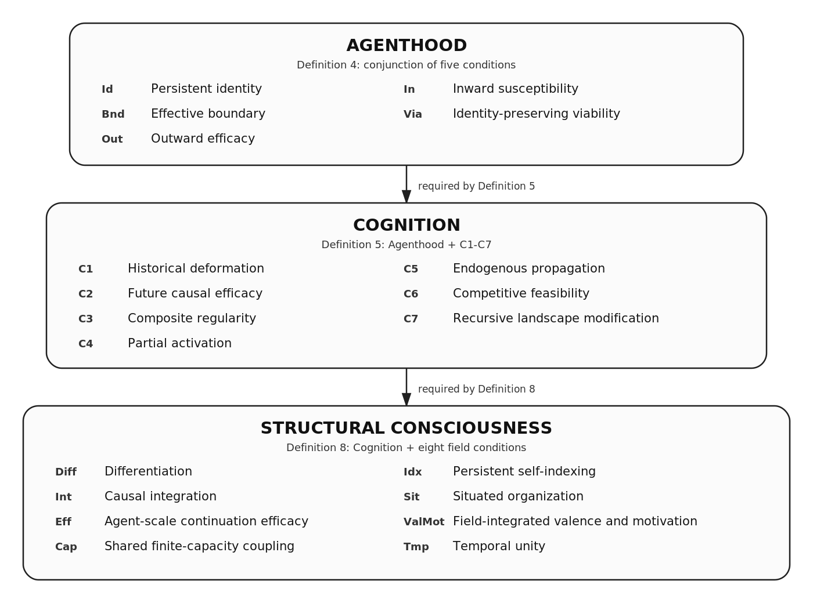

# Structural Consciousness

**Agenthood, Cognition, and the Constitution of a Subjective Field**  
**Ibrahim Nahvi Ibrahim** · Independent Researcher, Maldives  
ORCID: [0009-0000-7317-5811](https://orcid.org/0009-0000-7317-5811)  
**Version 1.0**

#### Manuscript
[Manuscript 1.0 – Markdown](Manuscript/Structural-Consciousness.md) · [PDF](Manuscript/Structural-Consciousness.pdf)

#### Extended Manuscript
[Extended Manuscript 1.0 – Markdown](Extended-Manuscript/Structural-Consciousness-Extended.md) · [PDF](Extended-Manuscript/Structural-Consciousness-Extended.pdf)

---

## Research target

Structural Consciousness (SC) asks:

> **What causal-organizational structure would a physical cognitive system have to realize for its active processes to constitute a unified subjective experience from one continuing point of view?**

SC gives an **organization-level constitutive account** of the physical organization under which differentiated processes constitute one continuing subjective field.

## Constitutive construction

SC is built in three cumulative stages:

```text
Agenthood
   ↓
Cognition
   ↓
Structural Consciousness
```



### 1. Agenthood – a continuing bearer

A candidate agent requires:

- **Persistent identity** – the identity-bearing organization has feasible later continuations.
- **Effective boundary** – internal and external processes are separated by a causally meaningful exchange structure.
- **Outward efficacy** – internal changes can alter later outward exchange.
- **Inward susceptibility** – external changes can alter the internal history.
- **Identity-preserving viability** – the organization has feasible continuations that preserve its identity under the relevant disturbances.

In continuous realizations, identity is grounded in continuity of the physical organization that carries the agent at the selected scale. Persistence of the same material particles is not required. SC separately treats singular actual continuation as an identity hypothesis for cases in which more than one continuation is physically possible.

### 2. Cognition – history becomes causally effective

Cognition adds seven required relations:

- **C1 – Historical deformation:** past interaction leaves a retained difference in present organization.
- **C2 – Future causal efficacy:** that retained difference changes later organization rather than merely persisting.
- **C3 – Composite regularity:** retained organization supports larger maintained composites.
- **C4 – Partial activation:** part of a composite can recruit more of it.
- **C5 – Endogenous propagation:** recruitment produces further internal change beyond the initially altered part.
- **C6 – Competitive feasibility:** finite capacity makes some candidate organizations separately feasible but not unrestrictedly maintainable together.
- **C7 – Recursive modification:** what is selected now changes what can become available later.

Together these conditions describe a system whose present organization has been shaped by its history, whose partial states can recruit larger structures, whose alternatives are constrained by finite physical capacity, and whose present selections alter subsequent possibilities.

### 3. Structural Consciousness – the subjective field

For a cognitive agent, SC requires the active field to have all of the following relations:

- **Differentiation** – active contents are physically realized and non-identical.
- **Causal integration** – major active contents participate in one intervention-sensitive causal organization.
- **Agent-scale efficacy** – major constituents can affect the agent's later continuation or history.
- **Capacity coupling** – allocation changes within the finite active organization have consequences across its constituents.
- **Persistent self-indexing** – active contents belong to the same continuing bearer.
- **Situated organization** – the field includes causally relevant relations to the agent itself, its interface with the environment, and the world beyond that interface.
- **Valence and motivation** – differences in viable continuation become active relations that can affect maintenance, selection, action, or later cognition.
- **Temporal unity** – these relations remain organized through successive causally dependent transitions.

All are required. Strength in one relation does not compensate for the absence of another.

---

## Organization of the subjective field

### Continuity across the construction

The construction concerns the same continuing bearer throughout:

- its past interactions shape its retained organization;
- its boundary structures interaction with the environment;
- its active contents are organized relative to its continuation;
- finite capacity constrains what can be maintained and selected together;
- its present field can alter its later possibilities;
- viable-continuation differences give present organization significance;
- temporal organization carries these relations through successive transitions.

Unity is the organization of differentiated contents within one continuing causal structure.

### Qualitative occurrence

A qualitative occurrence is a realized differentiated occurrence when it participates in the complete subjective field described above.

The same qualitative relation can recur across different objects and larger composites without being identical to any one object, word, autobiographical association, or affective association. The theory does not derive one universal sensory or qualitative geometry; the identity, recurrence, and proximity relations of qualitative contents must be established for the realization being studied.

### Valence and significance

SC relates valence to differences among the continuing agent's viable possibilities. A difference in possible continuation becomes field-integrated valence when the corresponding evaluative organization is causally active in maintenance, allocation, selection, action, or later cognition.

Protective regulation satisfies the field-level valence condition only when the relevant evaluative relation participates in the required field organization.

### Perspective and first-person organization

Agent-relative perspective is realized through the organization of active contents within the same continuing agent, relative to its boundary, situated relations, and identity continuation.

An external observer's representation is realized within the observer's own physical organization, while the described occurrence remains situated within the organization of the described agent.

---

## Human realization and empirical assessment

SC is substrate-independent at the level of definition. A realization assessment assigns its relations to physically specified organization at a declared scale and horizon.

For human realization, the manuscript evaluates mappings to physically specified organization including:

- continuity of the organism-level identity-bearing organization;
- sensory, motor, bodily, autonomic, and environmental exchange;
- learning, memory, and cue-dependent reinstatement of previously formed organization;
- finite neural, metabolic, signalling, and working-memory constraints on concurrent maintenance and selection;
- interacting bodily, self-related, interface, and world-related organization;
- evaluative relations tied to the organism's viable continuations;
- temporally maintained neural and bodily organization across successive transitions.


Empirical assessment is based on **causal contrasts** tied to the declared realization. Non-invasive contrasts can include prior exposure and cueing, controlled sensory or environmental changes, task demands, attention and working-memory prioritization, changes in resource availability or allocation, bodily or interface manipulations, and interruption or recovery conditions.

A contrast is informative when it changes the modeled causal variable, or a justified causal antecedent of it, without directly imposing the measured outcome. The resulting evidence classifies the required relation as demonstrated, failed, unresolved, or inaccessible in the assessed realization.

Complete demonstrated realization establishes membership in SC's structural category. Evaluation of the constitutive hypothesis then compares that classification with independently motivated evidence concerning the target subjective experience.

## Synthetic realization

A synthetic system satisfying the complete SC realization criteria is designated **Structurally Conscious Artificial Intelligence (SCAI, pronounced /skaɪ/)**. The designation is substrate-independent and refers to the realized causal organization specified by SC.

## Summary

Structural Consciousness specifies a continuous construction from agenthood, through history-sensitive cognition, to a differentiated, integrated, situated, evaluative, and temporally maintained subjective field. The same continuing bearer connects retained history, present contents, viable continuation, selection, action, and subsequent organization. The theory is formulated at the level of physical causal organization and is assessed through realization-specific causal tests.

---

## Manuscripts

### Manuscript 1.0 – primary presentation

[`Manuscript 1.0 – Markdown`](Manuscript/Structural-Consciousness.md) / [`Manuscript 1.0 – PDF`](Manuscript/Structural-Consciousness.pdf)

The concise, independently sufficient statement of SC: Agenthood, Cognition, the complete subjective-field conditions, qualitative occurrence, valence, first-person organization, candidate realizations, and empirical identification.

### Extended Manuscript 1.0 – detailed treatment

[`Extended Manuscript 1.0 – Markdown`](Extended-Manuscript/Structural-Consciousness-Extended.md) / [`Extended Manuscript 1.0 – PDF`](Extended-Manuscript/Structural-Consciousness-Extended.pdf)

The extended treatment of the same Structural Consciousness Version 1.0, including fuller derivations, phenomenological analysis, reinstatement, identity and interruption cases, biological and artificial realization, comparison cases, and empirical assessment.

---

## Citation

**Structural Consciousness Version 1.0** is published in this repository. A DOI assigned to the Version 1.0 repository release identifies the archived release snapshot.

Before DOI assignment:

> Ibrahim Nahvi Ibrahim (2026). *Structural Consciousness: Agenthood, Cognition, and the Constitution of a Subjective Field*. Version 1.0.

Machine-readable citation metadata are provided in [`CITATION.cff`](CITATION.cff).

## License

Text and repository figures are released under **Creative Commons Attribution 4.0 International (CC BY 4.0)**. See [`LICENSE`](LICENSE).

## Contact

Research correspondence: [contact form](https://forms.gle/uMeTYcnXAEeMShcN9)  
GitHub: [@iNahvi](https://github.com/iNahvi)  
ORCID: [0009-0000-7317-5811](https://orcid.org/0009-0000-7317-5811)
